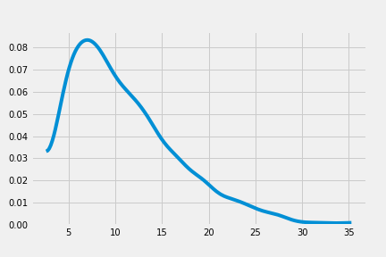

# Chapter 10 Counting and Classification

Two most common types of count regressions:

1. Binomial regression
2. Poisson regression

## Binomial regression

$y \sim Binomial(n, p)$

Two GLMs that use binomial likelihood functions:

1. Logistic regression for classification. (possible outcomes 0 and 1)
2. Aggregated Binomial regression when individual trials with same covariate values are aggregated (possible outcomes from zero up to $n$)

### Logistic regression (prosocial chimpanzee)

$L_i \sim Binomial(1, p_i)$
$logit(p_i) = \alpha + (\beta_P + \beta_{PC}C_i)P_i$
$\alpha \sim N(0, 10)$
$\beta_P \sim N(0, 10)$
$\beta_{PC} \sim N(0, 10)$

Fitting the intercept-only model:
$logit(p_i) = \alpha$

```python
with pm.Model() as model_10_1:
    a = pm.Normal('a', 0, 10)
    bp = pm.Normal('bp', 0, 10)
    p = pm.math.invlogit(a)
    pulled_left = pm.Binomial('pulled_left', 1, p, observed=d.pulled_left)

    trace_10_1 = pm.sample(1000, tune=1000)
```

||mean| sd  |mc_error|hpd_5.5|hpd_94.5|n_eff |Rhat|
|-----|---:|----:|-------:|------:|-------:|-----:|---:|
|a    |0.32| 0.09|     0.0|   0.17|    0.47|1978.4|   1|
|bp   |0.02|10.50|     0.2| -18.63|   14.94|1965.6|   1|

To interpret the estimate for a ($\alpha$), remember the parameters in logistic regressions are on the scale of log-odds. Use the inverse link function to project back onto the probability scale.

```python
logistic(df_10_1.iloc[:,3:5]).round(5)
```

||hpd_5.5|hpd_94.5|
|-----|------:|-------:|
|a    |   0.54|    0.62|
|bp   |   0.00|    1.00|

Now fit the model without partner/control condition:

```python
with pm.Model() as model_10_2:
    a = pm.Normal('a', 0, 10)
    bp = pm.Normal('bp', 0, 10)
    p = pm.math.invlogit(a + bp * d.prosoc_left)
    pulled_left = pm.Binomial('pulled_left', 1, p, observed=d.pulled_left)

    trace_10_2 = pm.sample(1000, tune=1000)
```

And the model with both `prosoc_left` and interaction between `prosoc_left` & `condition`.

```python
with pm.Model() as model_10_3:
    a = pm.Normal('a', 0, 10)
    bp = pm.Normal('bp', 0, 10)
    bpC = pm.Normal('bpC', 0, 10)
    p = pm.math.invlogit(a + (bp + bpC * d.condition) * d.prosoc_left)
    pulled_left = pm.Binomial('pulled_left', 1, p, observed=d.pulled_left)

    trace_10_3 = pm.sample(1000, tune=1000)
```

```python
comp_df = pm.compare({model_10_1: trace_10_1,
                     model_10_2: trace_10_2,
                     model_10_3: trace_10_3},
                     method='pseudo-BMA')

comp_df.loc[:,'model'] = pd.Series(['m10.1', 'm10.2', 'm10.3'])
comp_df = comp_df.set_index('model')
comp_df
```

|model|WAIC |pWAIC|dWAIC|weight| SE |dSE |
|-----|----:|----:|----:|-----:|---:|---:|
|m10.2|680.4| 1.93| 0.00|  0.73|9.42|0.00|
|m10.3|682.5| 3.06| 2.12|  0.25|9.44|0.91|
|m10.1|688.1| 1.09| 7.77|  0.02|7.12|6.29|

```python
pm.compareplot(comp_df);
```


model `m10.2` is better than `m10.3`. Why `m10.3` compares poorly with `m10.2`?

||mean | sd |mc_error|hpd_5.5|hpd_94.5|n_eff |Rhat|
|-----|----:|---:|-------:|------:|-------:|-----:|---:|
|a    | 0.05|0.13|    0.00|  -0.15|    0.26|1205.7|   1|
|bp   | 0.61|0.22|    0.01|   0.25|    0.97|1221.9|   1|
|bpC  |-0.12|0.26|    0.01|  -0.54|    0.27|1358.7|   1|

The estimated interaction effect `bpC` is negative with wide posterior on both sides, suggesting that the presence/absence of a partner is not relevant for chimpanzees although they do prefer the pro-social option.

Distinguish between **ABSOLUTE EFFECT** and **RELATIVE EFFECT**.

- Absolute effect: change in the probability of outcome
- Relative effect: proportional change induced by a change in the predictor (can be misleading)

Example: relative effect of `prosoc_left` and its parameter `bp`.

>The customary measure of relative effect for a logistic model is the proportional change in odds.

Changing the predictor `prosoc_left` from 0 to 1 increases the log-odds of pulling left lever by 0.61, or the odds are multiplied by $\exp(0.61) = 1.84$. The odds increases by 84%.

But the change also depends on other predictor variables. The change in probability if the intercept is 4:

```python
logistic(4 + 0.61) - logistic(4)
#0.0081324544388602371, less than 1%
```

The figure below shows that it made no difference whether or not the partner exists (condition = [0, 1]). Also, there are variations among individual chimpanzee, that 4 of them showed similar zig-zag pattern while the other 3 did not.


Modeling individual variation (individual handedness) by using a dummy variable for each individual chimpanzee:

$L_i \sim Binomial(l, p_i)$
$logit(p_i) = \alpha_{ACTOR[i] + (\beta_P + \beta_{PC}C_i)P_i}$
$\alpha_{ACTOR} \sim Normal(0, 10)$
$\beta_P \sim Normal(0, 10)$
$\beta_{PC} \sim Normal(0, 10)$

```python
with pm.Model() as model_10_4:
    a = pm.Normal('alpha', 0, 10, shape=len(d.actor.unique()))
    bp = pm.Normal('bp', 0, 10)
    bpC = pm.Normal('bpC', 0, 10)
    p = pm.math.invlogit(a[d.actor.values] + (bp + bpC * d.condition) * d.prosoc_left)
    pulled_left = pm.Binomial('pulled_left', 1, p, observed=d.pulled_left)

    trace_10_4 = pm.sample(1000, tune=1000)

    pm.summary(trace_10_4, alpha=.11).round(2)
```

||mean | sd |mc_error|hpd_5.5|hpd_94.5|n_eff |Rhat|
|--------|----:|---:|-------:|------:|-------:|-----:|---:|
|alpha__0|-0.74|0.28|    0.01|  -1.17|   -0.28|1727.7|   1|
|alpha__1|11.14|5.66|    0.17|   3.75|   19.32| 886.0|   1|
|alpha__2|-1.05|0.29|    0.01|  -1.50|   -0.60|1373.5|   1|
|alpha__3|-1.05|0.28|    0.01|  -1.46|   -0.58|1183.0|   1|
|alpha__4|-0.74|0.28|    0.01|  -1.20|   -0.31|1234.5|   1|
|alpha__5| 0.22|0.27|    0.01|  -0.20|    0.65|1212.3|   1|
|alpha__6| 1.80|0.40|    0.01|   1.20|    2.44|1642.2|   1|
|bp      | 0.84|0.26|    0.01|   0.43|    1.25| 812.4|   1|
|bpC     |-0.14|0.29|    0.01|  -0.60|    0.33| 991.3|   1|

Posteriors are not entirely Gaussian (e.g. `alpha__2`):



Possible values are mostly positive, suggesting a left-hand bias. Therefore, as long as the dummy value (`alpha__2`) is big enough to get the probability close to 1, any value will lead to the same prediction.

Plotting all posteriors again:


### Aggregated binomial: chimpanzees condensed

Combine the number of times each chimpanzee pulled the left-hand lever, first 2 chimpanzees:

```language
d_aggregated = d.groupby(['actor', 'condition', 'prosoc_left',  ])['pulled_left'].sum().reset_index()
d_aggregated.head(8)
```

|actor|condition|prosoc_left|pulled_left|
|----:|--------:|----------:|----------:|
|    0|        0|          0|          6|
|    0|        0|          1|          9|
|    0|        1|          0|          5|
|    0|        1|          1|         10|
|    1|        0|          0|         18|
|    1|        0|          1|         18|
|    1|        1|          0|         18|
|    1|        1|          1|         18|

The new model:

```python
with pm.Model() as model_10_5:
    a = pm.Normal('alpha', 0, 10)
    bp = pm.Normal('bp', 0, 10)
    bpC = pm.Normal('bpC', 0, 10)
    p = pm.math.invlogit(a + (bp + bpC * d_aggregated.condition) * d_aggregated.prosoc_left)
    pulled_left = pm.Binomial('pulled_left', 18, p, observed=d_aggregated.pulled_left)

    trace_10_5 = pm.sample(1000, tune=1000)
```

||mean | sd |mc_error|hpd_5.5|hpd_94.5|n_eff |Rhat|
|-----|----:|---:|-------:|------:|-------:|-----:|---:|
|alpha| 0.04|0.13|    0.00|  -0.17|    0.23| 957.7|   1|
|bp   | 0.62|0.22|    0.01|   0.26|    0.97| 778.6|   1|
|bpC  |-0.10|0.25|    0.01|  -0.54|    0.27|1118.2|   1|

This is the same coefficients as the model 10.2 before.

If we want to include the intercept:

```python
with pm.Model() as model_10_6:
    a = pm.Normal('alpha', 0, 10, shape=len(d_aggregated.actor.unique()))
    bp = pm.Normal('bp', 0, 10)
    bpC = pm.Normal('bpC', 0, 10)
    p = pm.math.invlogit(a[d_aggregated.actor.values] + (bp + bpC * d_aggregated.condition) * d_aggregated.prosoc_left)
    pulled_left = pm.Binomial('pulled_left', 18, p, observed=d_aggregated.pulled_left)

    trace_10_6 = pm.sample(1000, tune=1000)
```

||mean | sd |mc_error|hpd_5.5|hpd_94.5|n_eff |Rhat|
|--------|----:|---:|-------:|------:|-------:|-----:|---:|
|alpha__0|-0.74|0.27|    0.01|  -1.16|   -0.30|1311.2|   1|
|alpha__1|11.29|5.75|    0.19|   3.32|   18.95| 773.3|   1|
|alpha__2|-1.06|0.29|    0.01|  -1.50|   -0.59|1861.0|   1|
|alpha__3|-1.06|0.28|    0.01|  -1.50|   -0.60|1724.9|   1|
|alpha__4|-0.75|0.27|    0.01|  -1.19|   -0.32|1438.8|   1|
|alpha__5| 0.22|0.28|    0.01|  -0.21|    0.66|1579.6|   1|
|alpha__6| 1.83|0.40|    0.01|   1.23|    2.48|1678.4|   1|
|bp      | 0.84|0.26|    0.01|   0.43|    1.27| 981.8|   1|
|bpC     |-0.13|0.30|    0.01|  -0.56|    0.39|1448.8|   1|

### Aggregated binomial: Graduate school admission

Two models:

1. binomial regression that models `admit` as a function of gender.
2. binomial regression that models `admit` as a constant to check possible overfitting.

$n_{admit, i} \sim Binomial(n_i, p_i)$
$logit(p_i) = \alpha + \beta_m m_i$
$\alpha \sim Normal(0, 10)$
$\beta_m \sim Normal(0, 10)$

```python
d_ad['male'] = (d_ad['applicant.gender'] == 'male').astype(int)

with pm.Model() as model_10_6:
    a = pm.Normal('a', 0, 10)
    bm = pm.Normal('bm', 0, 10)
    p = pm.math.invlogit(a + bm * d_ad.male)
    admit = pm.Binomial('admit', p=p, n=d_ad.applications, observed=d_ad.admit)

    trace_10_6 = pm.sample(1000, tune=1000)

with pm.Model() as model_10_7:
    a = pm.Normal('a', 0, 10)
    p = pm.math.invlogit(a)
    admit = pm.Binomial('admit', p=p, n=d_ad.applications, observed=d_ad.admit)

    trace_10_7 = pm.sample(1000, tune=1000)

comp_df = pm.compare({model_10_6: trace_10_6, model_10_7: trace_10_7})

comp_df.loc[:,'model'] = pd.Series(['m10.6', 'm10.7'])
comp_df = comp_df.set_index('model')
comp_df
```

|model| WAIC |pWAIC |dWAIC|weight| SE  | dSE |var_warn|
|-----|-----:|-----:|----:|-----:|----:|----:|-------:|
|m10.6| 993.8|118.03| 0.00|  0.39|311.6|  0.0|       1|
|m10.7|1048.4| 80.06|54.66|  0.61|314.5|154.6|       1|

Result suggests that gender matters a lot. How much?

||mean | sd |mc_error|hpd_5.5|hpd_94.5|n_eff|Rhat|
|-----|----:|---:|-------:|------:|-------:|----:|---:|
|a    |-0.83|0.05|       0|  -0.91|   -0.75|438.8|   1|
|bm   | 0.61|0.07|       0|   0.50|    0.72|437.4|   1|

Being male increases the odds by $\exp(0.61) \approx 1.84$. On the absolute scale:

```python
post = pm.trace_to_dataframe(trace_10_6)
p_admit_male = logistic(post['a'] + post['bm'])
p_admit_female = logistic(post['a'])
diff_admit = p_admit_male - p_admit_female
diff_admit.describe(percentiles=[.025, .5, .975])[['2.5%', '50%', '97.5%']]
```

Median estimate of male advantage is about 14%.

Plotting the posterior prediction:

```python
for i in range(6):
    x = 1 + 2 * i
    y1 = d_ad.admit[x] / d_ad.applications[x]
    y2 = d_ad.admit[x+1] / d_ad.applications[x+1]
    plt.plot([x, x+1], [y1, y2], '-C0o', lw=2)
    plt.text(x + 0.25, (y1+y2)/2 + 0.05, d_ad.dept[x])
plt.ylim(0, 1)
```

As the figure shows, only in 2 departments female applicants have lower admission rate than male. The discrepancy here is because:

> The model did correctly answer the question we asked of it: *What are the average probabilities of admission for females and males, across all departments?* The problem in this case is that males and females do not apply to the same departments, and departments vary in their rates of admission.


Instead, we want to ask **“What is the average difference in probability of admission between females and males within departments?”** This can be answered by adding a department intercept.

$n_{admit, i} \sim Binomial(n_i, p_i)$
$logit(p_i) = \alpha_{DEPT[i]} + \beta_m m_i$
$\alpha_{DEPT[i]} \sim Normal(0, 10)$
$\beta_m \sim Normal(0, 10)$

```python
d_ad['dept_id'] = pd.Categorical(d_ad['dept']).codes

with pm.Model() as model_10_8:
    a = pm.Normal('a', 0, 10, shape=len(d_ad['dept'].unique()))
    p = pm.math.invlogit(a[d_ad['dept_id'].values])
    admit = pm.Binomial('admit', p=p, n=d_ad['applications'], observed=d_ad['admit'])

    trace_10_8 = pm.sample(1000, tune=1000)

with pm.Model() as model_10_9:
    a = pm.Normal('a', 0, 10, shape=len(d_ad['dept'].unique()))
    bm = pm.Normal('bm', 0, 10)
    p = pm.math.invlogit(a[d_ad['dept_id'].values] + bm * d_ad['male'])
    admit = pm.Binomial('admit', p=p, n=d_ad['applications'], observed=d_ad['admit'])

    trace_10_9 = pm.sample(1000, tune=1000)
```

|model| WAIC |pWAIC |dWAIC |weight|  SE  | dSE  |var_warn|
|-----|-----:|-----:|-----:|-----:|-----:|-----:|-------:|
|m10.8| 105.0|  6.49|  0.00|  0.81| 17.37|  0.00|       1|
|m10.9| 108.0|  9.16|  2.93|  0.19| 15.56|  3.64|       1|
|m10.6| 993.8|118.03|888.75|  0.00|311.61|308.57|       1|
|m10.7|1048.4| 80.06|943.41|  0.00|314.48|312.26|       1|

The model without `male` is ranked first, but close.

**Simpson's paradox** the outcome observed at a overall level does not apply to the individuals within the group.

### Fitting binomial regression with `glm`

```python
import statsmodels.api as sm
from patsy import dmatrix

endog = d_ad.loc[:,['admit', 'reject']].values # cbind(admit,reject)

m10_7glm = sm.GLM(endog, dmatrix('~ 1', data=d_ad),
                  family=sm.families.Binomial())
m10_6glm = sm.GLM(endog, dmatrix('~ male', data=d_ad),
                  family=sm.families.Binomial())
m10_8glm = sm.GLM(endog, dmatrix('~ dept_id', data=d_ad),
                  family=sm.families.Binomial())
m10_9glm = sm.GLM(endog, dmatrix('~ male + dept_id', data=d_ad),
                  family=sm.families.Binomial())
# res = m10_7glm.fit()
# res.summary()
```

```python
pm.GLM.from_formula('pulled_left ~ actor + prosoc_left*condition - condition',
                    family='binomial', data=d)
```

## Poisson regression

For binomial regression, expectation is $np$ and variance is $np(1-p)$. When $n$ is very large and $p$ is very small, then these are approximately the same. E.g. when $n = 10000$ and $p=0.0001$, $np = 1$ and $np(1-p) = 10000 \times 0.0001 \times(1-0.0001) \approx 1$.

Poisson distribution:

$y \sim Poisson (\lambda)$

With link function:

$y_i \sim Poisson (\lambda_i)$
$\log(\lambda_i) = \alpha + \beta x_i$

$\lambda$ is the expected value, or a rate. Implicitly, it is equal to an expected number of events $\mu$ per unit time or distance $\tau$. This implies that $\lambda = \mu/\tau$, and the second equation above is the same as:

$\log(\lambda_i) = \log \frac{\mu_i}{\tau_i} = \alpha + \beta x_i$, 
The same as
$\log \mu_i = \log \tau_i + \alpha + \beta x_i$, when $\tau_i = 1$, $\log \tau_i = 0$. 

This allows us to normalize across cases.

### Example: Oceanic tool complexity

Hypothesis:

1. the number of tools increases with the log population size. Why log? Because it is the order of magnitude of the population that matters, not the absolute size of it.
2. The number of tools increases with the contact rate. Islands that are better network acquire or sustain more tool types.
3. The impact of population on tool counts is increased by high contact.

The model that conforms to the research hypothesis includes the interaction between log-population and contact rate:

$T_i \sim Poison (\lambda_i)$
$\log(\lambda_i) = \alpha + \beta_p \log P_i + \beta_C C_i + \beta_{PC}C_i \log P_i$
$\alpha \sim Normal(0, 100)$
$\beta_P \sim Normal(0, 1)$
$\beta_{PC} \sim Normal(0, 1)$

```python
with pm.Model() as m_10_10:
    a = pm.Normal('a', 0, 100)
    b = pm.Normal('b', 0, 1, shape=3)
    lam = pm.math.exp(a + b[0] * log_pop + b[1] * contact_high + b[2] * contact_high * log_pop)
    obs = pm.Poisson('total_tools', lam, observed=total_tools)
    trace_10_10 = pm.sample(1000, tune=1000)

summary = pm.summary(trace_10_10, alpha=.11)[['mean', 'sd', 'hpd_5.5', 'hpd_94.5']]
trace_cov = pm.trace_cov(trace_10_10, model=m_10_10)
invD = (np.sqrt(np.diag(trace_cov))**-1)[:, None]
trace_corr = pd.DataFrame(invD*trace_cov*invD.T, index=summary.index, columns=summary.index)

summary.join(trace_corr).round(2)
```

||mean | sd |hpd_5.5|hpd_94.5|  a  |b__0 |b__1 |b__2 |
|-----|----:|---:|------:|-------:|----:|----:|----:|----:|
|a    | 0.92|0.36|   0.34|    1.49| 1.00|-0.97|-0.15| 0.09|
|b__0 | 0.27|0.03|   0.21|    0.32|-0.97| 1.00| 0.15|-0.11|
|b__1 |-0.07|0.83|  -1.40|    1.22|-0.15| 0.15| 1.00|-0.99|
|b__2 | 0.04|0.09|  -0.10|    0.19| 0.09|-0.11|-0.99| 1.00|

It appears that the coefficient for contact rate and interaction term may not be important:


Calculate the difference between posterior distributions of high and low contact.

```python
lambda_high = np.exp(trace_10_10['a'] + trace_10_10['b'][:,1] + (trace_10_10['b'][:,0] + trace_10_10['b'][:,2]) * 8)
lambda_low = np.exp(trace_10_10['a'] + trace_10_10['b'][:,0] * 8 )

diff = lambda_high - lambda_low
np.sum(diff > 0) / len(diff)
#0.95799999999999996
```

There is a 95% plausibility that high-contact island has more tools than the low-contact islands. Distribution of difference:


The reason is there is a negative correlation between `bc` and `bpc`:


We then build 4 models to check possible over-fitting, namely:

1. A model without interaction
2. 2 models with only one predictor variable each
3. "null" model with only the intercept

```python
with pm.Model() as m_10_11:
    a = pm.Normal('a', 0, 100)
    b = pm.Normal('b', 0, 1, shape=2)
    lam = pm.math.exp(a + b[0] * log_pop + b[1] * contact_high)
    obs = pm.Poisson('total_tools', lam, observed=total_tools)
    trace_10_11 = pm.sample(1000, tune=1000)

with pm.Model() as m_10_12:
    a = pm.Normal('a', 0, 100)
    b = pm.Normal('b', 0, 1)
    lam = pm.math.exp(a + b * log_pop)
    obs = pm.Poisson('total_tools', lam, observed=total_tools)
    trace_10_12 = pm.sample(1000, tune=1000)

with pm.Model() as m_10_13:
    a = pm.Normal('a', 0, 100)
    b = pm.Normal('b', 0, 1)
    lam = pm.math.exp(a + b * contact_high)
    obs = pm.Poisson('total_tools', lam, observed=total_tools)
    trace_10_13 = pm.sample(1000, tune=1000)

with pm.Model() as m_10_14:
    a = pm.Normal('a', 0, 100)
    lam = pm.math.exp(a)
    obs = pm.Poisson('total_tools', lam, observed=total_tools)
    trace_10_14 = pm.sample(1000, tune=1000)

traces = [trace_10_10, trace_10_11, trace_10_12, trace_10_13, trace_10_14]
models = [m_10_10, m_10_11, m_10_12, m_10_13, m_10_14]

islands_compare = pm.compare(dict(zip(models, traces)), method='pseudo-BMA')

islands_compare.loc[:,'model'] = pd.Series(['m10.10', 'm10.11', 'm10.12', 'm10.13', 'm10.14'])
islands_compare = islands_compare.set_index('model')
islands_compare
```

|model | WAIC |pWAIC|dWAIC|weight| SE  | dSE |var_warn|
|------|-----:|----:|----:|-----:|----:|----:|-------:|
|m10.11| 78.81| 4.13| 0.00|  0.66|11.05| 0.00|       1|
|m10.10| 80.36| 5.01| 1.54|  0.31|11.27| 1.24|       1|
|m10.12| 84.75| 3.94| 5.94|  0.03| 8.97| 7.91|       1|
|m10.14|142.31| 8.78|63.49|  0.00|32.11|33.24|       1|
|m10.13|150.03|16.45|71.21|  0.00|44.31|44.05|       1|


The top model does not have interaction in it. The model with interaction is the close second. It's the researcher's cal which model to use. But we can use the ensemble of the top 3 to generate predictions.

```python
# set new value for out-of-sample prediction 
log_pop_seq = np.linspace(6, 13, 30)
log_pop.set_value(np.hstack([log_pop_seq, log_pop_seq]))
contact_high.set_value(np.hstack([np.repeat(0, 30), np.repeat(1, 30)]))

islands_ensemble = pm.sample_ppc_w(traces, 10000, 
                                   models, weights=islands_compare.weight.sort_index(ascending=True))

f, axes = plt.subplots(1, 1, figsize=(5, 5))
index = dk.contact_high==1
axes.scatter(np.log(dk.population)[~index], dk.total_tools[~index],
             facecolors='none', edgecolors='k', lw=1)
axes.scatter(np.log(dk.population)[index], dk.total_tools[index])

mp = islands_ensemble['total_tools'][:, :30]
mu_hpd = pm.hpd(mp, alpha=.50)

axes.plot(log_pop_seq, np.median(mp, axis=0), '--', color='k')
axes.fill_between(log_pop_seq,
                  mu_hpd[:,0], mu_hpd[:,1], alpha=0.25, color='k')

mp = islands_ensemble['total_tools'][:, 30:]
mu_hpd = pm.hpd(mp, alpha=.50)

axes.plot(log_pop_seq, np.median(mp, axis=0))
axes.fill_between(log_pop_seq,
                  mu_hpd[:,0], mu_hpd[:,1], alpha=0.25)
axes.set_xlabel('log-population')
axes.set_ylabel('total tools')
axes.set_xlim(6.8, 12.8)
axes.set_ylim(10, 73);
```


Impact of contact rate can be seen by the distance between gray and orange predictions.

### MCMC islands

Verify that MAP esitmates of the model accurately describes shape of the posterior distribution.

```python
pm.summary(trace_10_10, alpha=.11).round(2)
```

||mean | sd |mc_error|hpd_5.5|hpd_94.5|n_eff|Rhat|
|-----|----:|---:|-------:|------:|-------:|----:|---:|
|a    | 0.92|0.36|    0.01|   0.34|    1.49|803.4|   1|
|b__0 | 0.27|0.03|    0.00|   0.21|    0.32|756.2|   1|
|b__1 |-0.07|0.83|    0.03|  -1.40|    1.22|564.4|   1|
|b__2 | 0.04|0.09|    0.00|  -0.10|    0.19|563.4|   1|

These estimates are the same as `m_10_10`. But look at pairs plot:

```python
# you can pass user-defined function to map to customize the PairGrid
from scipy import stats
def corrfunc(x, y, **kws):
    r, _ = stats.pearsonr(x, y)
    ax = plt.gca()
    ax.annotate("r = {:.2f}".format(r),
                xy=(.3, .9), fontsize=16,
                xycoords=ax.transAxes)


tracedf = pm.trace_to_dataframe(trace_10_10)
grid = (sns.PairGrid(tracedf,
                     diag_sharey=False)
           .map_diag(sns.kdeplot)
           .map_upper(plt.scatter, alpha=0.1)
           .map_lower(sns.kdeplot, cmap="summer")
           .map_lower(corrfunc))
```

Strong correlation exists between `b_0_` and `b_2`. Therefore, Hamiltonian Monte Carlo will be less efficient. 


Centering the predictors can help reduce the correlations among parameters.

```python
log_pop_c = dk.log_pop.values - dk.log_pop.values.mean()
log_pop.set_value(log_pop_c)
contact_high.set_value(dk.contact_high.values)
total_tools.set_value(dk.total_tools.values)

with pm.Model() as m_10_10c:
    a = pm.Normal('a', 0, 100)
    b = pm.Normal('b', 0, 1, shape=3)
    lam = pm.math.exp(a + b[0] * log_pop + b[1] * contact_high + b[2] * contact_high * log_pop)
    obs = pm.Poisson('total_tools', lam, observed=total_tools)
    trace_10_10c = pm.sample(1000, tune=1000)

pm.summary(trace_10_10c, alpha=.11).round(2)
```

||mean| sd |mc_error|hpd_5.5|hpd_94.5|n_eff |Rhat|
|-----|---:|---:|-------:|------:|-------:|-----:|---:|
|a    |3.31|0.09|       0|   3.17|    3.46|1267.6|   1|
|b__0 |0.26|0.04|       0|   0.21|    0.32|1613.2|   1|
|b__1 |0.29|0.12|       0|   0.08|    0.47|1164.2|   1|
|b__2 |0.06|0.17|       0|  -0.22|    0.32|1583.0|   1|

Note that the `n_eff` is larger, since the Markov Chain is more efficient.

Posterior distribution after centering:


### Example: Exposure and the offset

The *rate* of poisson distribution is constant. Therefore all we need to handle different exposures is to add an offset.

E.g. We can simulate a month of daily counts of completed manuscript:

```python
num_days = 30
y = np.random.poisson(1.5, num_days)
```

Simulate a different monastery that keeps only weekly records:

```python
num_weeks = 4
y_new = np.random.poisson(0.5*7, num_weeks)
```

Fit the model and estimate the rate of manuscript production at each monastery by computing the log of each exposure and include that in the linear model:

```python
log_days = np.log(exposure)
with pm.Model() as m_10_15:
    a = pm.Normal('a', 0., 100.)
    b = pm.Normal('b', 0., 1.)
    lam = pm.math.exp(log_days + a + b*monastery)
    obs = pm.Poisson('y', lam, observed=y_all)
    trace_10_15 = pm.sample(1000, tune=1000)

trace_10_15.add_values(dict(lambda_old=np.exp(trace_10_15['a']),
                            lambda_new=np.exp(trace_10_15['a'] + trace_10_15['b'])))

pm.summary(trace_10_15, varnames=['lambda_old', 'lambda_new'], alpha=.11).round(2)
```

||mean| sd |mc_error|hpd_5.5|hpd_94.5|n_eff |Rhat|
|----------|---:|---:|-------:|------:|-------:|-----:|---:|
|lambda_old|1.13|0.19|    0.01|   0.83|    1.43|1170.5|   1|
|lambda_new|0.42|0.12|    0.00|   0.24|    0.62|1195.1|   1|

The new monastery produces about half as many manuscript per day.

## Other count regressions

Other common count regressions:

1. multinomial
2. geometric
3. negative-binomial
4. beta-binomial

### Multinomial

Binomial is when we have two outcomes (white and blue marbles). Multinomial is when we have multiple possible outcomes(white, blue, and red marbles). It also requires that the probability of each type of event is constant across trials.

The probability of observing $y_1, \dots, y_K$ with possibilities $p_1, \dots, p_K$ is:

$\Pr(y_1, \dots, y_K|n, p_1, \dots, p_K) = \frac{n!}{\prod_i y_i!}\prod^K_{i=1}p_i^{y_i}$

The multinomial model is also called categorical regression, and is sometimes called the maximum entropy classifier.

#### Explicit multinomial models

Multinomial logistic regression. Probability of a particular type of event $k$:

$\Pr(k|s_1, \dots, s_K) = \frac{\exp(s_K)}{\sum^K_{i=1}\exp(s_i)}$

This is the `softmax` link function.

Two types of multinomial logistic regressions:

1. predictors have different values for each type of event
2. parameters are distinct for each type of event

Example for first type (modeling career choice)

```python
# simulate career choices among 500 individuals
N = 500                 # number of individuals
income = np.arange(3)+1 # expected income of each career
score = 0.5*income      # scores for each career, based on income
# next line converts scores to probabilities
def softmax(w):
    e = np.exp(w)
    return e/np.sum(e, axis=0)

p = softmax(score)
# now simulate choice
# outcome career holds event type values, not counts
career = np.random.multinomial(1, p, size=N)
career = np.where(career==1)[1]

import theano.tensor as tt
with pm.Model() as m_10_16:
    b = pm.Normal('b', 0., 5.)
    s2 = b*2
    s3 = b*3
    p_ = tt.stack([b, s2, s3])
    obs = pm.Categorical('career', p=tt.nnet.softmax(p_), observed=career)
    trace_10_16 = pm.sample(1000, tune=1000)
pm.summary(trace_10_16, alpha=.11).round(2)
```

||mean| sd |mc_error|hpd_5.5|hpd_94.5|n_eff|Rhat|
|-----|---:|---:|-------:|------:|-------:|----:|---:|
|b    |0.57|0.06|       0|   0.48|    0.66|787.2|   1|

Estimates from the model are extremely difficult to interpret.

>You absolutely must convert them to a vector of probabilities, to make much sense of them. The principle reason is that the estimates swing around wildly, depending upon which event type you assign a constant score. 

```python
N = 100
# simulate family incomes for each individual
family_income = np.random.rand(N)
# assign a unique coefficient for each type of event
b = np.arange(3)-1
p = softmax(score[:, None] + np.outer(b, family_income)).T
career = np.asarray([np.random.multinomial(1, pp) for pp in p])
career = np.where(career==1)[1]

with pm.Model() as m_10_17:
    a23 = pm.Normal('a23', 0, 5, shape=2)
    b23 = pm.Normal('b23', 0, 5, shape=2)
    s2 = a23[0] + b23[0]*family_income
    s3 = a23[1] + b23[1]*family_income
    p_ = tt.stack([np.zeros(N), s2, s3]).T
    obs = pm.Categorical('career', p=tt.nnet.softmax(p_), observed=career)
    trace_10_17 = pm.sample(1000, tune=1000)
pm.summary(trace_10_17, alpha=.11).round(2)
```

||mean | sd |mc_error|hpd_5.5|hpd_94.5|n_eff|Rhat|
|------|----:|---:|-------:|------:|-------:|----:|---:|
|a23__0|-0.10|0.57|    0.02|  -1.04|    0.80|579.4|   1|
|a23__1| 0.34|0.53|    0.02|  -0.49|    1.19|547.4|   1|
|b23__0| 1.31|1.18|    0.05|  -0.48|    3.30|555.9|   1|
|b23__1| 2.05|1.08|    0.04|   0.39|    3.81|503.9|   1|

#### Multinomial in disguise as Poisson

Another way is factor multinomial as a series of Poisson likelihoods.

E.g. Berkeley admissions data

```python
# binomial model of overall admission probability
with pm.Model() as m_binom:
    a = pm.Normal('a', 0, 100)
    p = pm.math.invlogit(a)
    admit = pm.Binomial('admit', p=p, n=d_ad.applications, observed=d_ad.admit)
    trace_binom = pm.sample(1000, tune=1000)
    
# Poisson model of overall admission rate and rejection rate
with pm.Model() as m_pois:
    a = pm.Normal('a', 0, 100, shape=2)
    lam = pm.math.exp(a)
    admit = pm.Poisson('admit', lam[0], observed=d_ad.admit)
    rej = pm.Poisson('rej', lam[1], observed=d_ad.reject)
    trace_pois = pm.sample(1000, tune=1000)
```

Inferred binomial probability of admission across the entire dataset:

```python
m_binom = pm.summary(trace_binom, alpha=.11).round(2)
logistic(m_binom['mean'])
#0.386986
```

In Poisson model, the implied probability of admission:

$p_{admit} = \frac{\lambda_1}{\lambda_1 + \lambda_2} = \frac{\exp(a_1)}{\exp(a_1) + \exp(a_2)}$

```python
m_pois = pm.summary(trace_pois, alpha=.11).round(2)
m_pois['mean'][0]
np.exp(m_pois['mean'][0])/(np.exp(m_pois['mean'][0])+np.exp(m_pois['mean'][1]))
#0.38698582386066455
```

Same inference as in the binomial model.

### Geometric

A number of events up until something happened. Also called event history analysis or survival analysis, when the terminating event is constant through time or distance.

Distribution of geometric distribution:

$\Pr(y|p) = p(1-p)^{y-1}$

We can simulate some data:

```python
# simulate
N = 100
x = np.random.rand(N)
y = np.random.geometric(logistic(-1 + 2*x), size=N)

with pm.Model() as m_10_18:
    a = pm.Normal('a', 0, 10)
    b = pm.Normal('b', 0, 1)
    p = pm.math.invlogit(a + b*x)
    obs = pm.Geometric('y', p=p, observed=y)
    trace_10_18 = pm.sample(1000, tune=1000)
pm.summary(trace_10_18, alpha=.11).round(2)
```

||mean | sd |mc_error|hpd_5.5|hpd_94.5|n_eff|Rhat|
|-----|----:|---:|-------:|------:|-------:|----:|---:|
|a    |-1.09|0.24|    0.01|  -1.47|   -0.71|455.5|   1|
|b    | 1.74|0.46|    0.02|   0.99|    2.40|465.2|   1|

### Negative binomial and beta-binomial

Instead of 1 bag with white and blue marbles, we are drawing samples from multiple bags, each with a different composition of blue and white marbles. Each set of draws comes from the same bag, but different sets come from different bags.

This is called mixtures since we mix different maximum entropy distributions. Common generalizations of count GLMs that are mixtures: Beta-binomial and Negative-binomials. The variation in the counts exceeds what we'd expect from a pure binomial or Poisson process.