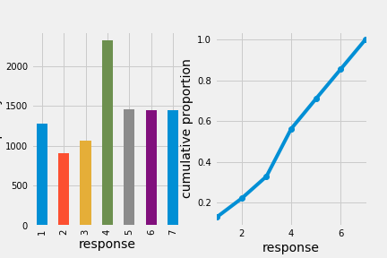
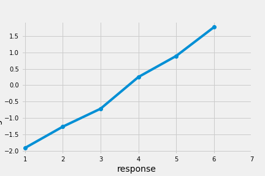
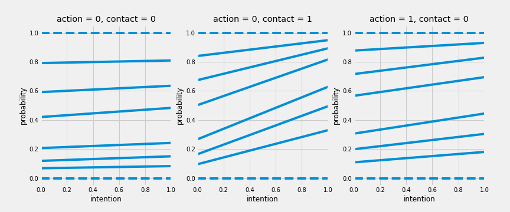
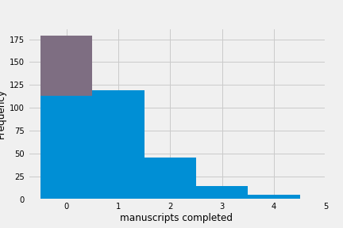
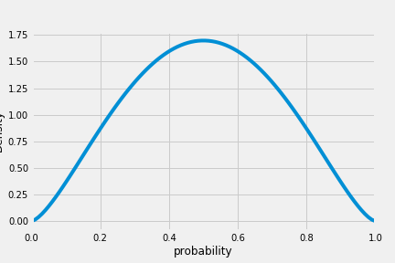
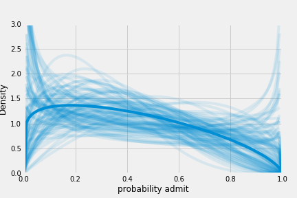
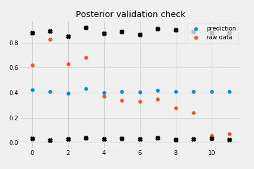
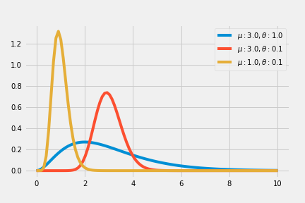

# Chapter 11 Monsters and mixtures

## Ordered categorical outcomes

When the outcome is a series of ordered values (ratings of Amazon).

The caveat: the differences in values are not necessarily equal (1 to 2 not necessarily equal to 5 to 6).

Solution: cumulative link function

### Example, moral intuition

Describing the distribution of discrete ordered values:



To redescribe the log-cumulative odds, a series of intercept is needed, each one on the log-cumulative-odds scale and stands for the cumulative probability of each outcome. The log-cumulative-odds that a response value $y_i$ is equal to or less than possible outcome value $k$ is:

$\log \frac{\Pr(y_i \le k)}{1 - \Pr(y_i \le k)} = \alpha_k$

Where $\alpha_k$ is an intercept unique to each possible outcome value $k$. The $\alpha_k$ can be calculated as:

```python
resp_lco = (trolley_df.response
                      .value_counts()
                      .sort_index()
                      .cumsum()
                      .iloc[:-1]
                      .div(trolley_df.shape[0])
                      .apply(lambda p: np.log(p / (1. - p))))
print(resp_lco)
#[-1.91609116 -1.26660559 -0.718634    0.24778573  0.88986365  1.76938091]
```

The log cumulative odds for the 7th response is $\inf$ and not shown.



The posterior distribution of these intercepts can be achieved through calculation of likelihood $\Pr(y_i) = k$. The likelihood of $k$ can be obtained through subtraction:

$p_k = \Pr(y_i = k) = \Pr(y_i \le k) - \Pr(y_i \le k-1)$

Using the above formula, we can reversely calculate all likelihood by subtraction.

```python
class Ordered(pm.distributions.transforms.ElemwiseTransform):
    name = "ordered"

    def forward(self, x):
        out = tt.zeros(x.shape)
        out = tt.inc_subtensor(out[0], x[0])
        out = tt.inc_subtensor(out[1:], tt.log(x[1:] - x[:-1]))
        return out

    def forward_val(self, x, point=None):
        x, = pm.distributions.distribution.draw_values([x], point=point)
        return self.forward(x)

    def backward(self, y):
        out = tt.zeros(y.shape)
        out = tt.inc_subtensor(out[0], y[0])
        out = tt.inc_subtensor(out[1:], tt.exp(y[1:]))
        return tt.cumsum(out)

    def jacobian_det(self, y):
        return tt.sum(y[1:])

with pm.Model() as m11_1:
    a = pm.Normal(
        'a', 0., 10.,
        transform=Ordered(),
        shape=6, testval=np.arange(6) - 2.5)

    pa = pm.math.sigmoid(a)

    p_cum = tt.concatenate([[0.], pa, [1.]])
    p = p_cum[1:] - p_cum[:-1]

    resp_obs = pm.Categorical(
        'resp_obs', p,
        observed=trolley_df.response - 1)

with m11_1:
    map_11_1 = pm.find_MAP()
```

posterior distribution of intercepts:

```python
map_11_1['a']
#array([-1.9160707 , -1.26658298, -0.71862013,  0.24778795,  0.88986631, 1.76937289])

with m11_1:
    trace_11_1 = pm.sample(1000, tune=1000)
pm.summary(trace_11_1, varnames=['a'], alpha=.11).round(2)
```

||mean | sd |mc_error|hpd_5.5|hpd_94.5|n_eff |Rhat|
|-----|----:|---:|-------:|------:|-------:|-----:|---:|
|a__0 |-1.92|0.03|       0|  -1.96|   -1.87|2117.4|   1|
|a__1 |-1.27|0.02|       0|  -1.30|   -1.23|2527.0|   1|
|a__2 |-0.72|0.02|       0|  -0.75|   -0.68|2350.5|   1|
|a__3 | 0.25|0.02|       0|   0.21|    0.28|2069.5|   1|
|a__4 | 0.89|0.02|       0|   0.85|    0.93|2149.8|   1|
|a__5 | 1.77|0.03|       0|   1.72|    1.82|2628.5|   1|

logistic function to get cumulative probabilities:

```python
sp.special.expit(map_11_1['a'])
#array([ 0.12830038,  0.21984275,  0.32769691,  0.56163196,  0.70886258, 0.85437967])
```

### Adding predictor variables

Adding a predictor $x$ to the model by defining a linear model $\phi_i = \beta x_i$. Then each cumulative logit becomes:

$\log \frac{\Pr(y_i \le k)}{1 - \Pr(y_i \le k)} = \alpha_k - \phi_i$
$\phi_i = \beta x_i$

>Why linear model $\phi$ subtracted from each intercept? Because if we decrease the log-cumulative-odds of every outcome value k below the maximum, this necessarily shifts probability mass upwards towards higher outcome values.

If we calculate MAP estimate from m11.1:

```python
def ordered_logistic_proba(a):
    pa = sp.special.expit(a)
    p_cum = np.concatenate(([0.], pa, [1.]))

    return p_cum[1:] - p_cum[:-1]

ordered_logistic_proba(trace_11_1['a'].mean(axis=0))
#array([ 0.12817034,  0.09156755,  0.10796181,  0.23405232,  0.1472369, 0.14552313,  0.14548796])
```

Average outcome:

```python
(ordered_logistic_proba(trace_11_1['a'].mean(axis=0)) \
     * (1 + np.arange(7))).sum()
#4.1991390877567065
```

Now we subtract 0.5 from each:

```python
ordered_logistic_proba(trace_11_1['a'].mean(axis=0) - 0.5)
#array([ 0.08186793,  0.06402364,  0.08229003,  0.20921751,  0.15899878, 0.1844197 ,  0.21918241])
```

Smaller values got smaller and larger values got larger. Expected value:

```python
(ordered_logistic_proba(trace_11_1['a'].mean(axis=0) - 0.5) \
     * (1 + np.arange(7))).sum()
#4.7294442978950277
```

The trolley example:

Model:

$\log \frac{\Pr(y_i \le k)}{1 - \Pr(y_i \le k)} = \alpha_k - \phi_i$
$\phi_i = \beta_A A_i + \beta_II_i + \beta_CC_i$

where A indicates action, I indicates intention, and C indicates contact.

```python
action = shared(trolley_df.action.values)
intention = shared(trolley_df.intention.values)
contact = shared(trolley_df.contact.values)

with pm.Model() as m11_2:
    a = pm.Normal(
        'a', 0., 10.,
        transform=Ordered(),
        shape=6,
        testval=trace_11_1['a'].mean(axis=0)
    )

    bA = pm.Normal('bA', 0., 10.)
    bI = pm.Normal('bI', 0., 10.)
    bC = pm.Normal('bC', 0., 10.)
    phi = bA * action + bI * intention + bC * contact

    pa = pm.math.sigmoid(
        tt.shape_padleft(a) - tt.shape_padright(phi)
    )
    p_cum = tt.concatenate([
        tt.zeros_like(tt.shape_padright(pa[:, 0])),
        pa,
        tt.ones_like(tt.shape_padright(pa[:, 0]))
    ], axis=1)
    p = p_cum[:, 1:] - p_cum[:, :-1]

    resp_obs = pm.Categorical(
        'resp_obs', p,
        observed=trolley_df.response - 1
    )
```

Another model with action and intention interact:

```python
with pm.Model() as m11_3:
    a = pm.Normal(
        'a', 0., 10.,
        transform=Ordered(),
        shape=6,
        testval=trace_11_1['a'].mean(axis=0)
    )

    bA = pm.Normal('bA', 0., 10.)
    bI = pm.Normal('bI', 0., 10.)
    bC = pm.Normal('bC', 0., 10.)
    bAI = pm.Normal('bAI', 0., 10.)
    bCI = pm.Normal('bCI', 0., 10.)
    phi = phi = bA * action + bI * intention + bC * contact \
            + bAI * action * intention \
            + bCI * contact * intention

    pa = pm.math.sigmoid(
        tt.shape_padleft(a) - tt.shape_padright(phi)
    )
    p_cum = tt.concatenate([
        tt.zeros_like(tt.shape_padright(pa[:, 0])),
        pa,
        tt.ones_like(tt.shape_padright(pa[:, 0]))
    ], axis=1)
    p = p_cum[:, 1:] - p_cum[:, :-1]

    resp_obs = pm.Categorical(
        'resp_obs', p,
        observed=trolley_df.response - 1
    )
```

Find the MAP of the models:

```python
with m11_2:
    map_11_2 = pm.find_MAP()

with m11_3:
    map_11_3 = pm.find_MAP()

def get_coefs(map_est):
    coefs = OrderedDict()

    for i, ai in enumerate(map_est['a']):
        coefs['a_{}'.format(i)] = ai

    coefs['bA'] = map_est.get('bA', np.nan)
    coefs['bI'] = map_est.get('bI', np.nan)
    coefs['bC'] = map_est.get('bC', np.nan)
    coefs['bAI'] = map_est.get('bAI', np.nan)
    coefs['bCI'] = map_est.get('bCI', np.nan)

    return coefs

pd.DataFrame.from_dict(
    OrderedDict([
        ('m11_1', get_coefs(map_11_1)),
        ('m11_2', get_coefs(map_11_2)),
        ('m11_3', get_coefs(map_11_3))
    ])).astype(np.float64).round(2)
```

||m11_1|m11_2|m11_3|
|-----|----:|----:|----:|
|a_0  |-1.92|-2.84|-2.63|
|a_1  |-1.27|-2.16|-1.94|
|a_2  |-0.72|-1.57|-1.34|
|a_3  | 0.25|-0.55|-0.31|
|a_4  | 0.89| 0.12| 0.36|
|a_5  | 1.77| 1.02| 1.27|
|bA   |  NaN|-0.71|-0.47|
|bAI  |  NaN|  NaN|-0.45|
|bC   |  NaN|-0.96|-0.33|
|bCI  |  NaN|  NaN|-1.27|
|bI   |  NaN|-0.72|-0.28|

```python
with m11_2:
    trace_11_2 = pm.sample(1000, tune=1000)
with m11_3:
    trace_11_3 = pm.sample(1000, tune=1000)

comp_df = pm.compare({m11_1:trace_11_1, m11_2:trace_11_2, m11_3:trace_11_3})

comp_df.loc[:,'model'] = pd.Series(['m11.1', 'm11.2', 'm11.3'])
comp_df = comp_df.set_index('model')
comp_df
```

|model| WAIC  |pWAIC|dWAIC|weight| SE  | dSE |var_warn|
|-----|------:|----:|----:|-----:|----:|----:|-------:|
|m11.3|36929.1|11.02|  0.0|  0.96|81.29| 0.00|       0|
|m11.2|37090.0| 9.07|160.8|  0.00|76.27|25.78|       0|
|m11.1|37854.2| 5.87|925.0|  0.04|57.69|62.74|       0|

Model 11.3 dominates. We can visualize the predictions.



## Zero-inflated outcomes

Example: Monks drinking(not working) on weekends. Possible zero in data source:

1. Monks drinking
2. Monks working but not producing

Likelihood of observing a zero:

$\Pr(0|p, \lambda) = \Pr(drink|p) + \Pr(work|p) \times \Pr(0|\lambda) = p + (1-p)\exp(-\lambda)$

Explanation:

> The probability of observing a zero is the probability that the monks didn’t drink OR (+) the probability that the monks worked AND (×) failed to finish anything.

Likelihood of a non-zero value $y$:

$\Pr(y|p, \lambda) = \Pr(drink|p)(0) + \Pr(work|p)\Pr(y|\lambda) = (1-p) \frac{\lambda^y \exp(-\lambda)}{y!}$

Zero inflated poisson (ZIPoisson) regression:

$y_i \sim ZIPoisson(p_i, \lambda_i)$
$logit(p_i) = \alpha_p + \beta_p x_i$
$\log(\lambda_i) = \alpha_\lambda + \beta_\lambda x_i$

Simulate date:

```python
# define parameters
PROB_DRINK = 0.2 # 20% of days
RATE_WORK = 1. # average 1 manuscript per day

# sample one year of production
N = 365

drink = np.random.binomial(1, PROB_DRINK, size=N)
y = (1 - drink) * np.random.poisson(RATE_WORK, size=N)
```



To fit the model:

```python
with pm.Model() as m11_4:
    ap = pm.Normal('ap', 0., 1.)
    p = pm.math.sigmoid(ap)

    al = pm.Normal('al', 0., 10.)
    lambda_ = tt.exp(al)

    y_obs = pm.ZeroInflatedPoisson('y_obs', 1. - p, lambda_, observed=y)

with m11_4:
    map_11_4 = pm.find_MAP()

map_11_4
#{'al': array(-0.06885652434033607), 'ap': array(-1.5202641910097827)}

print(sp.special.expit(map_11_4['ap'])) # probability drink
print(np.exp(map_11_4['al'])) # rate finish manuscripts, when not drinking

#0.179422619233
#0.933460599346
```

## Over-dispersed outcomes

When observed variance exceeds expected variance, it's a possible sign of omission of important variable.

Solutions:

1. continuous mixture model, with a linear model is attached not to observations bu to a distribution of observations.
2. multilevel models and estimate both the residuals of each observation and distribution of residuals (GLMM)

### Beta-binomial

This model assumes that each binomial count observation has its own probability of a success instead of a single probability for all.

Example: admission rate differs across departments for graduate school admission data.

The distribution used to describe probabilities: beta distribution, because easy to find a closed form likelihood function that averages over the unknown probabilities for each observation. Beta distribution has two parameters, average probability $\bar{p}$ and shape $\theta$.



$A_i \sim BetaBinomial(n_i, \bar{p}_i, \theta)$
$logit(\bar{p}_i) = \alpha$
$\alpha \sim N(0, 10)$
$\theta \sim HalfCauchy(0, 1)$

Outcome $A$ is admit, and size $n$ is applications.

```python
admit_df = pd.read_csv('Data/UCBadmit.csv', sep=';')

with pm.Model() as m11_5:
    a = pm.Normal('a', 0., 2.)
    pbar = pm.Deterministic('pbar', pm.math.sigmoid(a))

    theta = pm.Exponential('theta', 1.)

    admit_obs = pm.BetaBinomial(
        'admit_obs',
        pbar * theta, (1. - pbar) * theta,
        admit_df.applications.values,
        observed=admit_df.admit.values
    )

with m11_5:
    trace_11_5 = pm.sample(1000, tune=1000)
```

||mean | sd |mc_error|hpd_5.5|hpd_94.5|n_eff |Rhat|
|-----|----:|---:|-------:|------:|-------:|-----:|---:|
|a    |-0.38|0.30|    0.01|  -0.89|    0.06|1870.6|   1|
|pbar | 0.41|0.07|    0.00|   0.29|    0.51|1869.9|   1|
|theta| 2.80|1.01|    0.03|   1.21|    4.26|1844.2|   1|

The parameter is still on the log-odds scale. Average probability of admission across departments:

```python
np.percentile(trace_11_5['pbar'], [2.5, 50., 97.5])
#array([ 0.28002657,  0.40337076,  0.54895497])
```

Plot the model for interpretation:

```python
pbar_hat = trace_11_5['pbar'].mean()
theta_hat = trace_11_5['theta'].mean()

p_plot = np.linspace(0, 1, 100)

plt.plot(
    p_plot,
    sp.stats.beta.pdf(p_plot, pbar_hat * theta_hat, (1. - pbar_hat) * theta_hat)
);
plt.plot(
    p_plot,
    sp.stats.beta.pdf(
        p_plot[:, np.newaxis],
        trace_11_5['pbar'][:100] * trace_11_5['theta'][:100],
        (1. - trace_11_5['pbar'][:100]) * trace_11_5['theta'][:100]
    ),
    c='C0', alpha=0.1
);

plt.xlim(0., 1.);
plt.xlabel("probability admit");

plt.ylim(0., 3.);
plt.ylabel("Density");
```

100 different combinations of $\bar{p}$ and $\theta$ plotted together



Posterior validation check:

```python
with m11_5:
    pp_trace_11_5 = pm.sample_ppc(trace_11_5)

x_case = np.arange(admit_df.shape[0])
plt.scatter(
    x_case,
    pp_trace_11_5['admit_obs'].mean(axis=0) \
        / admit_df.applications.values,
    label='prediction'
);
plt.scatter(x_case, admit_df.admit / admit_df.applications, label='raw data');

high = np.percentile(pp_trace_11_5['admit_obs'], 95, axis=0) \
        / admit_df.applications.values
plt.scatter(x_case, high, marker='x', c='k');

low = np.percentile(pp_trace_11_5['admit_obs'], 5, axis=0) \
        / admit_df.applications.values
plt.scatter(x_case, low, marker='x', c='k');
plt.legend(loc=1)
```



### Negative-binomial or gamma-Poisson

Negative binomial/gamma-Poisson assumes each Poisson count observation has its own rate. This model is similar to beta-binomial, only with the gamma distribution of expected values replacing the beta distribution of probability of success.

As $\theta$ gets closer to 0, the distribution is closer to Gaussian with the same mean value.



### Over-dispersion, entropy, and information criteria

When using information criteria for model comparison, beta-binomial model is a binomial model and a gamma-Poisson model is a Poisson model.

Do not use WAIC for these models since binomial/Poisson models can be aggregated without changing causal assumptions, while the same is not true for beta-binomial/gamma-Poisson.

>For example, a beta-binomial model like the one examined earlier in this chapter has counts on each row. The rows were departments in that case, and all of the applications for each department were assumed to have the same unknown baseline probability of acceptance. What we’d like to do is treat each application as an observation, calculating WAIC over applications. But if we do that, then we lose the fact that the beta-binomial model implies the same latent probability for all of the applicants from the same row in the data. This is a huge bother.

Altenative: Use DIC. Or incorporate over-dispersion with multilevel models.