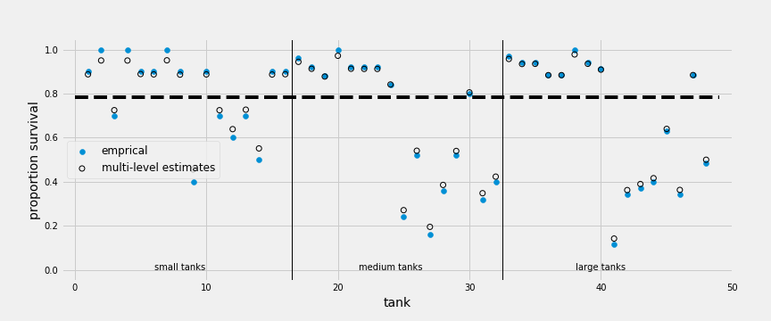
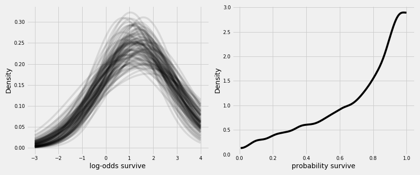
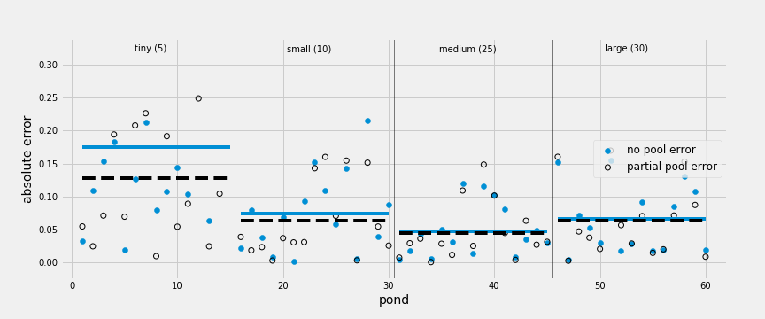
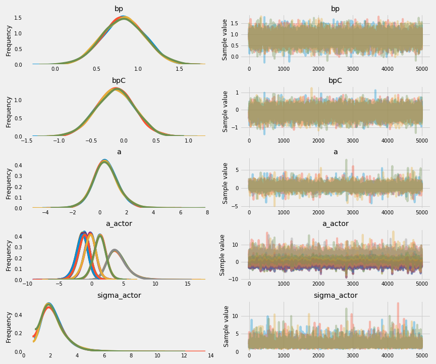
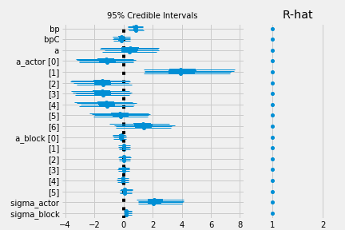
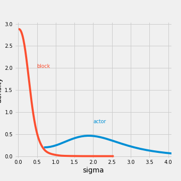
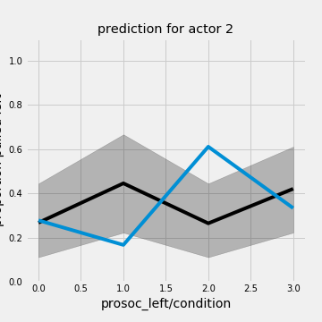
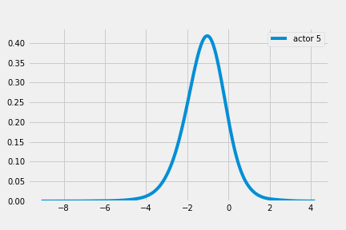

# Chapter 12 Multilevel Models

Multilevel/hierarchical/mixed-effect models learn priors from the data and tracks parameters from the learning process.

Advantages:

1. Improved estimates for repeat sampling. Avoid possible under- or over-fitting with traditional single-level models.
2. Improved estimates for imbalance in sampling.
3. Estimates of variation.
4. Avoid averaging, retain variation.

Costs:

1. Assumptions are different from traditional models
2. there are estimation challenges
3. hard to understand

## Example with tadpoles

48 tanks with tadpoles and different survival rates.

Traditional model for tank and survival rates:

$s_i \sim \text{Binomial}(n_i, p_i)$
$\text{logit}(p_i) = \alpha_{tank[i]}$
$\alpha_{tank} \sim \text{Normal}(0, 5)$

```python
# make the tank cluster variable
tank = np.arange(d.shape[0])
# fit
with pm.Model() as m_12_1:
    a_tank = pm.Normal('a_tank', 0, 5, shape=d.shape[0])
    p = pm.math.invlogit(a_tank[tank])
    surv = pm.Binomial('surv', n=d.density, p=p, observed=d.surv)
    trace_12_1 = pm.sample(2000, tune=2000, njobs=4)
# pm.summary(trace_12_1, alpha=.11).round(2)
```

The model has 48 intercepts for 48 tanks.

Multilevel model for tank and survival rates:

$s_i \sim \text{Binomial}(n_i, p_i)$
$\text{logit}(p_i) = \alpha_{tank[i]}$
$\alpha_{tank} \sim N(\alpha, \sigma)$
$\alpha \sim \text{Normal}(0,1)$
$\sigma \sim \text{HalfCauchy}(0, 1)$

$\alpha$ and $\sigma$: hyper-parameters with hyper-priors.

```python
with pm.Model() as m_12_2:
    a = pm.Normal('a', 0., 1.)
    sigma = pm.HalfCauchy('sigma', 1.)
    a_tank = pm.Normal('a_tank', a, sigma, shape=d.shape[0])
    p = pm.math.invlogit(a_tank[tank])
    surv = pm.Binomial('surv', n=d.density, p=p, observed=d.surv)
    trace_12_2 = pm.sample(2000, tune=2000, njobs=4)
```

The multilevel model has 50 parameters: 1 overall sample intercept $\alpha$, variance among tanks $\sigma$, and 48 intercepts. Use WAIC to compare:

```python
comp_df = pm.compare({m_12_1 : trace_12_1,
                      m_12_2 : trace_12_2},
                     method='pseudo-BMA')

comp_df.loc[:,'model'] = pd.Series(['m12.1', 'm12.2'])
comp_df = comp_df.set_index('model')
comp_df
```

|model|WAIC |pWAIC|dWAIC|weight| SE |dSE |var_warn|
|-----|----:|----:|----:|-----:|---:|---:|-------:|
|m12.2|200.4|21.03| 0.00|   0.6|7.09|0.00|       1|
|m12.1|201.2|22.48| 0.81|   0.4|9.27|4.46|       1|

The mean for $sigma$ (can be obtained with `pm.summary(trace_12_2)`) is around 1.6. This is a regularizing prior that we learned from the data.

Plotting the posterior medians from models:

```python
# extract PyMC3 samples
post = pm.trace_to_dataframe(trace_12_2, varnames=['a_tank'])

# compute median intercept for each tank
# also transform to probability with logistic
from scipy.special import expit as logistic
d.loc[:, 'propsurv_est'] = pd.Series(logistic(post.median(axis=0).values), index=d.index)

f, ax = plt.subplots(1, 1, figsize=(12, 5))
# display raw proportions surviving in each tank
ax.scatter(np.arange(1, 49), d.propsurv)
ax.scatter(np.arange(1, 49), d.propsurv_est,
             facecolors='none', edgecolors='k', lw=1)
ax.hlines(logistic(np.median(trace_12_2['a'], axis=0)), 0, 49, linestyles='--')
ax.vlines([16.5, 32.5], -.05, 1.05, lw=1)
ax.text(8, 0, "small tanks", horizontalalignment='center')
ax.text(16+8, 0, "medium tanks", horizontalalignment='center')
ax.text(32+8, 0, "large tanks", horizontalalignment='center')
ax.set_xlabel('tank', fontsize=14)
ax.set_ylabel('proportion survival', fontsize=14)
ax.set_xlim(-1, 50)
ax.set_ylim(-.05, 1.05);
```



Horizontal dashed line is the median survival rate. Vertical lines divides tanks based on number of tadpoles in the dataset (`density`). Several things:

1. In every case, the multilevel prediction is closer to the mean compared to the empirical estimate (shrinkage).
2. Smaller tanks have larger distance from the median.
3. Dots further away from the median has larger distance between empirical estimate (blue) and multilevel estimate (black circle).

Reason: pooling information from all tanks.

Plotting inferred population distribution of survival:

```python
from scipy import stats

f, ax = plt.subplots(1, 2, figsize=(12, 5))
# show first 100 populations in the posterior
xrange = np.linspace(-3, 4, 200)
postcurve = [stats.norm.pdf(xrange, loc=trace_12_2['a'][i], scale=trace_12_2['sigma'][i]) for i in range(100)]
ax[0].plot(xrange, np.asarray(postcurve).T,
           alpha=.1, color='k')
ax[0].set_xlabel('log-odds survive', fontsize=14)
ax[0].set_ylabel('Density', fontsize=14);
# sample 8000 imaginary tanks from the posterior distribution
sim_tanks = np.random.normal(loc=trace_12_2['a'], scale=trace_12_2['sigma'])
# transform to probability and visualize
pm.kdeplot(logistic(sim_tanks), ax=ax[1], color='k')
ax[1].set_xlabel('probability survive', fontsize=14)
ax[1].set_ylabel('Density', fontsize=14)
plt.tight_layout();
# dens( logistic(sim_tanks) , xlab="probability survive" )
```



## Varying effects and the underfitting/overfitting trade-off using simulated tadpole data

Varying intercepts are just regularized estimates adaptively regularized by estimating how diverse the clusters are. It helps with the trade off between underfitting and overfitting.

Reed frog survival problem:

1. complete pooling: estimating a common intercept for all ponds
2. no pooling: all ponds are different.
3. partial pooling: adaptive regularizing prior

**Complete pooling**: used a lot of data to estimate the mean, while the mean can be very different from any particular sample. Therefore the estimate of $\alpha$ is underfitting.

**No pooling**: each pond has little data and estimates are imprecise. Also no data is shared across the ponds. Overfitting.

**Partial pooling**: less underfit than no pooling estimates.

### model

$s_i \sim \text{Binomial}(n_i, p_i)$
$\text{logit} = \alpha_{\text{POND}[i]}$
$\alpha_{\text{POND}} \sim \text{Normal}(\alpha, \sigma)$
$\alpha \sim \text{Normal}(0, 1)$
$\sigma \sim \text{HalfCauchy(0, 1)}$

To simulate the data, we need to assign values to $\alpha$, $\sigma$, and $\alpha_{\text{POND}[i]}$.

**Notes:** priors do not need to be assigned. 
> Priors are epistemology, not ontology.

### Assign values to the parameters

```python
a, sigma, nponds = 1.4, 1.5, 60
ni = np.repeat([5, 10, 25, 35], 15)
#60 ponds with 15 each of initial density 5, 10, 25, and 35

a_pond = np.random.normal(loc=a, scale=sigma, size=nponds)
#60 intercepts for ponds

dsim = pd.DataFrame(dict(pond=np.arange(nponds), ni=ni, true_a=a_pond))
```

### Simulate survivors

probability of survival $p_i$:

$p_i = \frac{\exp(\alpha)}{1 + \exp(\alpha)}$

Simulating the survivor count for ponds:

```python
dsim.loc[:, 'si'] = np.random.binomial(dsim['ni'], logistic(dsim['true_a']))
```

### Compute the estimates

#### no-pooling

```python
dsim.loc[:, 'p_nopool'] = dsim.si / dsim.ni
```

#### partial pooling

```python
with pm.Model() as m_12_3:
    a = pm.Normal('a', 0., 1.)
    sigma = pm.HalfCauchy('sigma', 1.)
    a_pond = pm.Normal('a_pond', a, sigma, shape=nponds)
    p = pm.math.invlogit(a_pond[dsim.pond.values])
    si = pm.Binomial('si', n=dsim.ni.values, p=p, observed=dsim.si)
    trace_12_3 = pm.sample(1000, tune=1000)

summary_12_3 = pm.summary(trace_12_3, alpha=.11)
summary_12_3.iloc[[0, 1, 2, -3, -2, -1],:].round(2)
```

||mean| sd |mc_error|hpd_5.5|hpd_94.5|n_eff |Rhat|
|----------|---:|---:|-------:|------:|-------:|-----:|---:|
|a         |1.29|0.20|    0.01|   0.96|    1.60|1599.4|   1|
|a_pond__0 |2.34|1.06|    0.02|   0.77|    4.04|2077.4|   1|
|a_pond__1 |2.38|1.07|    0.03|   0.66|    3.95|1377.0|   1|
|a_pond__58|0.26|0.33|    0.01|  -0.26|    0.80|3426.7|   1|
|a_pond__59|3.53|0.83|    0.02|   2.20|    4.74|1654.9|   1|
|sigma     |1.32|0.20|    0.01|   0.99|    1.60| 666.3|   1|

Calculate the predicted survival proportions and probability:

```python
estimated_a_pond = pm.summary(trace_12_3, alpha=.11, varnames=['a_pond'])
dsim.loc[:, 'p_partpool'] = logistic(estimated_a_pond['mean'].values)
```

Compute the absolute error between the estimates and true varying effects

```python
nopool_error = np.abs(dsim.p_nopool - dsim.p_true)
partpool_error = np.abs(dsim.p_partpool - dsim.p_true)
```

Plotting:

```python
fig, ax = plt.subplots(1, 1, figsize=(12, 5))
xrange = np.arange(60)
xrange_ = xrange.reshape((4, 15))
# display raw proportions surviving in each tank
ax.scatter(xrange+1, nopool_error)
ax.scatter(xrange+1, partpool_error,
             facecolors='none', edgecolors='k', lw=1)
ax.vlines(xrange_[1:,0]+.5, -.025, 0.35, lw=.5)

textall = ["tiny (5)", "small (10)", "medium (25)", "large (30)"]
for isem in range(4):
    ax.hlines(nopool_error[xrange_[isem, :]].mean(), 
              xrange_[isem, 0]+1, xrange_[isem, -1]+1, color='C0')
    ax.hlines(partpool_error[xrange_[isem, :]].mean(), 
              xrange_[isem, 0]+1, xrange_[isem, -1]+1, color='k', linestyles='--')
    ax.text(xrange_[isem, 7]+.5, 0.32, textall[isem], horizontalalignment='center')
ax.set_xlabel('pond', fontsize=14)
ax.set_ylabel('absolute error', fontsize=14)
ax.set_xlim(-1, 62)
ax.set_ylim(-.025, 0.34)
```



Small pools created more error, and partial pool estimates are better on average, especially in smaller ponds. This is no coincidence—small ponds have fewer samples and are more easily influenced by pooled info from other ponds (prone to over-fitting).

## More than one type of cluster

Often use more than one type of cluster in the same model, for different experiment conditions.

Example: the chimpanzee data.

### Multilevel chimpanzees

Model with multilevel actors

$L_i \sim \text{Binomial} (l, p_i)$
$\text{logit}(p_i) = \alpha + \alpha_{\text{ACTOR}[i]} + (\beta_P + \beta_{PC}C_i)P_i$
$\alpha_{\text{ACTOR}[i]} \sim \text{Normal}(0, \sigma_{\text{ACTOR}})$
$\alpha \sim \text{Normal} (0, 10)$
$\beta_P \sim \text{Normal}(0, 10)$
$\beta_{PC} \sim \text{Normal}(0, 10)$
$\sigma_{\text{ACTOR}} \sim \text{HalfCauchy}(0, 1)$

```python
y1 = np.random.normal(10., 1., 10000)
y2 = 10. + np.random.normal(0., 1., 10000)

d = pd.read_csv('Data/chimpanzees.csv', sep=";")
# we change "actor" to zero-index
d.actor = (d.actor - 1).astype(int)
Nactor = len(d.actor.unique())

with pm.Model() as m_12_4:
    bp = pm.Normal('bp', 0, 10)
    bpC = pm.Normal('bpC', 0, 10)
    
    a = pm.Normal('a', 0, 10)
    sigma_actor = pm.HalfCauchy('sigma_actor', 1.)
    a_actor = pm.Normal('a_actor', 0., sigma_actor, shape=Nactor)

    p = pm.math.invlogit(a + a_actor[d.actor.values] + (bp + bpC * d.condition) * d.prosoc_left)
    pulled_left = pm.Binomial('pulled_left', 1, p, observed=d.pulled_left)

    trace_12_4 = pm.sample(5000, tune=1000, njobs=4)
pm.traceplot(trace_12_4)
pm.summary(trace_12_4, alpha=.11).round(2)
```



||mean | sd |mc_error|hpd_5.5|hpd_94.5| n_eff |Rhat|
|-----------|----:|---:|-------:|------:|-------:|------:|---:|
|bp         | 0.82|0.26|    0.00|   0.40|    1.23|11185.1|   1|
|bpC        |-0.13|0.30|    0.00|  -0.61|    0.33|11385.6|   1|
|a          | 0.46|0.97|    0.02|  -0.97|    2.01| 3392.1|   1|
|a_actor__0 |-1.18|0.99|    0.02|  -2.72|    0.29| 3481.3|   1|
|a_actor__1 | 4.15|1.62|    0.02|   1.79|    6.35| 6235.2|   1|
|a_actor__2 |-1.48|1.00|    0.02|  -3.05|   -0.03| 3509.8|   1|
|a_actor__3 |-1.48|0.99|    0.02|  -2.96|    0.04| 3455.4|   1|
|a_actor__4 |-1.18|0.99|    0.02|  -2.69|    0.30| 3500.4|   1|
|a_actor__5 |-0.24|0.99|    0.02|  -1.77|    1.23| 3505.2|   1|
|a_actor__6 | 1.30|1.01|    0.02|  -0.22|    2.84| 3679.8|   1|
|sigma_actor| 2.28|0.95|    0.01|   1.04|    3.46| 5481.5|   1|

**Note**: `a_actor` parameters are deviations from `a`. For any given row, the total intercept is $\alpha + \alpha_{\text{ACTOR}[i]}$. To get the true intercept for each model:

```python
total_a_actor = np.asarray([trace_12_4['a'] + trace_12_4['a_actor'][:, i] for i in range(Nactor)])
total_a_actor.mean(axis=1).round(2)
#array([-0.71,  4.61, -1.02, -1.02, -0.71,  0.23,  1.76])
```

### Two types of cluster

$L_i \sim \text{Binomial} (l, p_i)$
$\text{logit}(p_i) = \alpha + \alpha_{\text{ACTOR}[i]} + \alpha_{\text{BLOCK}[i]} + (\beta_P + \beta_{PC}C_i)P_i$
$\alpha_{\text{ACTOR}[i]} \sim \text{Normal}(0, \sigma_{\text{ACTOR}})$
$\alpha \sim \text{Normal} (0, 10)$
$\beta_P \sim \text{Normal}(0, 10)$
$\beta_{PC} \sim \text{Normal}(0, 10)$
$\sigma_{\text{ACTOR}} \sim \text{HalfCauchy}(0, 1)$
$\sigma_{\text{BLOCK}} \sim \text{HalfCauchy}(0, 1)$

```python
d.block = (d.block - 1).astype(int)
Nblock = len(d.block.unique())

with pm.Model() as m_12_5:
    bp = pm.Normal('bp', 0, 10)
    bpC = pm.Normal('bpC', 0, 10)
    a = pm.Normal('a', 0, 10)
    sigma_actor = pm.HalfCauchy('sigma_actor', 1.)
    a_actor = pm.Normal('a_actor', 0., sigma_actor, shape=Nactor)
    sigma_block = pm.HalfCauchy('sigma_block', 1.)
    a_block = pm.Normal('a_block', 0., sigma_block, shape=Nblock)
    p = pm.math.invlogit(a + a_actor[d.actor.values] + a_block[d.block.values]
                         + (bp + bpC * d.condition) * d.prosoc_left)
    pulled_left = pm.Binomial('pulled_left', 1, p, observed=d.pulled_left)
    trace_12_5 = pm.sample(6000, tune=1000, njobs=4)
    pm.summary(trace_12_5, alpha=.11).round(2)
```

||mean | sd |mc_error|hpd_5.5|hpd_94.5| n_eff |Rhat|
|-----------|----:|---:|-------:|------:|-------:|------:|---:|
|bp         | 0.83|0.26|    0.00|   0.41|    1.25|16247.8|   1|
|bpC        |-0.14|0.30|    0.00|  -0.60|    0.36|16448.6|   1|
|a          | 0.45|0.97|    0.02|  -1.06|    1.88| 3984.2|   1|
|a_actor__0 |-1.17|0.98|    0.02|  -2.57|    0.41| 3612.6|   1|
|a_actor__1 | 4.21|1.74|    0.02|   1.87|    6.47| 5501.2|   1|
|a_actor__2 |-1.47|0.99|    0.02|  -2.95|    0.04| 3583.6|   1|
|a_actor__3 |-1.47|0.98|    0.02|  -2.93|    0.02| 4210.3|   1|
|a_actor__4 |-1.16|0.98|    0.02|  -2.60|    0.38| 3898.5|   1|
|a_actor__5 |-0.22|0.98|    0.02|  -1.72|    1.26| 3762.9|   1|
|a_actor__6 | 1.33|1.01|    0.02|  -0.24|    2.83| 3897.0|   1|
|a_block__0 |-0.18|0.23|    0.00|  -0.54|    0.13| 5931.4|   1|
|a_block__1 | 0.04|0.19|    0.00|  -0.25|    0.33| 9085.6|   1|
|a_block__2 | 0.06|0.20|    0.00|  -0.22|    0.38| 8332.4|   1|
|a_block__3 | 0.01|0.19|    0.00|  -0.29|    0.29|10220.2|   1|
|a_block__4 |-0.03|0.19|    0.00|  -0.33|    0.26|10389.3|   1|
|a_block__5 | 0.12|0.21|    0.00|  -0.17|    0.45| 6269.8|   1|
|sigma_actor| 2.30|0.98|    0.02|   1.10|    3.51| 4515.0|   1|
|sigma_block| 0.23|0.18|    0.00|   0.01|    0.44| 3007.7|   1|

Different `n_eff` since some parameters spend more interations on a boundary. `sigma_actor` has larger variation compare to `sigma_block`. Compare the marginal posterior distributions of these two parameters:

```python
pm.forestplot(trace_12_5)
```



```python
fig, ax = plt.subplots(1, 1, figsize=(5, 5))
pm.kdeplot(trace_12_5['sigma_actor'], ax=ax)
pm.kdeplot(trace_12_5['sigma_block'], ax=ax)
ax.text(2, 0.75, "actor", color='C0')
ax.text(0.5, 2, "block", color='C1')
ax.set_xlabel('sigma', fontsize=14)
ax.set_ylabel('density', fontsize=14)
ax.set_xlim(-0.1, 4.1)
ax.set_ylim(-0.05, 3.05);
```

Actors vary more compared to blocks. Adding `block` to the model does not add over-fitting risk.



Compare the model:

```python
comp_df = pm.compare({m_12_4 : trace_12_4, 
                      m_12_5 : trace_12_5},
                     method='pseudo-BMA')
comp_df.loc[:,'model'] = pd.Series(['m12.4', 'm12.5'])
comp_df = comp_df.set_index('model')
comp_df
```

|model|WAIC |pWAIC|dWAIC|weight| SE  |dSE |var_warn|
|-----|----:|----:|----:|-----:|----:|---:|-------:|
|m12.4|531.3| 8.10| 0.00|  0.56|19.49|0.00|       0|
|m12.5|531.8| 9.81| 0.49|  0.44|19.40|1.79|       0|

The number of added "effective parameter" (`pWAIC`) is about 1.7. This is because posterior distribution of `block` ended up close to 0. As is seen in the forest plot, the `block` parameters are all close to 0.

### Even more clusters

Include more clusters if theoretically necessary. Hamiltonian Monte Carlo is capable with varying effects.

## Multilevel posterior predictions

Two ways to check a model:

1. check predictions
2. check information criteria

### Posterior prediction for same clusters

```python
chimp = 2
sel_actor = np.where((d.actor == (chimp)).values)[0]
_, uni_cond = np.unique(d.loc[sel_actor, ['condition', 'prosoc_left']], 
                        axis=0, return_index=True, )
d.loc[sel_actor[uni_cond], :].head()
ppc = pm.sample_ppc(trace=trace_12_4, samples=1000, model=m_12_4)

rt = ppc['pulled_left'][:, sel_actor]

pred_mean = np.zeros((1000, 4))
cond = d.condition.unique()
prosoc_l = d.prosoc_left.unique()
for i in range(len(rt)):
    tmp = []
    for cp in cond:
        for pl in prosoc_l:
            tmp.append(np.mean(rt[i][(d.prosoc_left[sel_actor].values==pl) &
                                     (d.condition[sel_actor].values==cp)]))
    pred_mean[i] = tmp
    
mp = pred_mean.mean(0)
hpd = pm.hpd(pred_mean, alpha=.11)

fig, ax = plt.subplots(1, 1, figsize=(5, 5))
ax.fill_between(range(4), hpd[:,1], hpd[:,0], alpha=0.25, color='k')
ax.plot(mp, color='k')
chimps = d.groupby(['actor', 'prosoc_left', 'condition']).agg('mean')['pulled_left'].values.reshape(7, -1)
ax.plot(chimps[chimp], 'C0')

ax.set_ylim(0, 1.1)
ax.set_xlabel("prosoc_left/condition", fontsize=14)
ax.set_ylabel("proportion pulled left", fontsize=14)
ax.set_xticks(range(4), ("0/0","1/0","0/1","1/1"))
ax.set_title('prediction for actor 2')
```



Predict using all models:

```python
post = pm.trace_to_dataframe(trace_12_4)
post.head()
#printing only top 5, total of 20000 models
```

||  bp  |  bpC  |   a    |a_actor__0|a_actor__1|a_actor__2|a_actor__3|a_actor__4|a_actor__5|a_actor__6|sigma_actor|
|----:|-----:|------:|-------:|---------:|---------:|---------:|---------:|---------:|---------:|---------:|----------:|
|    0|1.0008|-0.4795|-0.04767|   -0.4112|     2.526|   -0.7789|   -0.9088|   -0.8473|  0.577762|    1.8292|     0.9937|
|    1|1.2567|-0.4150| 0.59804|   -1.5295|     6.938|   -1.7115|   -1.8828|   -1.7638| -0.236458|    0.7876|     3.0102|
|    2|0.8637|-0.5532| 0.63770|   -1.4164|     3.551|   -1.5275|   -1.5929|   -1.5425| -0.006567|    0.9894|     1.1968|
|    3|1.2170|-0.4076| 0.52084|   -1.5979|     2.885|   -1.9169|   -1.5457|   -1.4829| -0.474407|    1.0467|     2.1502|
|    4|1.2503|-0.3386| 0.88120|   -1.7849|     1.966|   -2.0592|   -2.3365|   -1.9626| -1.018510|    1.1814|     2.0638|

Density for `actor 5`:

```python
pm.kdeplot(trace_12_4['a_actor'][:, 5-1]);
```



Create our own link function:

```python
def p_link(prosoc_left, condition, actor, trace):
    logodds = trace['a'] + \
                trace['a_actor'][:, actor] + \
                (trace['bp'] + trace['bpC'] * condition) * prosoc_left
    return logistic(logodds)
```

```python
prosoc_left = [0,1,0,1]
condition = [0,0,1,1]

pred_raw = np.asarray([p_link(p_l, c_d, 2-1, trace_12_4) 
                       for p_l, c_d in zip(prosoc_left, condition)]).T
pred_p = pred_raw.mean(axis=0)
pred_p_PI = pm.hpd(pred_raw, alpha=.11)
```

### posterior prediction for new clusters