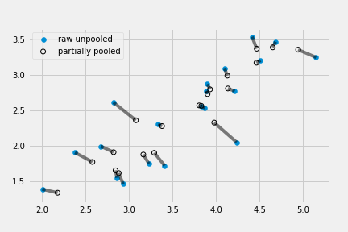

# Adventures in Covariance

Model:

$\mu_i = \alpha_{\text{CAFE}[i]} + \beta_{\text{cafe}[i]}A_i$

Sampled different values for intercept and slope should be pooled. But the intercepts and slopes may covary.

Example: a busy cafe would be much less busy in the afternoon, while an unpopular one won't differ much. In other words, the slope and intercept covary/correlate. If we can pool the information across different parameters, it would be helpful. Covariation of variables can be modeled using Gaussian processes.

## Varying slopes by construction

Simulate the covarying intercepts and slopes of the coffee robots:

### Simulate the population

```python
a = 3.5        # average morning wait time
b = -1.        # average difference afternoon wait time
sigma_a = 1.   # std dev in intercepts
sigma_b = 0.5  # std dev in slopes
rho = -0.7     # correlation between intercepts and slopes
```

To build a 2 by 2 matrix of variances and covariances:

```python
Mu = [a, b]
```

To build the matrix of variances and covariances:

$\begin{pmatrix}
\sigma_\alpha^2 & \sigma_\alpha\sigma_\beta\rho\\
\sigma_\alpha\sigma_\beta\rho & \sigma_\beta^2
\end{pmatrix}$

Diagonal elements: variances of slope and intercept. Others: covariance between slope and intercept.

```python
cov_ab = sigma_a * sigma_b * rho
Sigma = np.array([[sigma_a**2, cov_ab], [cov_ab, sigma_b**2]])
```

The other way to define the variance/covariance matrix:

```python
sigmas = [sigma_a, sigma_b]
Rho = np.matrix([[1, rho], [rho, 1]])

Sigma = np.diag(sigmas) * Rho * np.diag(sigmas)
```

Simulate cafes with intercepts and slopes:

```python
N_cafes = 20

np.random.seed(42)
vary_effects = np.random.multivariate_normal(mean=Mu, cov=Sigma, size=N_cafes)

a_cafe = vary_effects[:, 0]
b_cafe = vary_effects[:, 1]
```

Plot the slopes and intercepts

```python
from matplotlib.patches import Ellipse
from scipy.stats import chi2
def Gauss2d(mu, cov, ci, ax=None):
    """Copied from statsmodel"""
    if ax is None:
        _, ax = plt.subplots(figsize=(6, 6))

    v_, w = np.linalg.eigh(cov)
    u = w[0] / np.linalg.norm(w[0])
    angle = np.arctan(u[1]/u[0])
    angle = 180 * angle / np.pi # convert to degrees

    for level in ci:
        v = 2 * np.sqrt(v_ * chi2.ppf(level, 2)) #get size corresponding to level
        ell = Ellipse(mu[:2], v[0], v[1], 180 + angle, facecolor='None',
                      edgecolor='k',
                      alpha=(1-level)*.5,
                      lw=1.5)
        ell.set_clip_box(ax.bbox)
        ell.set_alpha(0.5)
        ax.add_artist(ell)

    return ax

f, ax = plt.subplots(1, 1, figsize=(5, 5))
Gauss2d(Mu, np.asarray(Sigma), [0.1, 0.3, 0.5, 0.8, 0.99], ax=ax)
ax.scatter(a_cafe, b_cafe)
ax.set_xlim(1.5, 6.1)
ax.set_ylim(-2, 0)
ax.set_xlabel('intercepts (a_cafe)')
ax.set_ylabel('slopes (b_cafe)');
```


### Simulate observations

```python
N_visits = 10
is_afternoon = np.tile([0,1], N_visits * N_cafes//2)  # wrap with int() to suppress warnings
cafe_id = np.repeat(np.arange(0, N_cafes), N_visits)  # 1-20 (minus 1 for python indexing)

mu = a_cafe[cafe_id] + b_cafe[cafe_id]*is_afternoon
sigma = 0.5 # std dev within cafes
wait = np.random.normal(loc=mu, scale=sigma, size=N_visits*N_cafes)
d = pd.DataFrame(dict(cafe=cafe_id , is_afternoon=is_afternoon , wait=wait))
```

### The varying slope model

$W_i \sim \text{Normal}(\mu_i, \sigma)$
$\mu_i = \alpha_{\text{CAFE}[i]} + \beta_{\text{CAFE}[i]}A_i$
$\begin{bmatrix} \alpha_{CAFE} \\ \beta_{CAFE} \end{bmatrix} \sim \text{MVNormal} (\begin{bmatrix} \alpha \\ \beta \end{bmatrix}, S)$
$S = \begin{pmatrix} \sigma_\alpha & 0 \\ 0 & \sigma_\beta \end{pmatrix} R \begin{pmatrix} \sigma_\alpha & 0 \\ 0 & \sigma_\beta \end{pmatrix}$
$\alpha \sim \text{Normal}(0, 10)$
$\beta \sim \text{Normal}(0, 10)$
$\sigma \sim \text{HalfCauchy}(0, 1)$
$\sigma_\alpha \sim \text{HalfCauchy}(0, 1)$
$\sigma_\beta \sim \text{HalfCauchy}(0, 1)$
$R \sim \text{LKJcorr}(2)$

**Third equation**: each cafe has an intercept $\alpha_{CAFE}$ and slope $\beta_{CAFE}$ with a prior distribution defined by the two-dimensional Gaussian distribution with mean $\alpha$ and $\beta$, and covariance matrix $S$.

**Fourth equation**: the way to construct the covariance matrix.

**Last equation**: the definition of $R$ would look like $R = \begin{pmatrix} 1 & \rho \\ \rho & 1 \end{pmatrix}$ where $\rho$ is the correlation. So it's one-parameter prior.

What a LKJcorr distribution looks like:

```python
R = pm.LKJCorr.dist(n=2, eta=2).random(size=10000)
f, ax = plt.subplots(1, 1, figsize=(5, 5))
pm.kdeplot(R, ax=ax);
ax.set_xlabel('correlation')
ax.set_ylabel('Density');
```

The single parameter of `LKJcorr` is $\eta$ which controls how skeptical the prior is of large correlations in the matrix.


Fit the model:

```python
cafe_idx = d['cafe'].values
with pm.Model() as m_13_1:
    sd_dist = pm.HalfCauchy.dist(beta=2) # This is the same as sigma_cafe ~ dcauchy(0,2)
    packed_chol = pm.LKJCholeskyCov('chol_cov', eta=2, n=2, sd_dist=sd_dist)

    # compute the covariance matrix
    chol = pm.expand_packed_triangular(2, packed_chol, lower=True)
    cov = tt.dot(chol, chol.T)

    # Extract the standard deviations and rho
    sigma_ab = pm.Deterministic('sigma_cafe', tt.sqrt(tt.diag(cov)))
    corr = tt.diag(sigma_ab**-1).dot(cov.dot(tt.diag(sigma_ab**-1)))
    r = pm.Deterministic('Rho', corr[np.triu_indices(2, k=1)])

    ab = pm.Normal('ab', mu=0, sd=10, shape=2)  # prior for average intercept and slope
    ab_cafe = pm.MvNormal('ab_cafe', mu=ab, chol=chol, shape=(N_cafes, 2)) # Population of varying effects
    # Shape needs to be (N_cafes, 2) because we're getting back both a and b for each cafe

    mu = ab_cafe[:, 0][cafe_idx] + ab_cafe[:, 1][cafe_idx] * d['is_afternoon'].values  # linear model
    sd = pm.HalfCauchy('sigma', beta=2)      # prior stddev within cafes
    wait = pm.Normal('wait', mu=mu, sd=sd, observed=d['wait'])  # likelihood
    trace_13_1 = pm.sample(5000, tune=2000)
```

```python
pm.traceplot(trace_13_1, varnames=['ab', 'Rho', 'sigma', 'sigma_cafe'],
             lines={"ab": Mu,
                    "Rho": rho,
                    "sigma": sigma,
                    "sigma_cafe": sigmas});
```


Examine the posterior correlation between intercepts and slopes

```python
post = pm.trace_to_dataframe(trace_13_1)
fig, ax = plt.subplots(1, 1, figsize=(5, 5))
R = pm.LKJCorr.dist(n=2, eta=2).random(size=10000)
pm.kdeplot(R, ax=ax, color='k', linestyle='--')
ax.text(0, .8, 'prior', horizontalalignment='center')
pm.kdeplot(trace_13_1['Rho'], ax=ax, color='C0')
ax.text(-.15, 1.5, 'posterior', color='C0', horizontalalignment='center')
ax.set_ylim(-.025, 2.5)
ax.set_xlabel('correlation', fontsize=14)
ax.set_ylabel('Density', fontsize=14)
```

The blue line is posterior distribution of the correlation, and dashed grey line is prior distribution defined by `LKJcorr(2)` density.


Visualize the posterior mean varying effects and shrinkage from the raw, unpooled estimates.

```python
# compute unpooled estimates directly from data
a1b1 = (d.groupby(['is_afternoon', 'cafe'])
        .agg('mean')
        .unstack(level=0)
        .values)
a1 = a1b1[:, 0]
b1 = a1b1[:, 1] - a1

# extract posterior means of partially pooled estimates
a2b2 = trace_13_1['ab_cafe'].mean(axis=0)
a2 = a2b2[:, 0]
b2 = a2b2[:, 1]

# plot both and connect with lines
_, ax = plt.subplots(1, 1, figsize=(5, 5))
ax.scatter(a1, b1)
ax.scatter(a2, b2,
           facecolors='none', edgecolors='k', lw=1)

ax.plot([a1, a2], [b1, b2], 'k-', alpha=.5)
ax.set_xlabel('intercept', fontsize=14)
ax.set_ylabel('slope', fontsize=14)
```


with contour:


Compute the average outcomes from the linear model:

```python
# convert varying effects to waiting times
wait_morning_1 = a1
wait_afternoon_1 = a1 + b1
wait_morning_2 = a2
wait_afternoon_2 = a2 + b2

f, ax = plt.subplots()
Gauss2d(Mu_est, np.asarray(Sigma_est), [0.1, 0.3, 0.5, 0.8, 0.99], ax=ax)
ax.scatter(wait_morning_1, wait_afternoon_1, label='raw unpooled')
ax.scatter(wait_morning_2, wait_afternoon_2, facecolors='none', edgecolors='k', lw=1, label='partially pooled')
ax.plot([wait_morning_1, wait_morning_2], [wait_afternoon_1, wait_afternoon_2], 'k-', alpha=.5)
ax.legend()
```



## Example: admission decisions and gender

Using the varying effect to pool information across departments.

```python
d_ad = pd.read_csv('./Data/UCBadmit.csv', sep=';')
d_ad['male'] = (d_ad['applicant.gender'] == 'male').astype(int)
d_ad['dept_id'] = pd.Categorical(d_ad['dept']).codes
```

Fit models

### Varying intercepts

$A_i \sim \text{Binomial}(n_i, p_i)$
$logit(pi) = \alpha_{\text{DEPT}[i]} + \beta m_i$
$\alpha_{\text{DEPT}} \sim \text{Normal}(\alpha, \sigma)$
$\alpha \sim \text{Normal}(0, 10)$
$\beta \sim \text{Normal}(0, 1)$
$\sigma \sim \text{HalfCauchy}(0, 2)$

```python
Dept_id = d_ad['dept_id'].values
Ndept = len(d_ad['dept_id'].unique())
with pm.Model() as m_13_2:
    a = pm.Normal('a', 0, 10)
    bm = pm.Normal('bm', 0, 1)
    sigma_dept = pm.HalfCauchy('sigma_dept', 2)
    a_dept = pm.Normal('a_dept', a, sigma_dept, shape=Ndept)
    p = pm.math.invlogit(a_dept[Dept_id] + bm * d_ad['male'])
    admit = pm.Binomial('admit', p=p, n=d_ad.applications, observed=d_ad.admit)

    trace_13_2 = pm.sample(4500, tune=500)
pm.summary(trace_13_2, alpha=.11).round(2)
```

||mean | sd |mc_error|hpd_5.5|hpd_94.5| n_eff |Rhat|
|----------|----:|---:|-------:|------:|-------:|------:|---:|
|a         |-0.59|0.65|    0.01|  -1.54|    0.44| 7727.9|   1|
|bm        |-0.09|0.08|    0.00|  -0.22|    0.03| 4516.4|   1|
|a_dept__0 | 0.67|0.10|    0.00|   0.52|    0.83| 5452.3|   1|
|a_dept__1 | 0.63|0.12|    0.00|   0.44|    0.82| 6138.4|   1|
|a_dept__2 |-0.58|0.07|    0.00|  -0.70|   -0.46| 8464.4|   1|
|a_dept__3 |-0.62|0.09|    0.00|  -0.76|   -0.49| 7558.6|   1|
|a_dept__4 |-1.06|0.10|    0.00|  -1.22|   -0.90|10306.9|   1|
|a_dept__5 |-2.61|0.16|    0.00|  -2.86|   -2.36|11362.3|   1|
|sigma_dept| 1.48|0.59|    0.01|   0.75|    2.21| 5605.5|   1|

### Varying effects of being male

$A_i \sim \text{Binomial}(n_i, p_i)$
$\text{logit}(p_i) = \alpha_{\text{DEPT}[i]} + \beta_{\text{DEPT}[i]}m_i$
$\begin{bmatrix} \alpha_{DEPT} \\ \beta_{DEPT} \end{bmatrix} \sim \text{MVNormal} (\begin{bmatrix} \alpha \\ \beta \end{bmatrix}, S)$
$S = \begin{pmatrix} \sigma_\alpha & 0 \\ 0 & \sigma_\beta \end{pmatrix} R \begin{pmatrix} \sigma_\alpha & 0 \\ 0 & \sigma_\beta \end{pmatrix}$
$\alpha \sim \text{Normal}(0, 10)$
$\beta \sim \text{Normal}(0, 1)$
$\sigma_\alpha, \sigma_\beta \sim \text{HalfCauchy}(0, 2)$
$R \sim \text{LKJcorr}(2)$

fitting the model:

```python
with pm.Model() as m_13_3:
    a = pm.Normal('a', 0, 10)
    bm = pm.Normal('bm', 0, 1)

    sd_dist = pm.HalfCauchy.dist(beta=2)
    packed_chol = pm.LKJCholeskyCov('chol_cov', eta=2, n=2, sd_dist=sd_dist)

    # compute the covariance matrix
    chol = pm.expand_packed_triangular(2, packed_chol, lower=True)
    cov = tt.dot(chol, chol.T)

    # Extract the standard deviations and rho
    sigma_ab = pm.Deterministic('sigma_dept', tt.sqrt(tt.diag(cov)))
    corr = tt.diag(sigma_ab**-1).dot(cov.dot(tt.diag(sigma_ab**-1)))
    r = pm.Deterministic('Rho', corr[np.triu_indices(2, k=1)])

    mu = pm.MvNormal('ab_cafe', mu=tt.stack([a, bm]), chol=chol, shape=(Ndept, 2))

    a_dept = pm.Deterministic('a_dept', mu[:, 0])
    a_dept = pm.Deterministic('bm_dept', mu[:, 1])

    p = pm.math.invlogit(mu[Dept_id, 0] + mu[Dept_id, 1] * d_ad['male'])
    admit = pm.Binomial('admit', p=p, n=d_ad.applications, observed=d_ad.admit)

    trace_13_3 = pm.sample(5000, tune=1000, njobs=4)
```

```python
pm.forestplot(trace_13_3, varnames=['bm_dept', 'a_dept'], alpha=.11);
```


The intercepts range all over the place, while most slopes are close to zero. The conclusions: departments vary in admission rates, but do not discriminate much.

Department 1 and 2 has relatively large bias, and their intercepts are also greatest. Let's look at the estimated correlation next.

### Model comparison

We can fit a model that ignores gender:

```python
with pm.Model() as m_13_4:
    a = pm.Normal('a', 0, 10)
    sigma_dept = pm.HalfCauchy('sigma_dept', 2)
    a_dept = pm.Normal('a_dept', a, sigma_dept, shape=Ndept)
    p = pm.math.invlogit(a_dept[Dept_id])
    admit = pm.Binomial('admit', p=p, n=d_ad.applications, observed=d_ad.admit)

    trace_13_4 = pm.sample(4500, tune=500)

comp_df = pm.compare({m_13_2:trace_13_2,
                      m_13_3:trace_13_3,
                      m_13_4:trace_13_4})

comp_df.loc[:,'model'] = pd.Series(['m13.2', 'm13.3', 'm13.4'])
comp_df = comp_df.set_index('model')
comp_df
```

|model| WAIC |pWAIC|dWAIC|weight| SE  | dSE |var_warn|
|-----|-----:|----:|----:|-----:|----:|----:|-------:|
|m13.3| 90.63| 6.61| 0.00|  0.83| 4.40| 0.00|       1|
|m13.4|105.18| 6.54|14.54|  0.17|17.26|14.72|       1|
|m13.2|108.19| 9.23|17.56|  0.00|15.76|13.03|       1|

The varying slope model `m13.3` dominates the gender-less model `m13.4` and constant gender effect `m13.2`.

## Cross-classified chimpanzees with varying slopes

2 Varying effects—varying intercepts and varying slopes, for more than 1 type of cluster.

Construct a cross-classified varying slopes model:

$L_i \sim \text{Binomial}(1, p_i)$
Linear model skeleton:
$\text{logit}(p_i) = \Alpha_i + (\Beta_{p, i} + \Beta_{PC, i}C_i) P_i$
Intercept model:
$\Alpha_i = \alpha + \alpha_{\text{ACTOR}[i]} + \alpha_{\text{BLOCK}[i]}$
$P$ slope model:
$\Beta_{P, i} = \Beta_P + \Beta_{P, \text{ACTOR}[i]} + \Beta_{P, \text{BLOCK}[i]}$
$P \times C$ interaction model:
$\Beta_{PC, i} = \Beta_P + \Beta_{PC, \text{ACTOR}[i]} + \Beta_{PC, \text{BLOCK}[i]}$

```python
d = pd.read_csv('Data/chimpanzees.csv', sep=";")
# we change "actor" and "block" to zero-index
actor = (d['actor'] - 1).values
block = (d['block'] - 1).values
Nactor = len(np.unique(actor))
Nblock = len(np.unique(block))

with pm.Model() as model_13_6:
    sd_dist = pm.HalfCauchy.dist(beta=2)
    pchol1 = pm.LKJCholeskyCov('pchol_actor', eta=4, n=3, sd_dist=sd_dist)
    pchol2 = pm.LKJCholeskyCov('pchol_block', eta=4, n=3, sd_dist=sd_dist)
    chol1 = pm.expand_packed_triangular(3, pchol1, lower=True)
    chol2 = pm.expand_packed_triangular(3, pchol2, lower=True)

    Intercept = pm.Normal('intercept', 0., 1., shape=3)

    beta_actor = pm.MvNormal('beta_actor', mu=0., chol=chol1, shape=(Nactor, 3))
    beta_block = pm.MvNormal('beta_block', mu=0., chol=chol2, shape=(Nblock, 3))

    A = Intercept[0] + beta_actor[actor, 0] + beta_block[block, 0]
    BP = Intercept[1] + beta_actor[actor, 1] + beta_block[block, 1]
    BPC = Intercept[2] + beta_actor[actor, 2] + beta_block[block, 2]

    p = pm.math.invlogit(A + (BP + BPC*d['condition'])*d['prosoc_left'])
    pulled_left = pm.Binomial('pulled_left', 1, p, observed=d['pulled_left'])

    trace_13_6 = pm.sample(5000, tune=1000)
```

Use non-centered parameterization to address divergent iterations.

```python
with pm.Model() as model_13_6NC:
    sd_dist = pm.HalfCauchy.dist(beta=2)
    pchol1 = pm.LKJCholeskyCov('pchol_actor', eta=4, n=3, sd_dist=sd_dist)
    pchol2 = pm.LKJCholeskyCov('pchol_block', eta=4, n=3, sd_dist=sd_dist)
    chol1 = pm.expand_packed_triangular(3, pchol1, lower=True)
    chol2 = pm.expand_packed_triangular(3, pchol2, lower=True)

    Intercept = pm.Normal('intercept', 0., 1., shape=3)

    b1 = pm.Normal('b1', 0., 1., shape=(3, Nactor))
    b2 = pm.Normal('b2', 0., 1., shape=(3, Nblock))
    beta_actor = tt.dot(chol1, b1)
    beta_block = tt.dot(chol2, b2)

    A = Intercept[0] + beta_actor[0, actor] + beta_block[0, block]
    BP = Intercept[1] + beta_actor[1, actor] + beta_block[1, block]
    BPC = Intercept[2] + beta_actor[2, actor] + beta_block[2, block]

    p = pm.math.invlogit(A + (BP + BPC*d['condition'])*d['prosoc_left'])
    pulled_left = pm.Binomial('pulled_left', 1, p, observed=d['pulled_left'])

    trace_13_6NC = pm.sample(5000, tune=1000)
```


The non-centered parameterzation uses more effective samples.

Check the posterior:

```python
# I didnt compute the sigma from the chol above, got to get a bit more creative here
def unpack_sigma(pack_chol):
    idxs = np.tril_indices(3)
    chol_ = np.zeros((3, 3, pack_chol.shape[0]))
    chol_[idxs] = pack_chol.T
    chol = np.transpose(chol_, (2, 0, 1))
    cholt= np.transpose(chol, (0, 2, 1))
    sigma = np.matmul(chol, cholt)
    return np.sqrt(np.diagonal(sigma, axis1=1, axis2=2))

sigmadict = dict(Sigma_actor=unpack_sigma(trace_13_6NC.get_values('pchol_actor', combine=True)),
                 Sigma_block=unpack_sigma(trace_13_6NC.get_values('pchol_block', combine=True)))
trace_13_6NC.add_values(sigmadict)
pm.summary(trace_13_6NC, varnames=['Sigma_actor', 'Sigma_block']).round(2)
```

||mean| sd |mc_error|hpd_2.5|hpd_97.5|n_eff |Rhat|
|--------------|---:|---:|-------:|------:|-------:|-----:|---:|
|Sigma_actor__0|2.31|0.86|    0.02|   1.05|    4.02|2634.6|   1|
|Sigma_actor__1|0.47|0.36|    0.01|   0.01|    1.15|2095.5|   1|
|Sigma_actor__2|0.52|0.46|    0.01|   0.01|    1.40|1469.0|   1|
|Sigma_block__0|0.22|0.21|    0.00|   0.00|    0.60|3852.6|   1|
|Sigma_block__1|0.57|0.40|    0.01|   0.01|    1.33|1242.9|   1|
|Sigma_block__2|0.54|0.43|    0.01|   0.01|    1.34|1455.6|   1|

Compute the varying slopes model and varying intercepts model(`m_12_5`):

```python
with pm.Model() as m_12_5:
    bp = pm.Normal('bp', 0, 10)
    bpC = pm.Normal('bpC', 0, 10)

    a = pm.Normal('a', 0, 10)
    sigma_actor = pm.HalfCauchy('sigma_actor', 1.)
    a_actor = pm.Normal('a_actor', 0., sigma_actor, shape=Nactor)

    sigma_block = pm.HalfCauchy('sigma_block', 1.)
    a_block = pm.Normal('a_block', 0., sigma_block, shape=Nblock)

    p = pm.math.invlogit(a + a_actor[actor] + a_block[block]
                         + (bp + bpC * d['condition']) * d['prosoc_left'])
    pulled_left = pm.Binomial('pulled_left', 1, p, observed=d['pulled_left'])

    trace_12_5 = pm.sample(6000, tune=1000)

comp_df = pm.compare({model_13_6NC:trace_13_6NC,
                     m_12_5:trace_12_5},
                     method='pseudo-BMA')

comp_df.loc[:,'model'] = pd.Series(['m13.6NC', 'm12.5'])
comp_df = comp_df.set_index('model')
comp_df
```

||WAIC |pWAIC|dWAIC|weight| SE  |dSE |var_warn|
|-------|----:|----:|----:|-----:|----:|---:|-------:|
|m12.5  |532.7|10.41| 0.00|  0.74|19.64|0.00|       0|
|m13.6NC|534.8|18.49| 2.14|  0.26|19.88|4.12|       0|

There are hardly any difference between the two models.

## Continous categories and the Gaussian process

All varying effects samples so far deals with unordered categorical variables. For continous variables, the general approach is Gaussian Process Regression.

### Example: Spatial autocorrelation with Oceanic tools

A distance matrix is defined among societies.

```python
Dmat = pd.read_csv('Data/islandsDistMatrix.csv', sep=",", index_col=0)
Dmat.round(1)
```

||Ml |Ti |SC |Ya |Fi |Tr |Ch |Mn |To |Ha |
|----------|--:|--:|--:|--:|--:|--:|--:|--:|--:|--:|
|Malekula  |0.0|0.5|0.6|4.4|1.2|2.0|3.2|2.8|1.9|5.7|
|Tikopia   |0.5|0.0|0.3|4.2|1.2|2.0|2.9|2.7|2.0|5.3|
|Santa Cruz|0.6|0.3|0.0|3.9|1.6|1.7|2.6|2.4|2.3|5.4|
|Yap       |4.4|4.2|3.9|0.0|5.4|2.5|1.6|1.6|6.1|7.2|
|Lau Fiji  |1.2|1.2|1.6|5.4|0.0|3.2|4.0|3.9|0.8|4.9|
|Trobriand |2.0|2.0|1.7|2.5|3.2|0.0|1.8|0.8|3.9|6.7|
|Chuuk     |3.2|2.9|2.6|1.6|4.0|1.8|0.0|1.2|4.8|5.8|
|Manus     |2.8|2.7|2.4|1.6|3.9|0.8|1.2|0.0|4.6|6.7|
|Tonga     |1.9|2.0|2.3|6.1|0.8|3.9|4.8|4.6|0.0|5.0|
|Hawaii    |5.7|5.3|5.4|7.2|4.9|6.7|5.8|6.7|5.0|0.0|

The distance will be used to measure the similarity of technological exposure. Poisson likelihood model, a varying intercept linear model with log link:

$T_i \sim \text{Poisson}(\lambda_i)$
$\log(\lambda_i) = \alpha + \gamma_{\text{SOCIETY}[i]} + \beta_P \log P_i$

Unlike typical varying intercepts, the varying intercepts will be estimated using geographical distance.

$\gamma \sim \text{MVNormal}([0, \dots, 0], K)$
$K_{ij} = \eta^2\exp(-\rho^2 D_{ij}^2)+\delta_{ij}\sigma^2$

The 10-dimensional Gaussian prior for 10 intercepts all have zero means since we have included overall intercept in the linear model. $K$ is the cavariance matrix, and $K_{ij}$ is the covariance between societies $i$ and $j$. $\eta^2$ is the maximum covariance between any two societies $i$ and $j$. $\delta_{ij}\sigma^2$ provides for extra covariance beyond $\eta^2$ when i = j.

the squared distance is a useful and convenient model. Plot the functions:

```python
f, ax = plt.subplots(1, 1, figsize=(5, 5))
xrange = np.linspace(0, 4, 100)
ax.plot(xrange, np.exp(-1*xrange), color='gray', ls='--', label='1st order')
ax.plot(xrange, np.exp(-1*xrange**2), 'k', label='squared')
ax.set_xlabel('distance', fontsize=14)
ax.set_ylabel('correlation', fontsize=14)
ax.legend()
```


The full model:

$T_i \sim \text{Poisson}(\lambda_i)$
$\log(\lambda_i) = \alpha + \gamma_{\text{SOCIETY}[i]} + \beta_P \log P_i$
$\gamma \sim \text{MVNormal}([0, \dots, 0], K)$
$K_{ij} = \eta^2\exp(-\rho^2 D_{ij}^2)+\delta_{ij}\sigma^2$
$\alpha \sim \text{Normal}(0, 10)$
$\beta_P \sim \text{Normal}(0, 1)$
$\eta^2 \sim \text{HalfCauchy}(0, 1)$
$\rho^2 \sim \text{HalfCauchy}(0, 1)$

Fitting the model:

```python
dk = pd.read_csv('Data/Kline2.csv', sep=",")
Nsociety = dk.shape[0]
dk.loc[:, 'society'] = np.arange(Nsociety)
Dmat_ = Dmat.values
Dmatsq = np.power(Dmat_, 2)

with pm.Model() as m_13_7:
    etasq = pm.HalfCauchy('etasq', 1)
    rhosq = pm.HalfCauchy('rhosq', 1)
    Kij = etasq*(tt.exp(-rhosq*Dmatsq)+np.diag([.01]*Nsociety))

    g = pm.MvNormal('g', mu=np.zeros(Nsociety), cov=Kij, shape=Nsociety)

    a = pm.Normal('a', 0, 10)
    bp = pm.Normal('bp', 0, 1)
    lam = pm.math.exp(a + g[dk.society.values] + bp*dk.logpop)
    obs = pm.Poisson('total_tools', lam, observed=dk.total_tools)
    trace_13_7 = pm.sample(1000, tune=1000)

pm.traceplot(trace_13_7, varnames=['g', 'a', 'bp', 'etasq', 'rhosq'])
```


```python
pm.summary(trace_13_7, varnames=['g', 'a', 'bp', 'etasq', 'rhosq']).round(2)
```

||mean | sd |mc_error|hpd_2.5|hpd_97.5|n_eff|Rhat|
|-----|----:|---:|-------:|------:|-------:|----:|---:|
|g__0 |-0.24|0.43|    0.02|  -1.15|    0.58|255.3|1.00|
|g__1 |-0.12|0.42|    0.02|  -0.93|    0.79|248.9|1.00|
|g__2 |-0.15|0.41|    0.02|  -1.02|    0.64|257.2|1.00|
|g__3 | 0.32|0.38|    0.02|  -0.42|    1.12|250.6|1.00|
|g__4 | 0.06|0.37|    0.02|  -0.74|    0.78|271.4|1.00|
|g__5 |-0.43|0.37|    0.02|  -1.28|    0.18|276.6|1.00|
|g__6 | 0.11|0.36|    0.02|  -0.65|    0.77|269.9|1.00|
|g__7 |-0.24|0.36|    0.02|  -1.01|    0.47|268.6|1.00|
|g__8 | 0.25|0.35|    0.02|  -0.43|    0.96|313.1|1.00|
|g__9 |-0.11|0.46|    0.02|  -1.09|    0.74|501.4|1.00|
|a    | 1.26|1.17|    0.06|  -1.17|    3.41|375.6|1.00|
|bp   | 0.25|0.12|    0.01|   0.02|    0.47|474.7|1.00|
|etasq| 0.33|0.40|    0.02|   0.01|    1.01|444.4|1.01|
|rhosq| 1.49|6.82|    0.28|   0.01|    3.84|574.4|1.00|

Plot the median density for covariance and distance:

```python
post = pm.trace_to_dataframe(trace_13_7, varnames=['g', 'a', 'bp', 'etasq', 'rhosq'])
post_etasq = post['etasq'].values
post_rhosq = post['rhosq'].values

_, ax = plt.subplots(1, 1, figsize=(8, 5))
xrange = np.linspace(0, 10, 200)

ax.plot(xrange, np.median(post_etasq) * np.exp(-np.median(post_rhosq) * xrange**2), 'k')
ax.plot(xrange, (post_etasq[:100][:, None] * np.exp(-post_rhosq[:100][:, None] * xrange**2)).T,
        'k', alpha=.1)

ax.set_ylim(0, 1)
ax.set_xlabel('distance')
ax.set_ylabel('correlation');
```


The above chart is produced using different combinations of $\rho^2$ and $\eta^2$. The majority of the posterior curves decine to zero covariance before 4 km. Hard to interpret the covariances since on log-scale. We can push the parameters back through the function for $K$, the covariance matrix

```python
# compute posterior median covariance among societies
Kij_post = np.median(post_etasq) * (np.exp(-np.median(post_rhosq) * Dmatsq) + np.diag([.01] * Nsociety))
```

And convert $K$ to a correlation matrix:

```python
# convert to correlation matrix
sigma_post = np.sqrt(np.diag(Kij_post))
Rho = np.diag(sigma_post**-1).dot(Kij_post.dot(np.diag(sigma_post**-1)))
# add row/col names for convenience
Rho = pd.DataFrame(Rho, index=["Ml","Ti","SC","Ya","Fi","Tr","Ch","Mn","To","Ha"],
                  columns=["Ml","Ti","SC","Ya","Fi","Tr","Ch","Mn","To","Ha"])

Rho.round(2)
```

|| Ml | Ti | SC | Ya | Fi | Tr | Ch | Mn | To |Ha |
|-----|---:|---:|---:|---:|---:|---:|---:|---:|---:|--:|
|Ml   |1.00|0.90|0.84|0.00|0.52|0.17|0.01|0.04|0.23|  0|
|Ti   |0.90|1.00|0.95|0.00|0.52|0.18|0.03|0.05|0.19|  0|
|SC   |0.84|0.95|1.00|0.00|0.36|0.29|0.06|0.09|0.11|  0|
|Ya   |0.00|0.00|0.00|1.00|0.00|0.08|0.36|0.33|0.00|  0|
|Fi   |0.52|0.52|0.36|0.00|1.00|0.01|0.00|0.00|0.77|  0|
|Tr   |0.17|0.18|0.29|0.08|0.01|1.00|0.25|0.73|0.00|  0|
|Ch   |0.01|0.03|0.06|0.36|0.00|0.25|1.00|0.53|0.00|  0|
|Mn   |0.04|0.05|0.09|0.33|0.00|0.73|0.53|1.00|0.00|  0|
|To   |0.23|0.19|0.11|0.00|0.77|0.00|0.00|0.00|1.00|  0|
|Ha   |0.00|0.00|0.00|0.00|0.00|0.00|0.00|0.00|0.00|  1|

Small clustered societies (Ml, Ti, SC) are highly correlated. Hawaii being far from all other societies have zero correlations. To plot the variation of correlation:

```python
# scale point size to logpop
logpop = np.copy(dk['logpop'].values)
logpop /= logpop.max()
psize = np.exp(logpop*5.5)

_, ax = plt.subplots(1, 1, figsize=(5, 5))
ax.scatter(dk['lon2'], dk['lat'], psize);
labels = dk['culture'].values
for i, itext in enumerate(labels):
    ax.text(dk['lon2'][i]+1, dk['lat'][i]+1, itext)
# overlay lines shaded by Rho
for i in range(10):
    for j in np.arange(i+1, 10):
        ax.plot([dk['lon2'][i], dk['lon2'][j]],
                [dk['lat'][i], dk['lat'][j]], 'k-', 
                alpha=Rho.iloc[i, j]**2, lw=2.5)
ax.set_xlabel('longitude')
ax.set_ylabel('latitude');
```


Darker lines represent stronger correlations.


It can be seen that Ml, Ti, and SC are spatially correlated, and all below the expectation given the population. Fiji would have lower level of tools if not for the correlation with Tonga.

### Other kinds of distance

The definition of K is not necessarily Euclidean distance, can be network distance, cosine distance, or any other distance.