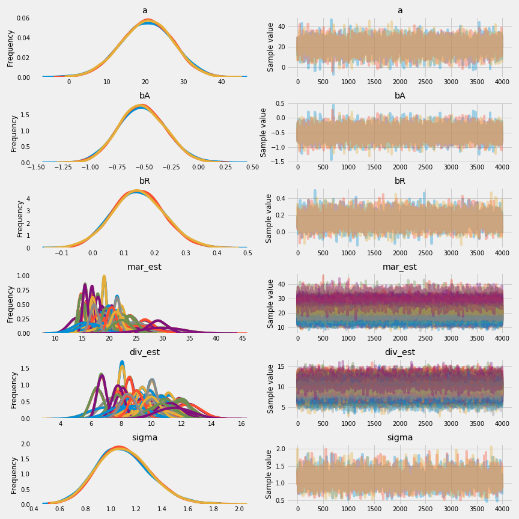

# Missing Data and Other Opportunities

Three pancakes (BB, BU, UU), when served one and the side facing up is burnt, what is the probability of the other side is also burnt?

$\Pr(\text{burnt down|burnt up}) = \frac{\Pr(\text{burnt up, burnt down})}{\Pr(\text{burnt up})}$

The denominator $\Pr(\text{burnt up} = \Pr(\text{BB}) \times 1 + \Pr(\text{BU}) \times 0.5 + \Pr(\text{UU}) \times 0 = 0.5$

To solve this by simulation

```python
pancake = np.array([[1,1],[1,0],[0,0]])
# simulate a pancake and return randomly ordered sides
pancakes = np.asarray([np.random.permutation(pancake[np.random.choice(range(3))]) for i in range(10000)])
up = pancakes[:, 0]
down = pancakes[:, 1]
# compute proportion 1/1 (BB) out of all 1/1 and 1/0
num_11_10 = np.sum(up==1)
num_11 = np.sum((up==1) & (down==1))
num_11/num_11_10
```

## Incorporate measurement error

Example: Divorce data

```python
d = pd.read_csv('Data/WaffleDivorce.csv', ';')
d['log_population'] = np.log(d['Population'])

_, ax = plt.subplots(1, 2, figsize=(18, 5))

# points
ax[0].scatter(d['MedianAgeMarriage'], d['Divorce'], marker='o', facecolor='none', edgecolors='k', linewidth=1)
# standard errors
ax[0].errorbar(d['MedianAgeMarriage'], d['Divorce'], d['Divorce SE'].values, ls='none', color='k', linewidth=1)
ax[0].set_xlabel('Median age marriage')
ax[0].set_ylabel('Divorce rate')
ax[0].set_ylim(4, 15)

# points
ax[1].scatter(d['log_population'], d['Divorce'], marker='o', facecolor='none', edgecolors='k', linewidth=1)
# standard errors
ax[1].errorbar(d['log_population'], d['Divorce'], d['Divorce SE'].values, ls='none', color='k', linewidth=1)
ax[1].set_xlabel('log population')
ax[1].set_ylabel('Divorce rate')
ax[1].set_ylim(4, 15);
```

Large states have better samples with smaller error bars.


### Error on the outcome

Replace the observed data with a distribution. All we need to do is to add a parameter for each observed value $D_{\text{OBS}, i}$.

$D_{\text{OBS}, i} \sim \text{Normal}(D_{\text{EST}, i}, D_{\text{SE}, i})$

Therefore, the final model would be:

$D_{\text{EST}, i} \sim \text{Normal}(\mu_i, \sigma)$
$\mu_i = \alpha + \beta_AA_i + \beta_RR_i$
$D_{\text{OBS}, i} \sim \text{Normal}(D_{\text{EST}, i}, D_{\text{SE}, i})$
$\alpha \sim \text{Normal}(0, 10)$
$\beta_A \sim \text{Normal}(0, 10)$
$\beta_R \sim \text{Normal}(0, 10)$
$\sigma \sim \text{Cauchy}(0, 2.5)$

In `python`:

```python
div_obs = d['Divorce'].values
div_sd = d['Divorce SE'].values
R = d['Marriage'].values
A = d['MedianAgeMarriage'].values
N = len(d)

with pm.Model() as m_14_1:
    sigma = pm.HalfCauchy('sigma', 2.5)
    a = pm.Normal('a', 0., 10.)
    bA = pm.Normal('bA', 0., 10.)
    bR = pm.Normal('bR', 0., 10.)
    mu = a + bA*A + bR*R
    div_est = pm.Normal('div_est', mu, sigma, shape=N)
    obs = pm.Normal('div_obs', div_est, div_sd, observed=div_obs)
    # start value and additional kwarg for NUTS
    start = dict(div_est=div_obs)
    trace_14_1 = pm.sample(4000, tune=1000, njobs=2, 
                           start=start, nuts_kwargs=dict(target_accept=.95))

pm.summary(trace_14_1, varnames=['div_est', 'a', 'bA', 'bR', 'sigma']).round(2)
```

||mean | sd |mc_error|hpd_2.5|hpd_97.5| n_eff |Rhat|
|-----------|----:|---:|-------:|------:|-------:|------:|---:|
|div_est__0 |11.79|0.70|    0.01|  10.49|   13.16| 8969.5|   1|
|div_est__1 |11.20|1.05|    0.01|   9.09|   13.25| 9267.1|   1|
|div_est__2 |10.47|0.62|    0.01|   9.28|   11.70|11979.2|   1|
|div_est__3 |12.34|0.87|    0.01|  10.68|   14.10|11754.2|   1|
|div_est__4 | 8.05|0.23|    0.00|   7.60|    8.51|14922.2|   1|
|div_est__5 |11.03|0.74|    0.01|   9.56|   12.46| 8635.7|   1|
|div_est__6 | 7.24|0.63|    0.01|   6.01|    8.48|12077.7|   1|
|div_est__7 | 9.37|0.90|    0.01|   7.63|   11.13|11628.1|   1|
|div_est__8 | 7.03|1.11|    0.01|   4.82|    9.16| 8692.2|   1|
|div_est__9 | 8.54|0.31|    0.00|   7.90|    9.12|10816.3|   1|
|div_est__10|11.15|0.53|    0.01|  10.13|   12.19|12315.3|   1|
|div_est__11| 9.11|0.89|    0.01|   7.36|   10.83| 9245.9|   1|
|div_est__12| 9.68|0.93|    0.01|   7.84|   11.45| 6125.8|   1|
|div_est__13| 8.11|0.41|    0.00|   7.30|    8.89|13957.1|   1|
|div_est__14|10.69|0.56|    0.00|   9.56|   11.75|12414.1|   1|
|div_est__15|10.14|0.71|    0.01|   8.74|   11.52|18809.4|   1|
|div_est__16|10.51|0.79|    0.01|   8.93|   12.03|12083.3|   1|
|div_est__17|11.95|0.64|    0.01|  10.69|   13.19| 8670.2|   1|
|div_est__18|10.50|0.73|    0.01|   9.10|   11.93|13310.9|   1|
|div_est__19|10.17|1.02|    0.01|   8.20|   12.18| 6645.7|   1|
|div_est__20| 8.76|0.60|    0.00|   7.58|    9.91|13149.5|   1|
|div_est__21| 7.77|0.49|    0.00|   6.83|    8.75|11252.7|   1|
|div_est__22| 9.14|0.48|    0.00|   8.17|   10.03|11553.6|   1|
|div_est__23| 7.73|0.55|    0.01|   6.66|    8.80| 9869.5|   1|
|div_est__24|10.42|0.78|    0.01|   8.90|   11.94|12430.6|   1|
|div_est__25| 9.54|0.57|    0.00|   8.42|   10.72|13798.7|   1|
|div_est__26| 9.43|0.95|    0.01|   7.61|   11.32|12519.4|   1|
|div_est__27| 9.26|0.73|    0.01|   7.85|   10.67| 9730.2|   1|
|div_est__28| 9.18|0.94|    0.01|   7.37|   11.11|13585.0|   1|
|div_est__29| 6.39|0.43|    0.00|   5.53|    7.19|12397.4|   1|
|div_est__30| 9.98|0.81|    0.01|   8.36|   11.52|10847.6|   1|
|div_est__31| 6.69|0.30|    0.00|   6.11|    7.30|15549.2|   1|
|div_est__32| 9.89|0.44|    0.00|   9.05|   10.76|14944.2|   1|
|div_est__33| 9.76|0.95|    0.01|   7.88|   11.62| 7613.5|   1|
|div_est__34| 9.44|0.42|    0.00|   8.59|   10.24|11719.8|   1|
|div_est__35|11.97|0.77|    0.01|  10.45|   13.52|10417.6|   1|
|div_est__36|10.07|0.66|    0.01|   8.77|   11.37|11893.1|   1|
|div_est__37| 7.80|0.39|    0.00|   7.03|    8.57|16932.4|   1|
|div_est__38| 8.21|1.01|    0.01|   6.19|   10.18|11444.3|   1|
|div_est__39| 8.39|0.59|    0.01|   7.20|    9.48|11425.2|   1|
|div_est__40|10.00|1.07|    0.01|   7.91|   12.17|11873.9|   1|
|div_est__41|10.94|0.63|    0.01|   9.75|   12.23|14320.3|   1|
|div_est__42|10.02|0.33|    0.00|   9.36|   10.64|11972.6|   1|
|div_est__43|11.07|0.80|    0.01|   9.46|   12.59| 8256.4|   1|
|div_est__44| 8.90|0.99|    0.01|   7.01|   10.93|13278.7|   1|
|div_est__45| 9.00|0.47|    0.00|   8.08|    9.90|17096.0|   1|
|div_est__46| 9.95|0.57|    0.00|   8.87|   11.12|13423.6|   1|
|div_est__47|10.60|0.88|    0.01|   8.85|   12.28|10026.8|   1|
|div_est__48| 8.47|0.50|    0.00|   7.53|    9.47|12167.0|   1|
|div_est__49|11.52|1.11|    0.01|   9.38|   13.64| 8324.2|   1|
|a          |21.12|6.64|    0.10|   8.12|   34.12| 3554.6|   1|
|bA         |-0.54|0.21|    0.00|  -0.97|   -0.13| 3729.2|   1|
|bR         | 0.13|0.08|    0.00|  -0.02|    0.28| 3984.2|   1|
|sigma      | 1.13|0.21|    0.00|   0.74|    1.53| 2432.6|   1|

The earlier model has a smaller value for `bA`. The inclusion of error prevent the model from exaggerating the associations.

### Error on both outcome and predictor

Add the marriage rate standard error in the model

$D_{\text{EST}, i} \sim \text{Normal}(\mu_i, \sigma)$
$\mu_i = \alpha + \beta_AA_i + \beta_RR_{\text{EST}, i}$
$D_{\text{OBS}, i} \sim \text{Normal}(D_{\text{EST}, i}, D_{\text{SE}, i})$
$R_{\text{OBS}, i} \sim \text{Normal}(R_{\text{EST}, i}, R_{\text{SE}, i})$
$\alpha \sim \text{Normal}(0, 10)$
$\beta_A \sim \text{Normal}(0, 10)$
$\beta_R \sim \text{Normal}(0, 10)$
$\sigma \sim \text{Cauchy}(0, 2.5)$



## Missing data

### Imputing neocortex

Bayesian methods allows for estimating the missing values with wide posterior so the estimates are honest.

MCAR(missing completely at random) imputation. The trick is to just include the variable with missing values in the model.

For the neocortex model:

$k_i \sim \text{Normal}(\mu_i, \sigma)$
$\mu_i = \alpha + \beta_N N_i + \beta_M \log M_i$
$N_i \sim \text{Normal}(\upsilon, \sigma_N)$
$\alpha \sim \text{Normal}(0, 10)$
$\beta_N \sim \text{Normal}(0, 10)$
$\beta_M \sim \text{Normal}(0, 10)$
$\sigma \sim \text{Cauchy}(0, 1)$
$\upsilon \sim \text{Normal}(0.5, 1)$
$\sigma_N \sim \text{Cauchy}(0, 1)$

Load the data

```python
d = pd.read_csv('Data/milk.csv', ';')
d.loc[:,'neocortex.prop'] = d['neocortex.perc'] / 100
d.loc[:,'logmass'] = np.log(d['mass'])
```

fitting the model

```python
# prep data
kcal = d['kcal.per.g'].values.copy()
logmass = d['logmass'].values.copy()
# PyMC3 can handle missing value quite naturally.
neocortex = d['neocortex.prop'].values.copy()
mask = np.isfinite(neocortex)
neocortex[~mask] = -999
neocortex = np.ma.masked_values(neocortex, value=-999)

# fit model
with pm.Model() as m_14_3:
    sigma = pm.HalfCauchy('sigma', 1.)
    sigma_N = pm.HalfCauchy('sigma_N', 1.)
    nu = pm.Normal('nu', .5, 1.)
    bN = pm.Normal('bN', 0., 10.)
    bM = pm.Normal('bM', 0., 10.)
    a = pm.Normal('a', 0., 100.)
    neocortex_ = pm.Normal('neocortex', nu, sigma_N, observed=neocortex)
    mu = a + bN*neocortex_ + bM*logmass
    kcal_ = pm.Normal('kcal', mu, sigma, observed=kcal)
    trace_14_3 = pm.sample(5000, tune=5000, njobs=2)

# the missing value in pymc3 is automatically model as a node with *_missing as name
pm.summary(trace_14_3, varnames=['neocortex_missing', 
                                 'a', 'bN', 'bM', 'nu', 'sigma_N', 'sigma']).round(2)
```

||mean | sd |mc_error|hpd_2.5|hpd_97.5|n_eff |Rhat|
|---------------------|----:|---:|-------:|------:|-------:|-----:|---:|
|neocortex_missing__0 | 0.63|0.05|    0.00|   0.53|    0.73|6751.8|   1|
|neocortex_missing__1 | 0.63|0.05|    0.00|   0.53|    0.73|5389.9|   1|
|neocortex_missing__2 | 0.62|0.05|    0.00|   0.52|    0.73|5600.5|   1|
|neocortex_missing__3 | 0.65|0.05|    0.00|   0.56|    0.75|6232.9|   1|
|neocortex_missing__4 | 0.70|0.05|    0.00|   0.60|    0.80|7758.3|   1|
|neocortex_missing__5 | 0.66|0.05|    0.00|   0.56|    0.76|5648.4|   1|
|neocortex_missing__6 | 0.69|0.05|    0.00|   0.59|    0.79|8302.2|   1|
|neocortex_missing__7 | 0.70|0.05|    0.00|   0.60|    0.79|7335.0|   1|
|neocortex_missing__8 | 0.71|0.05|    0.00|   0.61|    0.81|6423.4|   1|
|neocortex_missing__9 | 0.65|0.05|    0.00|   0.55|    0.74|6949.0|   1|
|neocortex_missing__10| 0.66|0.05|    0.00|   0.56|    0.75|7635.7|   1|
|neocortex_missing__11| 0.70|0.05|    0.00|   0.59|    0.79|5261.3|   1|
|a                    |-0.55|0.47|    0.01|  -1.47|    0.40|1864.7|   1|
|bN                   | 1.92|0.74|    0.02|   0.45|    3.36|1845.0|   1|
|bM                   |-0.07|0.02|    0.00|  -0.11|   -0.02|2767.5|   1|
|nu                   | 0.67|0.01|    0.00|   0.64|    0.70|5216.9|   1|
|sigma_N              | 0.06|0.01|    0.00|   0.04|    0.08|3905.6|   1|
|sigma                | 0.13|0.02|    0.00|   0.09|    0.18|2802.6|   1|

fitting a model with all missing values dropped:

```python
# prep data
neocortex = np.copy(d['neocortex.prop'].values)
mask = np.isfinite(neocortex)
kcal = np.copy(d['kcal.per.g'].values[mask])
logmass = np.copy(d['logmass'].values[mask])
neocortex = neocortex[mask]

# fit model
with pm.Model() as m_14_3cc:
    sigma = pm.HalfCauchy('sigma', 1.)
    bN = pm.Normal('bN', 0., 10.)
    bM = pm.Normal('bM', 0., 10.)
    a = pm.Normal('a', 0., 100.)
    mu = a + bN*neocortex + bM*logmass
    kcal_ = pm.Normal('kcal', mu, sigma, observed=kcal)
    trace_14_3cc = pm.sample(5000, tune=5000, njobs=2)

pm.summary(trace_14_3cc, varnames=['a', 'bN', 'bM', 'sigma']).round(2)
```

||mean | sd |mc_error|hpd_2.5|hpd_97.5|n_eff |Rhat|
|-----|----:|---:|-------:|------:|-------:|-----:|---:|
|a    |-1.07|0.60|    0.01|  -2.27|    0.12|2144.6|   1|
|bN   | 2.77|0.94|    0.02|   0.98|    4.72|2142.9|   1|
|bM   |-0.10|0.03|    0.00|  -0.15|   -0.04|2518.4|   1|
|sigma| 0.14|0.03|    0.00|   0.09|    0.20|3163.0|   1|

The posterior mean for neocortex(`bN`), body mass(`bM`) both shrunk. The model can be improved by changing the imputation by adding the association between the neocortex and the body mass.

### Improving the imputation model

Adding the association between neocortex and the body mass is simply replacing in the equations:

$N_i \sim \text{Normal}(\upsilon, \sigma_N)$

with

$N_i \sim \text{Normal}(\upsilon_i, \sigma_N)$
$\upsilon_i = \alpha_N + \gamma_M \log M_i$

the second equation describing the linear relationship between neocortex and the body mass.

```python
# prep data
kcal = d['kcal.per.g'].values.copy()
logmass = d['logmass'].values.copy()
neocortex = d['neocortex.prop'].values.copy()
mask = np.isfinite(neocortex)
neocortex[~mask] = -999
neocortex = np.ma.masked_values(neocortex, value=-999)

with pm.Model() as m_14_4:
    sigma = pm.HalfCauchy('sigma', 1.)
    sigma_N = pm.HalfCauchy('sigma_N', 1.)
    a_N = pm.Normal('a_N', .5, 1.)
    betas = pm.Normal('bNbMgM', 0., 10., shape=3) # bN, bM, and gM
    a = pm.Normal('a', 0., 100.)

    nu = a_N + betas[2]*logmass
    neocortex_ = pm.Normal('neocortex', nu, sigma_N, observed=neocortex)

    mu = a + betas[0]*neocortex_ + betas[1]*logmass
    kcal_ = pm.Normal('kcal', mu, sigma, observed=kcal)

    trace_14_4 = pm.sample(5000, tune=5000, njobs=2)

pm.summary(trace_14_4, varnames=['neocortex_missing', 
                                 'a', 'bNbMgM', 'a_N', 'sigma_N', 'sigma']).round(2)
```

||mean | sd |mc_error|hpd_2.5|hpd_97.5|n_eff |Rhat|
|---------------------|----:|---:|-------:|------:|-------:|-----:|---:|
|neocortex_missing__0 | 0.63|0.04|    0.00|   0.56|    0.70|3552.8|   1|
|neocortex_missing__1 | 0.63|0.04|    0.00|   0.56|    0.70|2591.8|   1|
|neocortex_missing__2 | 0.62|0.03|    0.00|   0.55|    0.69|6303.3|   1|
|neocortex_missing__3 | 0.65|0.03|    0.00|   0.58|    0.72|3942.3|   1|
|neocortex_missing__4 | 0.66|0.04|    0.00|   0.59|    0.74|1629.5|   1|
|neocortex_missing__5 | 0.63|0.03|    0.00|   0.56|    0.70|3851.5|   1|
|neocortex_missing__6 | 0.68|0.03|    0.00|   0.61|    0.75|1381.7|   1|
|neocortex_missing__7 | 0.70|0.04|    0.00|   0.63|    0.77|1239.3|   1|
|neocortex_missing__8 | 0.71|0.03|    0.00|   0.64|    0.78|1359.3|   1|
|neocortex_missing__9 | 0.66|0.03|    0.00|   0.60|    0.73|3425.2|   1|
|neocortex_missing__10| 0.68|0.03|    0.00|   0.61|    0.75|2759.3|   1|
|neocortex_missing__11| 0.74|0.04|    0.00|   0.67|    0.82| 994.4|   1|
|a                    |-0.86|0.50|    0.01|  -1.81|    0.11|1646.1|   1|
|bNbMgM__0            | 2.42|0.77|    0.02|   0.99|    3.99|1598.4|   1|
|bNbMgM__1            |-0.09|0.02|    0.00|  -0.14|   -0.04|1597.7|   1|
|bNbMgM__2            | 0.02|0.01|    0.00|   0.01|    0.03|3432.2|   1|
|a_N                  | 0.64|0.01|    0.00|   0.61|    0.66|1702.6|   1|
|sigma_N              | 0.04|0.01|    0.00|   0.03|    0.06|3189.3|   1|
|sigma                | 0.13|0.02|    0.00|   0.09|    0.17| 951.9|   1|

### Not a random

Sometimes the missing of data is not random. Bayesian inference can be used to figure out what the data says about the model.