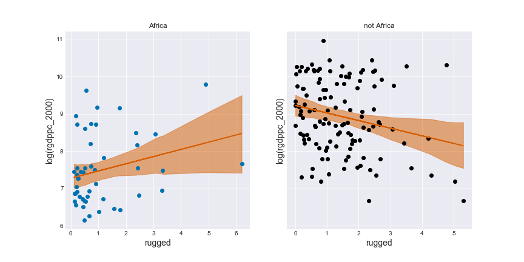
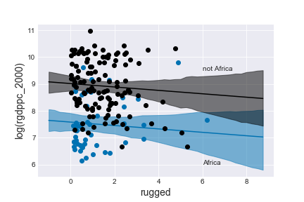
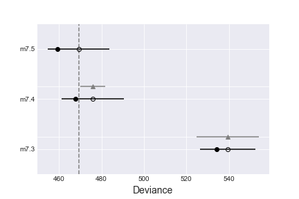
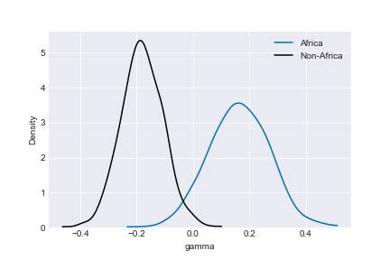
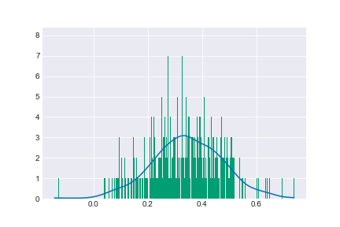
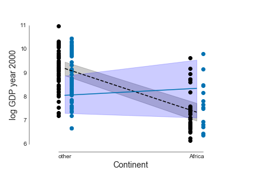
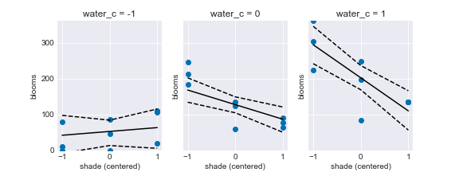
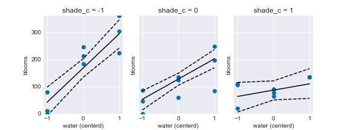

# Chapter 7 Interactions

Conditioning: data is conditional on how the sampling methods and procedures.

Simple linear models assume no conditioning and independent association with the mean of the outcome, therefore cannot handle interaction.

Example: influence of ruggedness on GDP per capita for African and non-African countries.



#### Adding a dummy variable doesn't work

Because the slope is different for African and Non-African countries, and the dummy variable only affects the intercept.

```python
# Model the entire data
with pm.Model() as model_7_3:
    a = pm.Normal('a', mu=8, sd=100)
    bR = pm.Normal('bR', mu=0, sd=1)
    sigma = pm.Uniform('sigma', lower=0, upper=10)
    mu = pm.Deterministic('mu', a + bR * dd.rugged)
    log_gdp = pm.Normal('log_gdp', mu, sigma, observed=np.log(dd.rgdppc_2000))
    trace_7_3 = pm.sample(1000, tune=1000)

# Model the entire data including a dummy variable
with pm.Model() as model_7_4:
    a = pm.Normal('a', mu=8, sd=100)
    bR = pm.Normal('bR', mu=0, sd=1)
    bA = pm.Normal('bA', mu=0, sd=1)
    sigma = pm.Uniform('sigma', lower=0, upper=10)
    mu = pm.Deterministic('mu', a + bR * dd.rugged + bA * dd.cont_africa)
    log_gdp = pm.Normal('log_gdp', mu, sigma, observed=np.log(dd.rgdppc_2000))
    trace_7_4 = pm.sample(1000, tune=1000)

df_comp_WAIC = pm.compare({model_7_3: trace_7_3, model_7_4: trace_7_4})
df_comp_WAIC
```

|model|WAIC |pWAIC|dWAIC|weight| SE  | dSE |var_warn|
|-----|----:|----:|----:|-----:|----:|----:|-------:|
|m7.4 |475.9| 4.09| 0.00|  0.97|14.81| 0.00|       1|
|m7.3 |539.4| 2.58|63.51|  0.03|12.98|14.64|       0|

The model m7.4 gets almost all the weight. We can plot the posterior predictions for the model. It's obvious that the dummy variable did not help. The model with dummy is better than without simply because African countries are on average with lower GDP.



#### Adding a linear interaction does work

The model with dummy:

$Y_i \sim N(\mu_i, \sigma)$
$\mu_i = \alpha + \beta_RR_i + \beta_AA_i$

Where $Y$ is GDP, $A$ is dummy for African/Non-african country, and $R$ is ruggedness. Adding in an interaction to make $\beta_R$ depend upon $A$ is just to define the slope $\beta_R$ as a linear model that includes $A$. This is called a *linear interaction effect* model. The new model:

likelihood:             $Y_i \sim N(\mu_i, \sigma)$
linear model of $\mu$:  $\mu_i = \alpha + \gamma_iR_i + \beta_AA_i$
linear model of slope:  $\gamma_i = \beta_R + \beta_{AR}A_i$

The slope between GDP and ruggedness depends on whether or not a nation is Africa. The model is the same as the previous one when $\beta_R$ = 0.

```python
with pm.Model() as model_7_5:
    a = pm.Normal('a', mu=8, sd=100)
    bR = pm.Normal('bR', mu=0, sd=1)
    bA = pm.Normal('bA', mu=0, sd=1)
    bAR = pm.Normal('bAR', mu=0, sd=1)
    sigma = pm.Uniform('sigma', lower=0, upper=10)
    gamma = bR + bAR * dd.cont_africa
    mu = pm.Deterministic('mu', a + gamma * dd.rugged + bA * dd.cont_africa)
    log_gdp = pm.Normal('log_gdp', mu, sigma, observed=np.log(dd.rgdppc_2000))
    trace_7_5 = pm.sample(1000, tune=1000)
```

To compare the models:

```python
comp_df = pm.compare({model_7_3:trace_7_3, model_7_4:trace_7_4, model_7_5:trace_7_5})
comp_df.loc[:,'model'] = pd.Series(['m7.3', 'm7.4', 'm7.5'])
comp_df = comp_df.set_index('model')
comp_df
```

|model|WAIC |pWAIC|dWAIC|weight| SE  | dSE |var_warn|
|-----|----:|----:|----:|-----:|----:|----:|-------:|
|m7.5 |469.3| 4.97| 0.00|  0.92|14.48| 0.00|       1|
|m7.4 |475.9| 4.09| 6.65|  0.08|14.81| 5.98|       1|
|m7.3 |539.4| 2.58|70.16|  0.00|12.98|14.58|       0|

The model with the linear interaction effect has 92% of the weight. The standard error of the top 2 models are not very different, since there are only so many African countries and the data are sparse for estimating the interaction.



#### Interpreting an interaction estimate

Interpreting interaction is tricky. Plotting the interaction is easier to interpret.

1. Adding interaction to a model changes the meaning of parameters.
2. Table of numbers does not help a lot since covariance among parameters not shown. Harder for predictor conditional on multiple parameters.

##### parameters change meaning

Okay to examine each coefficient for influence in a simple linear model since independence assumption. In a interaction model:

likelihood:             $Y_i \sim N(\mu_i, \sigma)$
linear model of $\mu$:  $\mu_i = \alpha + \gamma_iR_i + \beta_AA_i$
linear model of slope:  $\gamma_i = \beta_R + \beta_{AR}A_i$

change in $\mu_i$ results from a unit change from $R_i$ given by $\gamma_i$, which is a function of $\beta_R$, $\beta_{AR}$, and $A_i$.

|index| mean | sd  |mc_error|hpd_5.5|hpd_94.5|n_eff |Rhat |
|-----|-----:|----:|-------:|------:|-------:|-----:|----:|
|a    | 9.177|0.135|   0.004|  8.974|   9.404|1016.6|1.002|
|bA   |-1.836|0.217|   0.007| -2.178|  -1.502|1006.6|1.001|
|bR   |-0.182|0.074|   0.002| -0.302|  -0.072| 966.9|1.001|
|bAR  | 0.343|0.128|   0.004|  0.145|   0.547| 961.9|1.000|
|sigma| 0.951|0.054|   0.001|  0.866|   1.039|1945.0|1.000|

Since $\gamma$ does not appear in the table, we have to compute it. For African countries:

$\gamma = \beta_R + \beta_{AR}(1) = -0.18+0.35=0.17$

Outside Africa:

$\gamma = \beta_R + \beta{AR}(0) = -0.18$

So the relationship is reversed inside and outside of Africa.

##### Incorporating uncertainty

The above estimates of $\gamma$ are only the MAP values. The whole posterior is necessary for uncertainty.

```python
gamma_Africa = trace_7_5b['bR'] + trace_7_5b['bAR'] * 1
gamma_notAfrica = trace_7_5b['bR']

print("Gamma within Africa: {:.2f}".format(gamma_Africa.mean()))
print("Gamma outside Africa: {:.2f}".format(gamma_notAfrica.mean()))
```

Output:
>Gamma within Africa: 0.16
>Gamma outside Africa: -0.18

Plotting the posterior slope inside and outside Africa:

```python
_, ax = plt.subplots()
ax.set_xlabel('gamma')
ax.set_ylabel('Density')
ax.set_ylim(top=5.25)
pm.kdeplot(gamma_Africa, color='C0', ax=ax)
pm.kdeplot(gamma_notAfrica, color='k', ax=ax);
```



Plot the posterior distribution of the difference, and calculate the probability of slope in Africa smaller than that outside Africa:

```python
diff = gamma_Africa - gamma_notAfrica
# First let's plot a histogram and a kernel densitiy estimate.
pm.kdeplot(diff)
plt.hist(diff, bins=len(diff));
# Notice that there are very few values below zero.

sum(diff[diff < 0]) / len(diff)
#-0.00031401893209480439
```



### Symmetry of the linear interaction

The interaction in model 7.5 can be interpreted both ways:

1. How much does the influence of ruggedness depend upon whether the nation is in Africa?
2. How much does the influence of being in Africa depend upon ruggedness?

Mathematically,

$Y_i \sim N(\mu_i, \sigma)$
$\mu_i = \alpha + \gamma_iR_i + \beta_AA_i$
$\gamma_i = \beta_R + \beta_{AR}A_i$

If we expand the $\gamma_i$ into the expression for $\mu_i$:

$\mu_i = \alpha + (\beta_R+\beta_{AR}A_i)R_i + \beta_AA_i = \alpha + \beta_RR_i + (\beta_{AR}R_i + \beta_A)A_i$

The interaction is symmetric, and the model does not know which way to interpret the data.

We can try to interpret reversely: being in Africa depends upon ruggedness. Almost same procedure except horizontal axis is is_africa and use different lines for different values of ruggedness.

```python
# Get min and max rugged values.
q_rugged = [0, 0]
q_rugged[0] = np.min(dd.rugged)
q_rugged[1] = np.max(dd.rugged)

# Compute lines and confidence intervals.
# Since the link function isn't implemented we have to again compute the mean over samples ourselves using a loop.
mu_ruggedlo = np.zeros((2, len(trace_7_5b['bR'])))
mu_ruggedhi = np.zeros((2, len(trace_7_5b['bR'])))
# Iterate over outside Africa (0) and inside Africa (1).
for iAfri in range(0,2):
    mu_ruggedlo[iAfri] = trace_7_5b['a'] + trace_7_5b['bR'] * q_rugged[0] + \
                              trace_7_5b['bAR'] * q_rugged[0] * iAfri + \
                              trace_7_5b['bA'] * iAfri
    mu_ruggedhi[iAfri] = trace_7_5b['a'] + trace_7_5b['bR'] * q_rugged[1] + \
                              trace_7_5b['bAR'] * q_rugged[1] * iAfri + \
                              trace_7_5b['bA'] * iAfri

mu_ruggedlo_mean = np.mean(mu_ruggedlo, axis=1)
mu_hpd_ruggedlo = pm.hpd(mu_ruggedlo.T, alpha=0.03)  # 97% probability interval: 1-.97 = 0.03
mu_ruggedhi_mean = np.mean(mu_ruggedhi, axis=1)
mu_hpd_ruggedhi = pm.hpd(mu_ruggedhi.T, alpha=0.03)  # 97% probability interval: 1-.97 = 0.03

# Source http://matplotlib.org/examples/pylab_examples/spine_placement_demo.html
def adjust_spines(ax, spines):
    for loc, spine in ax.spines.items():
        if loc in spines:
            spine.set_position(('outward', 5))  # outward by 5 points
            spine.set_smart_bounds(True)
        else:
            spine.set_color('none')  # don't draw spine

    # turn off ticks where there is no spine
    if 'left' in spines:
        ax.yaxis.set_ticks_position('left')
    else:
        # no yaxis ticks
        ax.yaxis.set_ticks([])

    if 'bottom' in spines:
        ax.xaxis.set_ticks_position('bottom')
    else:
        # no xaxis ticks
        ax.xaxis.set_ticks([])

# Plot it all, splitting points at median
med_r = np.median(dd.rugged)
# Use list comprehension to split points at median
ox = [0.05 if x > med_r else -0.05 for x in dd.rugged]
idxk = [i for i,x in enumerate(ox) if x == -0.05]
idxb = [i for i,x in enumerate(ox) if x == 0.05]
cont_africa_ox = dd.cont_africa + ox
plt.plot(cont_africa_ox[dd.cont_africa.index[idxk]], np.log(dd.rgdppc_2000[dd.cont_africa.index[idxk]]), 'ko')
plt.plot(cont_africa_ox[dd.cont_africa.index[idxb]], np.log(dd.rgdppc_2000[dd.cont_africa.index[idxb]]), 'C0o')
plt.plot([0, 1], mu_ruggedlo_mean, 'k--')
plt.plot([0, 1], mu_ruggedhi_mean, 'C0')
plt.fill_between([0, 1], mu_hpd_ruggedlo[:,0], mu_hpd_ruggedlo[:,1], color='k', alpha=0.2)
plt.fill_between([0, 1], mu_hpd_ruggedhi[:,0], mu_hpd_ruggedhi[:,1], color='b', alpha=0.2)
plt.ylabel('log GDP year 2000', fontsize=14);
plt.xlabel('Continent', fontsize=14)
axes = plt.gca()
axes.set_xlim([-0.25, 1.25])
axes.set_ylim([5.8, 11.2])
axes.set_xticks([0, 1])
axes.set_xticklabels(['other', 'Africa'], fontsize=12)
axes.set_facecolor('white')
adjust_spines(axes, ['left', 'bottom'])
axes.spines['top'].set_visible(False)
axes.spines['right'].set_visible(False)
axes.spines['bottom'].set_linewidth(0.5)
axes.spines['left'].set_linewidth(0.5)
axes.spines['bottom'].set_color('black')
axes.spines['left'].set_color('black');
```



Left: Non-African countries; right: African countries. Black dots: nations with ruggedness below the median; blue dots: nations with ruggedness above the median. Based on the blue shaded region, a nation with high ruggedness there is no negative effect on GDP of being in Africa.

### Continuous interactions

- **Dependent variable**: bloom size of tulips
- **Independent variables**: water, shade, and bed.

Main effect likelihood:

$B_i \sim N(\mu_i, \sigma)$
$\mu_i = \alpha + \beta_WW_i + \beta_SS_i$

Full interaction likelihood:

$B_i \sim N(\mu_i, \sigma)$
$\mu_i = \alpha + \beta_WW_i + \beta_SS_i + \beta_{WS}W_iS_i$

```python
with pm.Model() as model_7_6:
    a = pm.Normal('a', mu=0, sd=100)
    bW = pm.Normal('bW', mu=0, sd=100)
    bS = pm.Normal('bS', mu=0, sd=100)
    sigma = pm.Uniform('sigma', lower=0, upper=100)
    mu = pm.Deterministic('mu', a + bW*d.water + bS*d.shade)
    blooms = pm.Normal('blooms', mu, sigma, observed=d.blooms)
    trace_7_6 = pm.sample(1000, tune=1000)

with pm.Model() as model_7_7:
    a = pm.Normal('a', mu=0, sd=100)
    bW = pm.Normal('bW', mu=0, sd=100)
    bS = pm.Normal('bS', mu=0, sd=100)
    bWS = pm.Normal('bWS', mu=0, sd=100)
    sigma = pm.Uniform('sigma', lower=0, upper=100)
    mu = pm.Deterministic('mu', a + bW*d.water + bS*d.shade + bWS*d.water*d.shade)
    blooms = pm.Normal('blooms', mu, sigma, observed=d.blooms)
    trace_7_7 = pm.sample(1000, tune=1000)
```

Result:

```python
pm.summary(trace_7_6, varnames=['a', 'bW', 'bS', 'sigma'])['mean']
pm.summary(trace_7_7, varnames=['a', 'bW', 'bS', 'sigma', 'bWS'])['mean']
```

|| m7.6 | m7.7 |
|-----|-----:|-----:|
|a    | 51.52|-74.38|
|bW   | 77.12|146.45|
|bS   |-38.76| 31.02|
|sigma| 64.22| 52.62|
|bWS  | N/A  |-37.61|

Compare the models:

|model|WAIC |pWAIC|dWAIC|weight| SE |dSE |var_warn|
|-----|----:|----:|----:|-----:|---:|---:|-------:|
|m7.7 |294.1| 4.21|  0.0|     1|7.15|0.00|       1|
|m7.6 |303.6| 3.53|  9.5|     0|6.76|3.91|       1|

All the weight go to model 7.7. The interpretation starts with centering the predictor variables and re-estimating the models.

#### Centering and re-estimate

Centering: standardize the mean to 0 without changing the variance.

```python
d.shade_c = d.shade - np.mean(d.shade)
d.water_c = d.water - np.mean(d.water)
```

The importance of centering:

1. reduce number of iteracitons necessary.
2. make the estimates easier to interpret.

Re-estimate using centered variables:

```python
with pm.Model() as model_7_8:
    a = pm.Normal('a', mu=0, sd=100)
    bW = pm.Normal('bW', mu=0, sd=100)
    bS = pm.Normal('bS', mu=0, sd=100)
    sigma = pm.Uniform('sigma', lower=0, upper=100)
    mu = pm.Deterministic('mu', a + bW*d.water_c + bS*d.shade_c)
    blooms = pm.Normal('blooms', mu, sigma, observed=d.blooms)
    trace_7_8 = pm.sample(1000, tune=1000)
    start = {'a':np.mean(d.blooms), 'bW':0, 'bS':0, 'sigma':np.std(d.blooms)}

with pm.Model() as model_7_9:
    a = pm.Normal('a', mu=0, sd=100)
    bW = pm.Normal('bW', mu=0, sd=100)
    bS = pm.Normal('bS', mu=0, sd=100)
    bWS = pm.Normal('bWS', mu=0, sd=100)
    sigma = pm.Uniform('sigma', lower=0, upper=100)
    mu = pm.Deterministic('mu', a + bW*d.water_c + bS*d.shade_c + bWS*d.water_c*d.shade_c)
    blooms = pm.Normal('blooms', mu, sigma, observed=d.blooms)
    trace_7_9 = pm.sample(1000, tune=1000)
    start = {'a':np.mean(d.blooms), 'bW':0, 'bS':0, 'bWS':0, 'sigma':np.std(d.blooms)}
```

Find MAP

```python
map_7_8 = pm.find_MAP(model=model_7_8)
map_7_8

map_7_9 = pm.find_MAP(model=model_7_9)
map_7_9
```

|index| mean | mean |
|-----|-----:|-----:|
|a    |127.31|127.88|
|bW   | 73.94| 74.72|
|bS   |-40.44|-40.72|
|sigma| 63.82| 51.93|
|bWS  |  N/A |-51.40|

After centering, the models are easier to compare.

Why centering works?

1. Estimation works better since centered values are easier to optimize.
2. Estimates change less across models.
3. Intercept becomes meaningful — the grand mean of the outcome variable

Read the improved, centered estimates:

|index| mean | sd  |mc_error|hpd_5.5|hpd_94.5|n_eff |Rhat |
|-----|-----:|----:|-------:|------:|-------:|-----:|----:|
|a    |127.88|10.26|   0.271| 112.00|  144.15|1736.4| 1.00|
|bW   | 74.72|12.22|   0.276|  54.98|   93.31|1914.9| 1.00|
|bS   |-40.72|12.31|   0.289| -60.96|  -21.39|1888.8| 1.00|
|bWS  |-51.40|14.63|   0.281| -73.14|  -27.81|2038.4| 1.00|
|sigma| 51.93| 8.19|   0.227|  39.37|   64.04|1374.7| 1.00|

- The estimate `a`, $\alpha$, is the expected value of `blooms` when both `water` and `shade` are at their average values (0 since centered).
- The estimate `bW`, $\beta_W$, is the expected change in `blooms` when `water` increases by one unite and `shade` is at its average value (0). When `shade` is at its average value, increasing `water` is highly beneficial to blooms.
- The estimate `bS`, $\beta_S$, is the expected change in `blooms` when `shade` increases by one unit and `water` is at its average value (0). When `water` is at its average value, increasing `shade` is highly detrimental to the blooms.
- The estimate `bWS`, $\beta_{WS}$, is the interaction effect. It tells us 1) **the expected change in the influence of `water` on blooms when increasing `shade` by one unit.** 2)**The expected change in the influence of `shade` on blooms when increasing `water` by one unit.**

>So why is the interaction estimate, bWS, negative? The short answer is that water and shade have opposite effects on blooms, but that each also makes the other more important to the outcome. If you don’t see how to read that from the number −52, you are in good company. And that’s why the best thing to do is to plot implied predictions.

#### Plotting implied predictions

**Triptych**: three-column plot to show interactions.

```python
f, axs = plt.subplots(1, 3, sharey=True, figsize=(8,3))
# Loop over values of water_c and plot predictions.
shade_seq = range(-1, 2, 1)

mu_w = np.zeros((len(shade_seq), len(trace_7_9['a'])))
for ax, w in zip(axs.flat, range(-1, 2, 1)):
    dt = d[d.water_c == w]
    ax.plot(dt.shade-np.mean(dt.shade), dt.blooms, 'C0o')
    for x, iSeq in enumerate(shade_seq):
        mu_w[x] = trace_7_9['a'] + trace_7_9['bW'] * w + trace_7_9['bS'] * iSeq + trace_7_9['bWS'] * w * iSeq
    mu_mean_w = mu_w.mean(1)
    mu_hpd_w = pm.hpd(mu_w.T, alpha=0.03)  # 97% probability interval: 1-.97 = 0.03
    ax.plot(shade_seq, mu_mean_w, 'k')
    ax.plot(shade_seq, mu_hpd_w.T[0], 'k--')
    ax.plot(shade_seq, mu_hpd_w.T[1], 'k--')
    ax.set_ylim(0,362)
    ax.set_ylabel('blooms')
    ax.set_xlabel('shade (centered)')
    ax.set_title('water_c = {:d}'.format(w))
    ax.set_xticks(shade_seq)
    ax.set_yticks(range(0, 301, 100))
```



When water level is low, shade has little effect given uncertain positive trend. At mean water level (c=0), increasing shade reduces size of blooms. At highest water value, the slope becomes more negative, and shade is an even stronger predictor of smaller blooms.

We can also make the interaction plot using water on horizontal axis and shade level varies from left to right.



### Interactions in design formulas

#### Model with interactions and main effects

The model:

$y_i \sim N(\mu_i, \sigma)$
$\mu_i = \alpha + \beta_xx_i + \beta_zz_i + \beta_{xz}x_iz_i$

In `R`:

```r
m7.x <- lm( y ~ x + z + x*z , data=d )
```

In `python`:

```python
import statsmodels.formula.api as smf
m_7_x = smf.ols('blooms ~ shade + water + shade * water', data=d).fit()
```

#### Model with interactions and partial main effects

When you do not want the main effect of one variable

The model:

$y_i \sim N(\mu_i, \sigma)$
$\mu_i = \alpha + \beta_xx_i + \beta_{xz}x_iz_i$

In `R`:

```r
m7.x <- lm( y ~ x + x*z - z , data=d )
```

In `python`:

```python
m_7_x = smf.ols('blooms ~ shade * water - water', data=d).fit()
```

#### Model with higher order interactions

The model:

$y_i \sim N(\mu_i, \sigma)$
$\mu_i = \alpha + \beta_xx_i + \beta_zz_i + \beta_ww_i + \beta_{xw}x_iw_i + \beta_{zw}z_iw_i + \beta_{xz}x_iz_i + \beta_{xzw}x_iz_iw_i$

In `R`:

```r
m7.x <- lm( y ~ x*z*w , data=d )
```

In `python`:

```python
m_7_x = smf.ols('blooms ~ shade * water * bed', data=d).fit()
```

Any lower-order interactions or main effects can be explicitly subtracted to construct a reduced model.