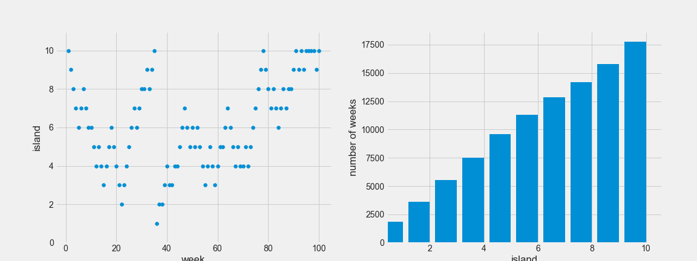
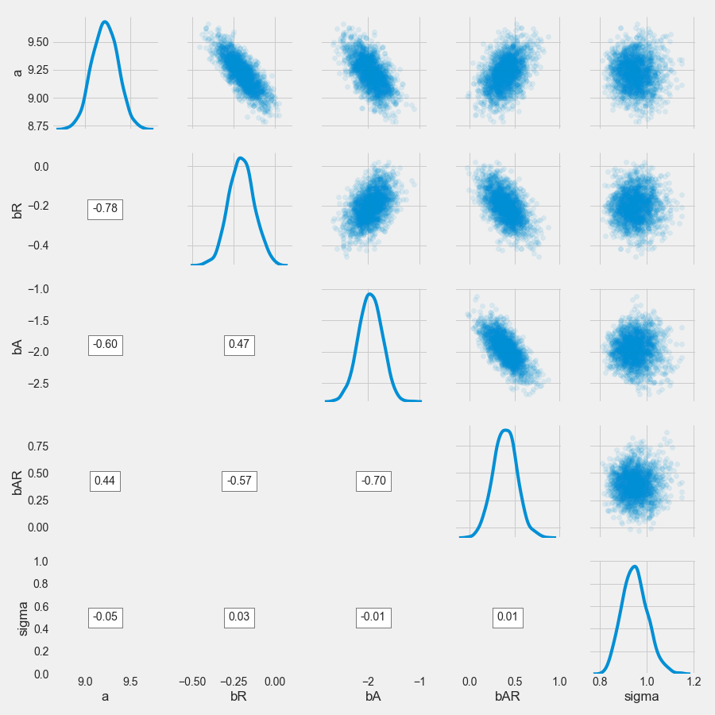
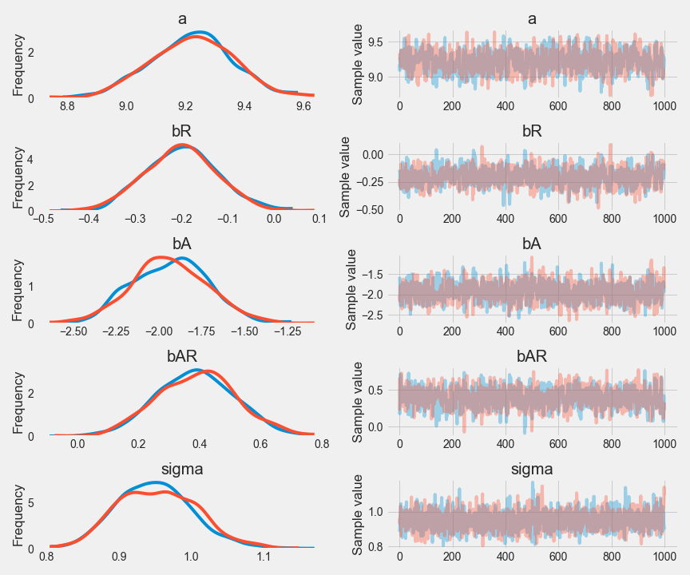
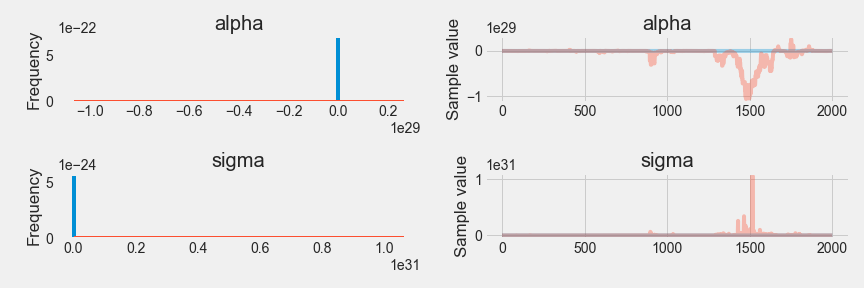
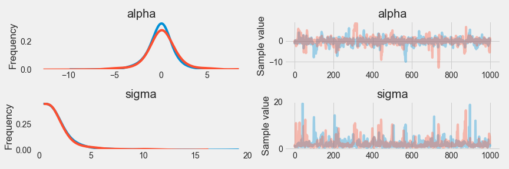
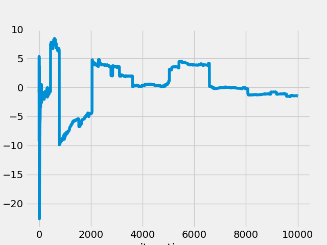
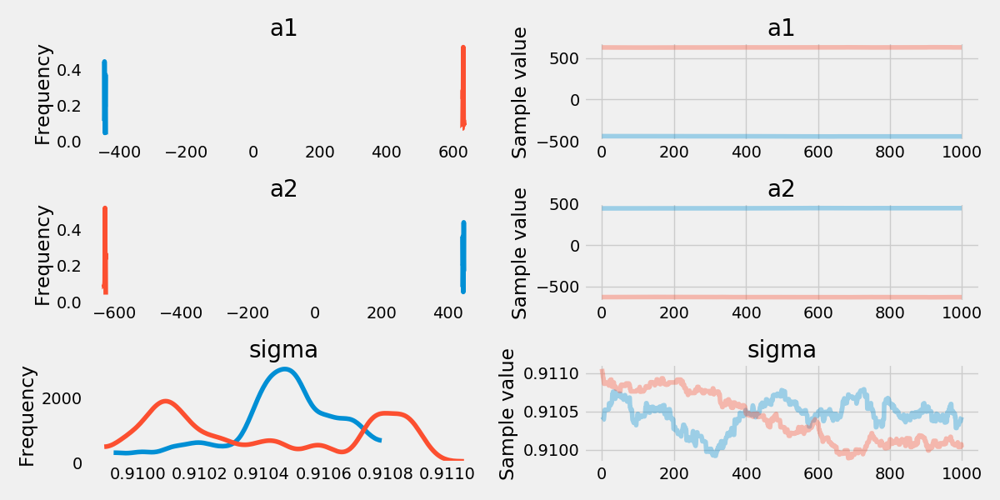
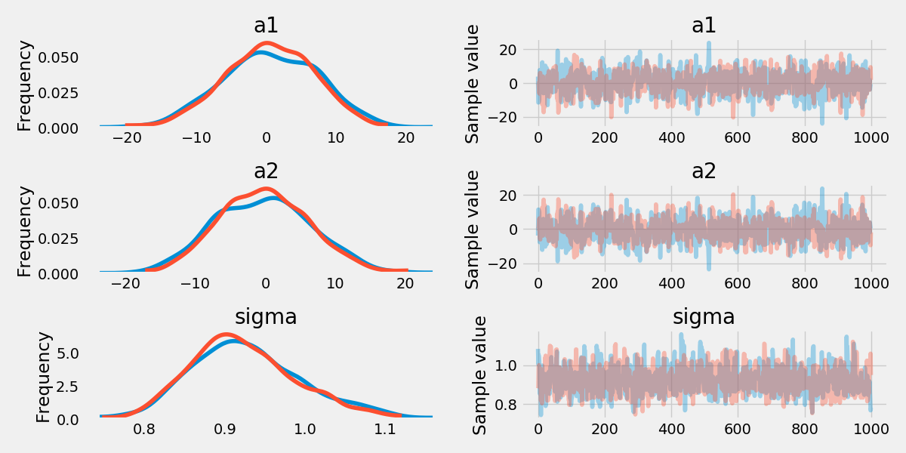

# Chapter 8 Markov Chain Monte Carlo

## The Metropolis algorithm (symmetric proposal distribution)

From [wikipedia](https://en.wikipedia.org/wiki/Metropolis%E2%80%93Hastings_algorithm#Intuition):

Let $f(x)$ be a function that is proportional to the desired probability distribution $P(x)$ (target distribution).

1. Initialization: choose an arbitrary point $x_0$ to be the first sample, and choose an arbitrary probability density $g(x|y)$ (sometimes written $Q(x|y)$) that suggests a candidate for the next sample value $x$, given the previous sample value $y$. $g$ must be symmetric; in other words, it must satisfy $g(x|y) = g(y|x)$. A usual choice is to let $g(x|y)$ be a Gaussian distribution centered at $y$, so that points closer to $y$ are more likely to be visited next—making the sequence of samples into a random walk. The function $g$ is referred to as the *proposal density* or *jumping distribution*.
2. For each iteration $t$:
   - **Generate**: a candidate $x'$ for the next sample by picking from the distribution $g(x'|x_t)$
   - **Calculate**: the *acceptance ratio* $\alpha = f(x')/f(x_t)$, which willbe used to decide whether to accept or reject the candidate. Because $f$ is proportional to the density of $P$, we have that $\alpha = f(x')/f(x_t)=P(x')/P(x_t)$.
   - **Accept or Reject**:
     - Generate a uniform random number $u$ on $[0,1]$.
     - If $u \le \alpha$ *accept* the candidate by setting $x_{t+1}=x'$,
     - If $u > \alpha$ *reject* the candidate and set $x_{t+1} = x_t$, instead.

Example in the book (Good King Markov and his island kingdom):

```python
num_weeks = int(1e5)
positions = np.empty(num_weeks, dtype=np.int64)
current = 9

for i in range(num_weeks):
    # record current position
    positions[i] = current

    # flip coin to generate proposal
    proposal = current + np.random.choice([-1, 1])
    # now make sure he loops around the archipelago
    proposal %= 10

    #move?
    prob_move = (proposal + 1) / (current + 1)
    current = proposal if np.random.uniform() < prob_move else current
```

```python
f, (week_ax, island_ax) = plt.subplots(ncols=2, figsize=(16, 6))

week_ax.scatter(np.arange(100) + 1, positions[:100] + 1);

week_ax.set_xlabel('week');
week_ax.set_ylim(0, 11);
week_ax.set_ylabel('island');

island_ax.bar(np.arange(10) + 0.6, np.bincount(positions));

island_ax.set_xlim(0.4, 10.6);
island_ax.set_xlabel('island');
island_ax.set_ylabel('number of weeks');
```



## Markov Chain Monte Carlo

The Metropolis algorithm is the grandparent of several different strategies including Gibbs sampling and Hamiltonian (Hybrid, HMC) Monte Carlo.

### Gibbs sampling

Metropolis-Hastings algorithm allows for asymmetric proposals compared to Metropolis Algorithm which only allows for symmetric proposals.

#### Advantages of allowing for asymmetric proposal

1. It makes it easier to handle parameters (e.g. standard deviation boundaries at 0).
2. Allows for savvy proposals that help efficiently explore the posterior distribution.

Gibbs sampling: a more efficient way to generate proposals based on *adaptive proposal*. Gibbs sampling computes the adaptive proposal using particular combinations of prior distributions and likelihoods known as *conjugate pairs*.

Gibbs sampling is the basis of `BUGS` (Bayesian inference Using Gibbs Sampling) and `JAGS` (Just Another Gibbs Sampler).

#### Limitations

1. conjugate priors are not always preferred
2. inefficient when model becomes complex

### Hamiltonian Monte Carlo

Hamiltonian Monte Carlo is much more computationally costly than Metropolis or Gibbs sampling, but its proposals are much more efficient. Therefore, much fewer samples are needed to describe the posterior distribution, and HMC becomes more efficient when models are complex.

#### Limitations

1. requires continuous parameters
2. needs to be tuned to have momentum by adding mass, and sensitive to the choice of mass.

## Easy HMC: `map2stan`

Revisiting the ruggedness example in the traditional way:

In `python`:

```python
rugged_df = pd.read_csv('Data/rugged.csv', sep=';').assign(log_gdp=lambda df: np.log(df.rgdppc_2000)).dropna(subset=['log_gdp'])

with pm.Model() as m8_1_map:
    a = pm.Normal('a', 0., 100.)
    bR = pm.Normal('bR', 0., 10.)
    bA = pm.Normal('bA', 0., 10.)
    bAR = pm.Normal('bAR', 0., 10.)
    mu = a \
            + bR * rugged_df.rugged \
            + bA * rugged_df.cont_africa \
            + bAR * rugged_df.rugged * rugged_df.cont_africa

    sigma = pm.Uniform('sigma', 0., 10.)
    log_gdp = pm.Normal('log_gdp', mu, sigma, observed=rugged_df.log_gdp)
    trace_8_1 = pm.sample(1000, tune=1000)

    varnames = ['a', 'bA', 'bAR', 'bR', 'sigma']
    pm.summary(trace_8_1, varnames, alpha=.11).round(3)
```

|| mean | sd  |mc_error|hpd_5.5|hpd_94.5|n_eff |Rhat|
|-----|-----:|----:|-------:|------:|-------:|-----:|---:|
|a    | 9.222|0.144|   0.005|  8.999|   9.459|1076.9|   1|
|bA   |-1.948|0.228|   0.008| -2.342|  -1.599| 961.2|   1|
|bAR  | 0.392|0.134|   0.005|  0.174|   0.601| 793.7|   1|
|bR   |-0.203|0.078|   0.003| -0.330|  -0.085| 939.0|   1|
|sigma| 0.950|0.052|   0.001|  0.866|   1.028|2166.6|   1|

The HMC way:

### preparation

1. preprocess all transformation
2. create a data frame only containing relevant variables

### Estimation

In `python`, the [NUT sampler](https://arxiv.org/abs/1111.4246) is implemented as default instead of `HMC`:

```python
with pm.Model() as m8_1:
    a = pm.Normal('a', 0., 100.)
    bR = pm.Normal('bR', 0., 10.)
    bA = pm.Normal('bA', 0., 10.)
    bAR = pm.Normal('bAR', 0., 10.)
    mu = a \
            + bR * rugged_df.rugged \
            + bA * rugged_df.cont_africa \
            + bAR * rugged_df.rugged * rugged_df.cont_africa

    sigma = pm.HalfCauchy('sigma', 2.)

    log_gdp = pm.Normal('log_gdp', mu, sigma, observed=rugged_df.log_gdp)

with m8_1:
    trace_8_1 = pm.sample(1000, tune=1000)
pm.summary(trace_8_1, alpha=.11).round(2)
```

||mean | sd |mc_error|hpd_5.5|hpd_94.5|n_eff |Rhat|
|-----|----:|---:|-------:|------:|-------:|-----:|---:|
|a    | 9.22|0.14|    0.01|   8.99|    9.45| 723.8|   1|
|bR   |-0.20|0.08|    0.00|  -0.34|   -0.09| 707.4|   1|
|bA   |-1.94|0.22|    0.01|  -2.28|   -1.58| 823.5|   1|
|bAR  | 0.39|0.13|    0.00|   0.19|    0.60| 852.2|   1|
|sigma| 0.95|0.05|    0.00|   0.86|    1.03|1770.0|   1|

### Visualization

```python
with m8_1:
    trace_8_1_4_chains = pm.sample(1000, tune=1000)
trace_8_1_df = pm.trace_to_dataframe(trace_8_1)

def plot_corr(x, y, **kwargs):
    corrcoeff = np.corrcoef(x, y)[0, 1]

    artist = AnchoredText('{:.2f}'.format(corrcoeff), loc=10)
    plt.gca().add_artist(artist)
    plt.grid(b=False)

trace_8_1_df = pm.trace_to_dataframe(trace_8_1_4_chains)
grid = (sns.PairGrid(trace_8_1_df,
                     x_vars=['a', 'bR', 'bA', 'bAR', 'sigma'],
                     y_vars=['a', 'bR', 'bA', 'bAR', 'sigma'],
                     diag_sharey=False)
           .map_diag(sns.kdeplot)
           .map_upper(plt.scatter, alpha=0.1)
           .map_lower(plot_corr))
```



### Using the samples

```python
m8_1.logp({
    varname: trace_8_1[varname].mean()
        for varname in trace_8_1.varnames
})
pm.waic(trace_8_1, model=m8_1)
#WAIC=469.18255290884269, WAIC_se=14.84452996430471, p_WAIC=5.0536791377056218
```

### Checking the chain

```python
pm.traceplot(trace_8_1);
```



Healthy chains are typically stationary and mixed.

- **stationarity**: path stays within posterior distribution
- **mixing**: each successive sample is not highly correlated with the sample before it.

## Care and feeding the Markov chain

### How many samples is enough

Markov chains are typically autocorrelated.

It's important to tune the number of warm-up samples (the initial samples from the sequence which are less stationary).

If posterior means are of interest, several hundreds would be enough. However, if extreme values (e.g. 99th percentile) are of interest, many many more is necessary.

### How many chains is enough

1. when debugging the model, use one chain
2. when deciding if the chain is valid, use more
3. make the inference use one best chain

Rule of thumb:
>four short chains to check, one long chain for inference.

### Taming a wild chain

When using flat priors, the chain may fluctuate rapidly.

E.g. estimate the mean and standard deviation of two Gaussian observations $-1$ and $1$ with flat priors.

```python
y = np.array([-1., 1.])

with pm.Model() as m8_2:
    alpha = pm.Flat('alpha')
    sigma = pm.Bound(pm.Flat, lower=0.)('sigma')

    y_obs = pm.Normal('y_obs', alpha, sigma, observed=y)

with m8_2:
    trace_8_2 = pm.sample(draws=2000, tune=2000)
```



```python
pm.summary(trace_8_2, alpha=.11).round(2)
```

|index|            mean             |              sd              |          mc_error          |           hpd_5.5           |          hpd_94.5           |n_eff |Rhat|
|-----|----------------------------:|-----------------------------:|---------------------------:|----------------------------:|----------------------------:|-----:|---:|
|alpha|-3359497277120991922430672896| 13475752915021007961666355200|1284759325171570998136274944|-5290333508227186299464843264| 2096789046610944506122469376| 20.05|1.06|
|sigma|19981813103785883857879826432|219709175471990034330797735936|8425001692874338458729971712|           175102479700374496|12247704169898214280476491776|192.48|1.01|

These estimate cannot be right. mean of $-1$ and $1$ should be zero; number of effective samples `n_eff` here is very small and `Rhat` should be 1.00 in a healthy chain.

Using weakly informed priors:

```python
with pm.Model() as m8_3:
    alpha = pm.Normal('alpha', 1., 10.)
    sigma = pm.HalfCauchy('sigma', 1.)

    y_obs = pm.Normal('y_obs', alpha, sigma, observed=y)
with m8_3:
    trace_8_3 = pm.sample(1000, tune=1000)
pm.summary(trace_8_3, alpha=.11).round(2)
```

||mean | sd |mc_error|hpd_5.5|hpd_94.5|n_eff|Rhat|
|-----|----:|---:|-------:|------:|-------:|----:|---:|
|alpha|-0.07|1.76|    0.09|  -2.55|    2.35|333.3|   1|
|sigma| 2.09|1.86|    0.09|   0.51|    3.71|378.6|   1|



Reason: flat priors do not have a gradient and sampling method can go wild.

**Cauchy distribution**: distribution of the ratio of two random Gaussian draws. Parameters: scale $x_0$ and scale $\gamma$. Probability density function:

$p(x|x_0, \gamma) = (\pi \gamma [1 + (\frac{x-x_0}{\gamma})^2])^{-1}$

Cauchy distribution has no defined mean nor variance since very sensitive to outlier samples.

Trace of the mean:

```python
y = sp.stats.cauchy.rvs(0., 5., size=int(1e4))
mu = y.cumsum() / (1 + np.arange(int(1e4)))
plt.plot(mu)
plt.ylabel('$\mu$')
plt.xlabel('iterations')
```



### Non-identifiable parameters

>When a parameter is non- identifiable, it means that the structure of the data and model do not make it possible to estimate the parameter’s value.

We can see how such parameters behave in a Markov chain.

Construct a non-identifiable model using simulated observations form a Gaussian distribution with mean zero and sd 1:

```python
y = np.random.normal(0., 1., size=100)
```

Create two perfectly collinear parameters whose sum can be identified but each cannot be identified given multicollinearity.

```python
with pm.Model() as m8_4:
    a1 = pm.Flat('a1')
    a2 = pm.Flat('a2')
    sigma = pm.HalfCauchy('sigma', 1.)

    y_obs = pm.Normal('y_obs', a1 + a2, sigma, observed=y)

with m8_4:
    trace_8_4 = pm.sample(1000, tune=1000)

pm.summary(trace_8_4, alpha=.11).round(2)
```

The output is messy, with suspicious `n_eff` and `Rhat`:

|| mean  |  sd   |mc_error|hpd_5.5 |hpd_94.5|n_eff| Rhat |
|-----|------:|------:|-------:|-------:|-------:|----:|-----:|
|a1   |-622.91|1087.53|  108.75|-1711.02|  465.41|    1|1923.2|
|a2   | 622.85|1087.53|  108.75| -465.47| 1710.97|    1|1910.9|
|sigma|   0.85|   0.08|    0.01|    0.77|    0.93|    1| 536.1|



Adding weak priors helps

```python
with pm.Model() as m8_5:
    a1 = pm.Normal('a1', 0., 10.)
    a2 = pm.Normal('a2', 0., 10.)
    sigma = pm.HalfCauchy('sigma', 1.)

    y_obs = pm.Normal('y_obs', a1 + a2, sigma, observed=y)

with m8_5:
    trace_8_5 = pm.sample(1000, tune=1000)

pm.summary(trace_8_5, alpha=.11).round(2)
```

||mean | sd |mc_error|hpd_5.5|hpd_94.5|n_eff|Rhat|
|-----|----:|---:|-------:|------:|-------:|----:|---:|
|a1   | 0.37|6.66|    0.24| -10.28|   11.03|665.6|   1|
|a2   |-0.29|6.66|    0.24| -10.37|   10.90|666.0|   1|
|sigma| 0.92|0.07|    0.00|   0.82|    1.03|857.1|   1|

