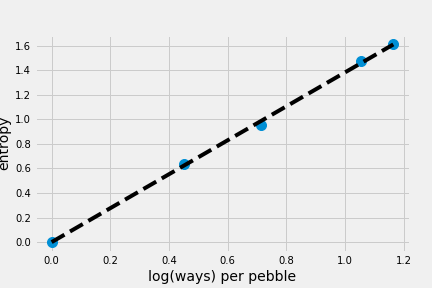
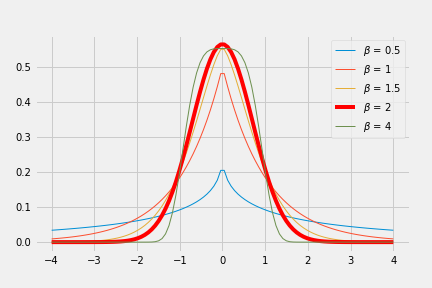
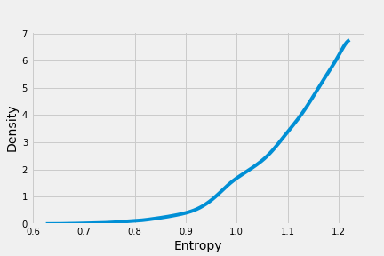
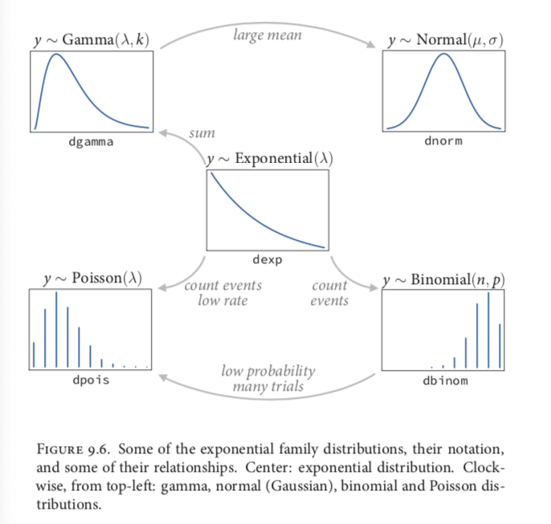

# Chapter 9 Big Entropy and the Generalized Linear Model

Use the distribution with the biggest entropy, because:

1. Distribution with the biggest entropy is the widest and least informative distribution, so we are spreading probability as evenly as possible while remaining consistent with anything we think we know.
2. Nature tend to produce empirical distributions wth high entropy.
3. Practically this rule works.

## Maximum entropy

Three criteria that a measure of uncertainty should satisfy:

1. it should be continuous
2. it should increase as the number of possible events increases
3. it should be additive

Outcome (average log-probability) aka *information entropy*:

$H(p) = - \sum _i p_i \log p_i$

Maximum entropy principle:

>The distribution that can happen the most ways is also the distribution with the biggest information entropy. The distribution with the biggest entropy is the most conservative distribution that obeys its constraints.



The log(ways) per pebble contains the same information as the information entropy. Information entropy is a way of counting how many unique arrangements correspond to a distribution. Maximum entropy is the center of gravity for the highly plausible distributions.

The probability of any particular candidate distribution is just its multinomial probability, the counts under uniform chances of landing in each bucket:

$\Pr(n_1, n_2, \dots, n_m) = \frac{N!}{n_1!n_2! \dots n_m!} \prod_{i=1}^{M} (\frac{1}{M})^{n_i} = \frac{N!}{n_1!n_2! \dots n_m!} (\frac{1}{M})^N = W(\frac{1}{M})^N$

$W$ is the *multiplicity*, the number of ways a set of counts can be realized.

$\frac{1}{N} \log W = \frac{1}{N}(\log N! - \sum_{i}\log [(N_{p_i})!])$

Since $N$ is very large, we can approximate $N!$ with Stirling's approximation, $N \log N - N$:

$\frac{1}{N} log W \sim \frac{1}{N}(N \log N - N - \sum_i (Np_i \log(Np_i) - Np_i)) = - \sum_i p_i \log p_i$

This is the formula of [Shannon's information entropy](https://en.wikipedia.org/wiki/Shannon%27s_source_coding_theorem).

The quantity to maximize is:

$\frac{1}{N} \log \Pr(n_1, n_2, \dots, n_m) \sim - \sum_i p_i \log(p_i/q_i)$

The last part is the same as KL divergence with a negative sign. The distribution that maximizes the entropy is also the distribution that minimizes the information distance from the prior. Therefore Bayesian inference can be seen as producing a posterior distribution that is most similar to prior while remaining logically consistent with given information.

### Gaussian

We can visually examine why the Gaussian is the most even distribution of any given variance. **Generalized normal distribution** is defined by probability density:

$\Pr(y|\mu, \alpha, \beta) = \frac{\beta}{2\alpha \Gamma (1/\beta)}e^{- (\frac{|y-\mu|}{\alpha})^\beta}$

The generalized gaussian distribution is the standard normal distribution when $\beta$ = 2.



### Binomial

Probability of observing $y$ events of type 1 ($p$) and $n-y$ events of type 2 ($1-p$) is:

$\Pr(y|n, p) = \frac{n!}{y!(n-y)!}p^y(1-p)^{n-y}$

If we do not care about the order, the probability of any event:

$\Pr(y_1, y_2, \dots, y_n|n, p) = p^y(1-p)^{n-y}$

Marble drawing example, given the constraing $E(n_{blue})=1$:

probabilities of candidate distributions:

```python
p = [[1/4, 1/4, 1/4, 1/4],
     [2/6, 1/6, 1/6, 2/6],
     [1/6, 2/6, 2/6, 1/6],
     [1/8, 4/8, 2/8, 1/8]]

# Compute expected value of each. The sum of the multiplied entries is just a dot product.
p_ev = [np.dot(i,[0, 1, 1, 2]) for i in p]
print(p_ev)
#[1.0, 1.0, 1.0, 1.0]
```

We can compute the entropy for each candidate:

```python
p_ent = [entropy(i) for i in p]
print(p_ent)
#[1.3862943611198906, 1.3296613488547582, 1.3296613488547582, 1.2130075659799042]
```

Distribution A is binomial distribution with $n=2$ and $p=0.5$, and has the largest entropy. Other distributions have the same expected values, but none is binomial.

**Note**: this is a special case. When the expected values is 1, the pmf is flat.

If we have a example with $E(n_{blue})=1.4$, or $p = 0.7$:

```python
p = 0.7
A = [(1-p)**2, p*(1-p), (1-p)*p, p**2]
print(A)
#[0.09000000000000002, 0.21000000000000002, 0.21000000000000002, 0.48999999999999994
#Distribution not flat

-np.sum(A*np.log(A))
#1.221728604109787 Largest entropy
```

Generate random distributions with expectation = 1.4, and none of which should have a larger entropy.

```python
def sim_p(G=1.4):
    x123 = np.random.uniform(size=3)
    x4 = (G * np.sum(x123) - x123[1] - x123[2]) / (2 - G)
    x1234 = np.concatenate((x123, [x4]))
    z = np.sum(x1234)
    p = x1234 / z
    return - np.sum(p * np.log(p)), p

H = []
p = np.zeros((10**5, 4))
for rep in range(10**5):
    h, p_ = sim_p()
    H.append(h)
    p[rep] = p_

pm.kdeplot(H)
plt.xlabel('Entropy', fontsize=14)
plt.ylabel('Density', fontsize=14);
```



The largest entropy and its corresponding distribution:

```python
np.max(H)
#1.2217283973260835

p[np.argmax(H)]
#array([ 0.09013294,  0.20983027,  0.20990385,  0.49013294])
```

Take home messages:

1. when two outcomes are possible, with constant expectation, it's a binomial distribution.
2. expectation is not always given, but can be estimated.
3. likelihood and entropy yield the same result for the same distribution.

## Generalized linear models

$y_i \sim N(\mu_i, \sigma)$
$\mu_i = \alpha + \beta x_i$

Has max entropy only when outcome is continuous and far from any theoretical maximum or minimum. Not appropriate when outcome is discrete or bounded.

We can generalize the linear regression strategy—replace a parameter describing the shape of the likelihood with a linear model—to probability distribution other than Gaussian.

$y_i \sim Binomial(n, p_i)$
$f(p_i) = \alpha + \beta x_i$

Two changes:

1. the likelihood is binomial instead of Gaussian.
2. there is a link function.

### Exponential family

Every member is a maximum entropy distribution.



#### Exponential distribution

Constrained to be zero or positive, measurements tha represent displacement from some point of reference. 

>If the probability of an event is constant in time or across space, then the distribution of events tends towards exponential.

Shape of exponential distribution described by a single parameter, the rate of events $\lambda$. or the average displacement $\lambda^{-1}$.

#### Gamma distribution

Also constrained to be zero or positive, also a distribution for distance and duration, but can have a peak above zero. Common for survival and event history analysis.

E.g. age for cancer onset is gamma distributed.

#### Poisson distribution

Count distribution (similar to binomial) for when trials $n$ is very large (and usually unknown) and probability of success $p$ is very small. Described by a single parameter, the rate of events $\lambda$.

### Linking linear models to distributions

Choosing a link function to map the linear space onto the non linear space of a parameter.

#### Logit link

$y_i \sim Binomial(n, p_i)$
$logit(p_i) = \alpha + \beta x_i$

Logit is defined as the *log-odds*:

$logit(p_i) = \log \frac{p_i}{1-p_i}$

It can be calculated that

$p_i = \frac{\exp(\alpha + \beta x_i)}{1 + exp(\alpha + \beta x_i)}$

The above function is called logistic function aka inverse-logit.

#### Log link

Log link maps a parameter that is defined over only positive real values onto a linear model.

E.g. modeling a standard deviation $\sigma$ of a Gaussian distribution which cannot be negative or zero.

$y_i \sim N(\mu, \sigma_i)$
$\log(\sigma_i) = \alpha + \beta x_i$

Log link:

$\sigma_i = \exp(\alpha + \beta x_i)$

Logarithms are *magnitudes*. Increase of one unit on the log scale means an increase of an order of magnitude on the untransformed scale.

Log link creates a problem when model is used to predict outside the distribution of the training data. Exponential model cannot be exponential forever in real life since other variables will be limiting factors.

### Absolute and relative differences

In a GLM, parameter estimates don't tell the importance of a predictor on the outcome, since each parameter represents a relative difference on the scale of th linear model, while we are interested in absolute difference in outcomes that must incorporate all parameters.

### GLMs and information criteria

Information criteria such as WAIC cannot help choosing link functions. Use entropy to choose likelihood.

Information criteria can be used to compare models with the same link function.

## Maximum entropy priors

Max entropy nominates the least informative distributions that are consistent with the constrains on the outcome variable, and also help choosing prior distribution.

The GLM help us link the background information to the outcome.