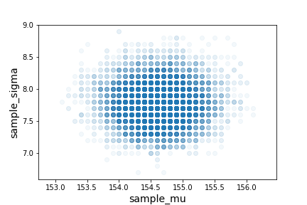
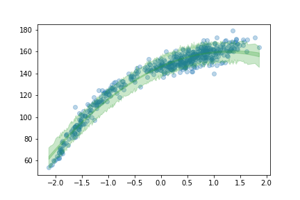

# Rethinking Statistics

## Chp2 Small worlds and large worlds

Important definitions:

- likelihood
    "the number of ways each conjecture could produce an observation"
- parameters
    "the accumulated number of ways each conjecture could produce the entire data"
- prior
    "the initial plausibility of each conjectured cause of the data"

### Likelihood

The difference between likelihood and probability is available at [StackExchange][1]. 

#### Discrete Random Variables

We find the values $\theta$ that maximize the function:

$L(\theta|O) = P(O|\theta)$

$L(\theta|O)$ is the likelihood function. This value is conditioned on observed $O$ and is a function of the unknown parameters $\theta$.

#### Continuous Random Variables

$L(\theta|O) = f(O|\theta)$

where $f(O|\theta)$ is the probability density function (pdf).

For the globe toss problem, the assumptions for binomial distribution:

1. every sample is independent of others
2. probability is the same on every sample

The probability of observing $w$ W's in $n$ tosses with a probability $p$ of W, is:

$Pr(w|n, p) = \frac{n!}{w!(n-w)!}p^w(1-p)^{n-w}$

>The count of “water” observations w is distributed binomially, with probability p of “water” on each toss and n tosses in total.

To calculate likelihood of data (e.g. 6 W's in 9 tosses under value p)

in `R`:

```R
dbinom(6, size=9, prob=0.5)
```

in `python`:

```python
import scipy.stats as stats
stats.binom.pmf(6, n=9, p=0.5)
```

[1]: https://stats.stackexchange.com/questions/2641/what-is-the-difference-between-likelihood-and-probability "What is the difference between “likelihood” and “probability”?"

### Parameters

Parameters are adjustable inputs ($p$, $n$, and $w$ for binomial likelihood).

Data are measured and known; parameters are unknown and must be estimated from data.

### Prior

The prior will be updated at every step by the machine through the learning process.

### Posterior

$Pr(w, p) = Pr(w|p)Pr(p) = Pr(p|w)Pr(w)$

$\therefore Pr(p|w) = \frac{Pr(w|p)Pr(p)}{Pr(w)}$

In word form:

$Posterior = \frac{Likelihood \times Prior}{Average\ Likelihood}$

Average Likelihood $Pr(w)$ (“evidence” or the “probability of the data”):

$Pr(w)=E(Pr(w|p))=\int Pr(w|p)Pr(p)dp$

### Numerical techniques for computing posterior distributions

#### Grid approximation

Approximate a continuous distribution by taking on an infinite number of values.

Not very practical since **Not scalable**.

Steps:

1. Define the grid
2. Compute the value of the prior at each parameter value on the grid
3. Compute the likelihood at each parameter value
4. Compute the unstandardized posterior at each parameter value, by multiplying prior by the likelihood.
5. Standardize the posterior by dividing each value by the sum of all values.

In `R`:

```R
#define grid
p_grid <- seq(from=0, to=1, length.out=20)

#define prior
prior <- rep(1, 20)

#compute likelihood at each value in grid
likelihood <- dbinom(6, size=9, prob=p_grid)

#compute product of likelihood and prior
unstd.posterior <- likelihood * prior

#standardize the posterior so it sums to 1
posterior <- unstd.posterior / sum(unstd.posterior)

#plot
plot( p_grid , posterior , type="b" ,
    xlab="probability of water" , ylab="posterior probability" )
mtext( "20 points" )
```


In `python`:

```python
def posterior_grid_approx(grid_points=5, success=6, tosses=9):
    #define grid
    p_grid = np.linspace(0, 1, grid_points)

    #define prior
    prior = np.repeat(1, grid_points)

    #compute likelihood at each point in the grid
    likelihood = stats.binom.pmf(success, tosses, p_grid)

    #compute product of likelihood and prior
    unstd_posterior = likelihood * prior

    #standardize the posterior so it sums to 1
    posterior = unstd_posterior / unstd_posterior.sum()

    return p_grid, posterior
```


#### Quadratic approximation

Models get complicated with more parameters. Quadratic approximation (also called Gaussian approximation) addresses the limited scalability of grid approximation.

In `R`:

```r
library(rethinking)
globe.qa <- map( #Maximum A Posterior
    alist(
        w ~ dbinom(9,p) ,  # binomial likelihood
        p ~ dunif(0,1)     # uniform prior
), data=list(w=6) )
# display summary of quadratic approximation
precis( globe.qa )
```

Output:

| >Mean | StdDev | 5.5% | 94.5% |
| ----- | ------ | ---- | ----- |
| p     | 0.67   | 0.16 | 0.42  | 0.92 |

In `python`:

```python
import pymc3 as pm

data = np.repeat((0, 1), (3, 6))
with pm.Model() as normal_approximation:
    p = pm.Uniform('p', 0, 1)
    w = pm.Binomial('w', n=len(data), p=p, observed=data.sum())
    mean_q = pm.find_MAP()
    std_q = ((1/pm.find_hessian(mean_q, vars=[p]))**0.5)[0]
print (mean_q['p'], std_q)
```

Output:

>logp = -1.8075, ||grad|| = 1.5: 100%|██████████| 7/7[00:00<00:00, 1519.44it/s]
0.6666666671652423 [ 0.15713484]

The quadratic approximation, either with a uniform prior or with a lot of data, is usually equivalent to a maximum likelihood estimate (MLE) and its standard error.

#### Markov chain Monte Carlo (MCMC)

TBC in Chap 8.

## Chp3 Sampling the Imaginary

Sampling the posterior distribution

1. because calculus is difficult
2. Some methods produce only samples of posteriors (e.g. MCMC).

> Scientific inference
> 1. An hypothesis is either true or false
> 2. We use a statistical procedure and get an imperfect cue of the hypothesis’ falsity
> 3. We (should) use Bayes’ theorem to logically deduce the impact of the cue on the status of the hypothesis.

In `R`:

```r
p_grid <- seq( from=0 , to=1 , length.out=1000 )
prior <- rep( 1 , 1000 )
likelihood <- dbinom( 6 , size=9 , prob=p_grid )
posterior <- likelihood * prior
posterior <- posterior / sum(posterior)

samples <- sample( p_grid , prob=posterior , size=1e4 , replace=TRUE )
plot( samples )

library(rethinking)
dens( samples )
```

In `python`:

```python
def posterior_grid_approx(grid_points=100, success=6, tosses=9):
    # define grid
    p_grid = np.linspace(0, 1, grid_points)

    # define prior
    prior = np.repeat(5, grid_points)  # uniform
    #prior = (p_grid >= 0.5).astype(int)  # truncated
    #prior = np.exp(- 5 * abs(p_grid - 0.5))  # double exp

    # compute likelihood at each point in the grid
    likelihood = stats.binom.pmf(success, tosses, p_grid)

    # compute product of likelihood and prior
    unstd_posterior = likelihood * prior

    # standardize the posterior, so it sums to 1
    posterior = unstd_posterior / unstd_posterior.sum()
    return p_grid, posterior

p_grid, posterior = posterior_grid_approx(grid_points=100, success=6, tosses=9)
samples = np.random.choice(p_grid, p=posterior, size=int(1e4), replace=True)

fig, (ax0, ax1) = plt.subplots(1,2, figsize=(12,6))
ax0.plot(samples, 'o', alpha=0.2)
ax0.set_xlabel('sample number', fontsize=14)
ax0.set_ylabel('proportion water (p)', fontsize=14)
sns.kdeplot(samples, ax=ax1)
ax1.set_xlabel('proportion water (p)', fontsize=14)
ax1.set_ylabel('density', fontsize=14);
fig.savefig('sampling.png')
```


Questions commonly asked:

- How much posterior probability lies below some parameter value?
- How much posterior probability lies between two parameter values?
- Which parameter value marks the lower 5% of the posterior probability?
- Which range of parameter values contains 90% of the posterior probability?
- Which parameter value has highest posterior probability?

### Intervals of defined boundaries

posterior probability that the proportion of water is less than 0.5

In `R`:

```r
# add up posterior probability where p < 0.5
sum( posterior[ p_grid < 0.5 ] )
```

Alternative by summing the samples:

```r
sum( samples < 0.5 ) / 1e4
```

In `python`:

```python
sum(posterior[ p_grid < 0.5 ])
```

Alternative by summing the samples:

```python
sum( samples < 0.5 ) / 1e4
```


```python
x = np.linspace(0, 1, 100)
y = stats.norm.pdf(x, 0.67, 0.16)
def plot_cdf(lower=0.0, upper=1., ax=ax):
    ax.plot(x, y)
    ax.set_xlabel('proportion water (p)', fontsize=14)
    ax.set_ylabel('density', fontsize=14);
    return ax.fill_between(x, 0, y, where= (lower<=x) & (x<=upper), interpolate=True)

fig, ((ax1, ax2), (ax3, ax4)) = plt.subplots(nrows=2, ncols=2, figsize=(10, 10))
x = np.linspace(0, 1, 100)
y = stats.norm.pdf(x, 0.67, 0.16)
param_list = [(0, 0.5), (0.5, 0.75), (0, np.percentile(samples, 80)),
              (np.percentile(samples, (10, 90)))]
for i, ax in enumerate((ax1, ax2, ax3, ax4)):
    lower, upper = param_list[i]
    plot_cdf(lower=lower, upper=upper, ax=ax)

ax1.text(0., 2, s=r'$P(x<0.5)$ = {0:.2f}'.format(stats.norm.cdf(0.5, loc=0.67, scale=0.17)), fontsize=12)
ax2.text(0., 2, s=r'$P(0.5<x<0.75)$ = {0:.2f}'.format(stats.norm.cdf(0.75, loc=0.67, scale=0.17)-stats.norm.cdf(0.5, loc=0.67, scale=0.17)), fontsize=12)
ax3.text(0., 2, s='Lower 80%', fontsize=12)
ax4.text(0., 2, s='Middle 80%', fontsize=12)
#plt.show()
plt.savefig('cdf.png')
```

### Intervals of defined mass

Bottom 80% and middle 80%:

In `R`:

```r
quantile( samples , 0.8 )
quantile( samples , c( 0.1 , 0.9 ) )
```

In `python`:

```python
np.percentile(samples, 80)
np.percentile(samples, [10, 90])
```

#### Why 95%

Ronald Fisher:
>The [number of standard deviations] for which P = .05, or 1 in 20, is 1.96 or nearly 2; it is convenient to take this point as a limit in judging whether a deviation is to be considered significant or not.

#### What does confidence interval mean

Non-Bayesian:

>if we repeated the study and analysis a very large number of times, then 95% of the computed intervals would contain the true parameter value.

confidence intervals exhibit chronic overconfidence. The word true should set off alarms that something is wrong with a statement like“contains the true value.”

### Point estimates

Things that are commonly reported:

- _maximum a posteriori_ (MAP) estimate
- mean
- median

In `R`:

```r
p_grid[which.max(posterior)]
mean(samples)
median(samples)
```

In `python`:

```python
stats.mode(samples)[0]
np.mean(samples)
np.median(samples)
```

Reporting which point estimate depends on **loss function**. Most common loss functions: absolute error ($abs(d-p)$, median value minimize the loss) and quadratic error ($(d-p)^2$, mean value minimize the loss).

E.g. Using the mean absolute error as loss function:

```r
loss <- sapply(p_grid, function(d) sum(posterior * abs(d-p_grid)))
p_grid[which.min(loss)]
```

```python
loss = [sum(posterior * abs(p - p_grid)) for p in p_grid]
p_grid[loss == min(loss)]
```

### Sampling to simulate prediction

What it's good for:

1. Model checking
2. Software validation
3. Research design
4. Forecasting

#### Dummy data

In `R`:

```r
# dbinom gives the density
dbinom(0:2, size=2, prob=0.7)
>>> 0.09 0.42 0.49
# 9% chance of observing w = 0
# 42% chance of w = 1
# 49% chance of w = 2

# rbinom generates random deviates
rbinom(1, size=2, prob=0.7)
>>> 1

rbinom(10, size=2, prob=0.7)
>>> 2 2 2 1 2 1 1 1 0 2

dummy_w <- rbinom( 1e5 , size=2 , prob=0.7 )
table(dummy_w)/1e5

>>> dummy_w
    0       1       2
    0.08904 0.41948 0.49148
#close to results of dbinom
```

In `python`:

```python
dummy_w = stats.binom.rvs(n=9, p=0.7, size=int(1e4))
plt.hist(dummy_w, bins=50)
plt.xlabel('dummy water count', fontsize=14)
plt.ylabel('Frequency', fontsize=14);
```


#### Model checking

Model checking: ensuring the model fitting worked correctly and evaluating the adequacy of a model for some purpose.

1. did the software work
2. is the model adequate

Is the model adequate? Uncertainties associated with observation, and uncertaintly about $p$.

**Solution**: propagate uncertainty of $p$ as **posterior predictive distribution**.

In `R`:

```r
#previously
w <- rbinom(1e4, size=9, prob=0.6)

#propagation
#samples <- sample( p_grid , prob=posterior , size=1e4 , replace=TRUE )
w <- rbinom(1e4, size=9, prob=samples)
```

In `python`:

```python
dummy_w = stats.binom.rvs(n=9, p=samples)
plt.hist(dummy_w, bins=50)
plt.xlabel('dummy water count', fontsize=14)
plt.ylabel('Frequency', fontsize=14);
plt.savefig('dummy_propagate.png')
```


## Chp4 Linear models

### Normal by addition

Any process that adds together random values from the same distribution converges to a normal.


>Whatever the average value of the source distribution, each sample from it can be thought of as a fluctuation from that average value. When we begin to add these fluctuations together, they also begin to cancel one another out.

### Normal by multiplication

Multiplication by small increases can be approximated using addition.

$1.1\times1.1=(1+0.1)\times(1+0.1)=1+0.2+0.01\approx1.2$

In `R`:

```r
growth <- replicate(10000, prod(1 + runif(12,0,0.1)))
hist(growth)

#the smaller the growth, the more Gaussian the product
big <- replicate(10000, prod(1 + runif(12,0,0.5)))
small <- replicate(10000, prod(1 + runif(12,0,0.01)))
```

In `python`:

```python
pos = np.random.uniform(1, 1.1, size=(12, 10000)).prod(0)
pm.kdeplot(pos);

big = np.random.uniform(1, 1.5, size=(12, 10000)).prod(0)
small = np.random.uniform(1, 1.01, size=(12, 10000)).prod(0)
fig, ax = plt.subplots(1,2, figsize=(8,4))
pm.kdeplot(big, ax=ax[0])
pm.kdeplot(small, ax=ax[1]);
```


### Normal by log-multiplication

For large deviates, Gaussian distribution can be achieved through log scale.

In `R`:

```r
log.big <- replicate(10000, log(prod(1 + runif(12,0,0.5))))
hist(log.big)
```

In `python`:

```python
log_big = np.log(np.random.uniform(1, 1.5, size=(12, 10000)).prod(0))
pm.kdeplot(log_big);
```

### Why use Gaussian distributions

PDF of Gaussian distribution:

$p(y|\mu, \sigma) = \frac{1}{\sqrt{2\pi\sigma^2}}exp(-\frac{(y-\mu)^2}{2\sigma^2})$

Properties:

- $(y-\mu)^2$ provides quadratic, and $exp((y-\mu)^2)$ gets the bell
- Everything else is normalization
- continuous

Ontology:

Mathematical idealization for addition of fluctuations.

Gaussian $\in$ Exponential family.

Epistemology:

Gaussian distribution represents a state of ignorance. (See more in information theory and maximum entropy)

### A language for describing models

1. Define outcome variable(s)
2. Define likelihood distribution for the outcome variable (Always Gaussian for regression)
3. Define predictor variables
4. Relate likelihood distribution to the predictor variables
5. Choose priors for parameters

Summary of model:

$outcome_i \sim Normal(\mu_i, \sigma)$
$\mu_i=\beta \times predictor_i$
$\beta \sim Normal(0, 10)$
$\sigma \sim HalfCauchy(0, 1)$

Independent and identically distributed (iid)

$h_i \stackrel{iid}{\sim} Normal(\mu, \sigma)$

### Gaussian model of height

In `R`:

```r
hist(dnorm( x , 178 , 20 ) , from=100 , to=250 )
hist(dunif( x , 0 , 50 ) , from=-10 , to=60 )
```

In `python`:

```python
fig, (ax1, ax2) = plt.subplots(figsize=(10,4),ncols=2)

x = np.linspace(100, 250, 100)
ax1.plot(x, stats.norm.pdf(x, 178, 20))
ax1.set_title(r'$\beta$')

x = np.linspace(-10, 60, 100)
ax2.plot(x, stats.uniform.pdf(x, 0, 50))
ax2.set_title(r'$\sigma$')

fig.savefig('priorsforlr.png')
```

Output:


Plot the prior distribution of heights. 

In `R`:

```r
sample_mu <- rnorm( 1e4 , 178 , 20 )
sample_sigma <- runif( 1e4 , 0 , 50 )
prior_h <- rnorm( 1e4 , sample_mu , sample_sigma )
hist( prior_h )
```

In `python`:

```python
n_samples = 1000
sample_mu = stats.norm.rvs(loc=178, scale=20, size=n_samples)
sample_sigma = stats.uniform.rvs(loc=0, scale=50, size=n_samples)
prior_h = stats.norm.rvs(loc=sample_mu, scale=sample_sigma)
pm.kdeplot(prior_h)
plt.xlabel('heights', fontsize=14)
plt.yticks([])
plt.savefig('prior_height.png')
```

Output:


#### Grid approximation of posterior distribution

In `python`:

```python
from scipy.interpolate import griddata

post = np.mgrid[140:160:0.1, 4:9:0.1].reshape(2,-1).T
likelihood = [sum(stats.norm.logpdf(d2.height, loc=post[:,0][i], scale=post[:,1][i])) for i in range(len(post))]
post_prod = (likelihood + 
             stats.norm.logpdf(post[:,0], loc=178, scale=20) + 
             stats.uniform.logpdf(post[:,1], loc=0, scale=50))
post_prob = np.exp(post_prod - max(post_prod))

xi = np.linspace(post[:,0].min(), post[:,0].max(), 100)
yi = np.linspace(post[:,1].min(), post[:,1].max(), 100)
zi = griddata((post[:,0], post[:,1]), post_prob, (xi[None,:], yi[:,None]))
plt.contour(xi, yi, zi);
```


#### Sampling from the posterior

In `python`:

```python
sample_rows = np.random.choice(np.arange(len(post)), size=10000, replace=True, 
                               p=(post_prob/post_prob.sum()))
sample_mu = post[:,0][sample_rows]
sample_sigma = post[:,1][sample_rows]

plt.plot(sample_mu, sample_sigma, 'o', alpha=0.05)
plt.axis('equal')
plt.grid(False)
plt.xlabel('sample_mu', fontsize=14)
plt.ylabel('sample_sigma', fontsize=14);
```



```python
fig, (ax1, ax2) = plt.subplots(1,2, figsize=(8,4))
pm.kdeplot(sample_mu, ax=ax1)
ax1.set_xlabel('sample_mu', fontsize=14)
ax1.set_yticks([])
pm.kdeplot(sample_sigma, ax=ax2)
ax2.set_xlabel('sample_sigma', fontsize=14)
ax2.set_yticks([]);
```


To summarize the width of densities with highest posterior density intervals:

`pymc3.stats.hpd` calculate highest posterior density (HPD) of array for given alpha. The HPD is the minimum width Bayesian credible interval (BCI). This function assumes the posterior distribution is unimodal. It always returns one interval per variable.

```python
pm.hpd(sample_mu), pm.hpd(sample_sigma)
# (array([ 153.8,  155.4]), array([ 7.3,  8.4]))
```

#### Approximation

Note from ipython [notebook](https://github.com/aloctavodia/Statistical-Rethinking-with-Python-and-PyMC3/blob/master/Chp_04.ipynb): We could use a quadratic approximation like McElreath does in his book and we did in code 2.6. But Using PyMC3 is really simple to just sample from the model using a "sampler method". Most common sampler methods are members of the Markov Chain Monte Carlo Method (MCMC) family (for details read Section 2.4.3 and Chapter 8 of Statistical Rethinking).

PyMC3 comes with various sampler. Some sampler are more suited than others for certain type of variable (and/or problems). For now we are going to let PyMC3 choose the sampler for us. PyMC3 also tries to provide a reasonable starting point for the simulation. By default PyMC3 uses the same adaptive procedure as in STAN 'jitter+adapt_diag', which start with a identity mass matrix and then adapt a diagonal based on the variance of the tuning samples.

In `python`:

```python
d = pd.read_csv('Data/Howell1.csv', sep=';', header=0)
d2 = d[d.age >= 18]
with pm.Model() as m4_1:
    mu = pm.Normal('mu', mu=178, sd=20)
    sigma = pm.Uniform('sigma', lower=0, upper=50)
    height = pm.Normal('height', mu=mu, sd=sigma, observed=d2.height)

with m4_1:
    trace_4_1 = pm.sample(1000, tune=1000)
pm.traceplot(trace_4_1); 
pm.summary(trace_4_1, alpha=.11).round(2)
```

| <i></i> | mean   | sd  | mc_error | hpd_5.5 | hpd_94.5 | n_eff   | Rhat |
| ------- | ------ | --- | -------- | ------- | -------- | ------- | ---- |  |
| mu      | 154.62 | 0.4 | 0.01     | 153.97  | 155.25   | 2014.85 | 1.0  |
| sigma   | 7.77   | 0.3 | 0.01     | 7.26    | 8.25     | 2161.45 | 1.0  |


If we use a narrower $\sigma$ for the prior, the results will be very different.

In `python`:

```python
with pm.Model() as m4_2:
    mu = pm.Normal('mu', mu=178, sd=0.1)
    sigma = pm.Uniform('sigma', lower=0, upper=50)
    height = pm.Normal('height', mu=mu, sd=sigma, observed=d2.height)
    trace_4_2 = pm.sample(1000, tune=1000)

pm.summary(trace_4_2, alpha=.11).round(2)
```

| <i></i> | mean   | sd  | mc_error | hpd_5.5 | hpd_94.5 | n_eff   | Rhat |
| ------- | ------ | --- | -------- | ------- | -------- | ------- | ---- |  |
| mu      | 177.86 | 0.1 | 0.00     | 177.70  | 178.01   | 1899.72 | 1.0  |
| sigma   | 24.59  | 0.9 | 0.02     | 23.13   | 25.94    | 2030.21 | 1.0  |

A smaller $\sigma$ (0.1 compared to 20) leads to a small change of $\mu$ from the prior (178). However, the $\sigma$ is now bigger (24.59 compared to 7.77).

>Once the golem is certain that the mean is near 178—as the prior insists—then the golem has to estimate σ conditional on that fact.

##### Strong and weak priors

The implied amount of data can be calculated using:

$\sigma_{post} = 1/ \sqrt n$

For example, the stronger prior $\mu \sim N(178, 0.1)$ implies that $n = 1/ \sigma_{post}^2 = 100$. So the $\mu \sim N(178, 0.1)$ is equivalent to having previously observed 100 heights with mean value 178. On the contrary, the $\mu \sim N(178, 20)$ is equivalent to having observed 0.0025 samples, which is weak.

Decomposing the Variance-Covariance matrix in `python`:

```python
np.diag(trace_df.cov())
#array([ 0.16324874,  0.09262872])

trace_df.corr()
```

| <i></i> | mu        | sigma     |
| ------- | --------- | --------- |
| mu      | 1.000000  | -0.028866 |
| sigma   | -0.028866 | 1.000000  |

Note: the distribution of $\sigma$ may not always be Gaussian. But a log-transformation helps since $log(\sigma)$ is often close to Gaussian.

### Adding a predictor

Scatter between height and weight in `python`:

```python
plt.plot(d2.height, d2.weight, '.')
plt.xlabel('height')
plt.ylabel('weight')
```


Linear model definition:

likelihood: $h_i \sim Normal(\mu_i, \sigma)$
linear model:  $\mu_i = \alpha + \beta x_i$
$\alpha$ prior:  $\alpha \sim Normal(178, 100)$
$\beta$ prior:  $\beta \sim Normal(0, 10)$
$\sigma$ prior:  $\sigma \sim Uniform(0, 50)$


#### interpret the model

The measure of coefficient is model-dependent.
The measure of intercept can be uninterpretable without also looking at coefficient. Therefore weak priors for intercepts are necessary.

##### Tables

Getting the parameters from the model in `python`:

```python
pm.summary(trace_4_3, alpha=.11).round(2)
```

Output:

<i></i> |mean |sd |mc_error |hpd_5.5 |hpd_94.5 |n_eff |Rhat
---|---|---|---|---|---|---|---
alpha |114.01 |1.94 |0.07 |110.96 |117.07 |701.50 |1.0
beta |0.90 |0.04 |0.00 |0.84 |0.97 |695.60 |1.0
sigma |5.10 |0.19 |0.01 |4.77 |5.40 |771.39 |1.0

Get correlation between parameters:

```python
trace_df = pm.trace_to_dataframe(trace_4_3)
trace_df.corr().round(2)
```

<i></i>|alpha |beta |sigma
---|---|---|---
alpha |1.00 |-0.99 |-0.01
beta |-0.99 |1.00 |0.02
sigma |-0.01 |0.02 |1.00

Note: $\alpha$ and $\beta$ are almost perfectly negatively correlated, and this means the two carries same information, and changing one leads to changes in another. 

###### Centering before fitting

In `python`:

```python
#subtract weights by the mean
d2 = d2.assign(weight_c=pd.Series(d2.weight - d2.weight.mean()))

d2 = d2.assign(weight_c=pd.Series(d2.weight - d2.weight.mean()))
with pm.Model() as m4_4:
    alpha = pm.Normal('alpha', mu=178, sd=100)
    beta = pm.Normal('beta', mu=0, sd=10)
    sigma = pm.Uniform('sigma', lower=0, upper=50)
    mu = alpha + beta * d2.weight_c
    height = pm.Normal('height', mu=mu, sd=sigma, observed=d2.height)
    trace_4_4 = pm.sample(1000, tune=1000)

pm.summary(trace_4_4, alpha=.11).round(2)
```

<i></i>|mean |sd |mc_error |hpd_5.5 |hpd_94.5 |n_eff |Rhat
---|---|---|---|---|---|---|---
alpha |154.59 |0.28 |0.01 |154.15 |155.03 |2000.0 |1.0
beta |0.90 |0.04 |0.00 |0.84 |0.97 |2000.0 |1.0
sigma |5.11 |0.19 |0.00 |4.80 |5.40 |2000.0 |1.0

Note: the new $\beta$ and $\sigma$ are unchanged, but $\alpha$ is now the same as average height in the raw data. 

##### Plotting


##### Adding uncertainty around the mean


##### Plotting regression intervals and contours


Since components of $\mu$ has distribution, so does $\mu$. Since $\alpha$ and $\beta$ are Gaussian, so are $\mu$.

Highest posterior distribution in `python`:

```python
pm.hpd(mu_at_50, alpha=.11)
#array([ 153.70674812,  159.95660857])
```

Plotting the uncertainty in `python`:

```python
fig, (ax1, ax2) = plt.subplots(ncols=2, figsize=(10,5))

weight_seq = np.arange(25, 71)
# Given that we have a lot of samples we can use less of them for plotting (or we can use all!)
chain_N_thinned = chain_N[::10]
mu_pred = np.zeros((len(weight_seq), len(chain_N_thinned)*chain_N.nchains))
for i, w in enumerate(weight_seq):
    mu_pred[i] = chain_N_thinned['alpha'] + chain_N_thinned['beta'] * w
ax1.plot(weight_seq, mu_pred, 'C0.', alpha=0.1)
ax1.set_xlabel('weight', fontsize=14)
ax1.set_ylabel('height', fontsize=14)

mu_mean = mu_pred.mean(1)
mu_hpd = pm.hpd(mu_pred.T, alpha=.11)
ax2.scatter(d2.weight[:N], d2.height[:N])
ax2.plot(weight_seq, mu_mean, 'C2')
ax2.fill_between(weight_seq, mu_hpd[:,0], mu_hpd[:,1], color='C2', alpha=0.25)
ax2.set_xlabel('weight', fontsize=14)
ax2.set_ylabel('height', fontsize=14)
ax2.set_xlim(d2.weight[:N].min(), d2.weight[:N].max());
```


##### Prediction intervals

Predicting every possible height instead of only the mean in `python`:

```python
height_pred = pm.sample_ppc(chain_N, 200, m_N)
height_pred_hpd = pm.hpd(height_pred['height_hat'])
```

Plotting the intervals of predictions in `python`:

```python
idx = np.argsort(d2.weight.values[:N])
d2_weight_ord = d2.weight.values[:N][idx]
height_pred_hpd = height_pred_hpd[idx]
plt.scatter(d2.weight[:N], d2.height[:N])
plt.fill_between(weigth_seq, mu_hpd[:,0], mu_hpd[:,1], color='C2', alpha=0.25)
plt.fill_between(d2_weight_ord, height_pred_hpd[:,0], height_pred_hpd[:,1], color='C2', alpha=0.25)
plt.plot(weigth_seq, mu_mean, 'C2')
plt.xlabel('weight', fontsize=14)
plt.ylabel('height', fontsize=14)
plt.xlim(d2.weight[:N].min(), d2.weight[:N].max())
plt.savefig('prediction_interval.png')
```

89% prediction interval for height, as a function of weight. The solid line is the MAP estimate of the mean height at each weight. The two shaded regions show different 89% plausible regions. The narrow shaded interval around the line is the distribution of $\mu$. The wider shaded region represents the region within which the model expects to find 89% of actual heights in the population, at each weight.


### Polynomial regression

Standardize the predictor variable

1. simplifies interpretation
   >For a standardized variable, a change of one unit is equivalent to a change of one standard deviation. 
2. helps fitting the model
   >When predictor variables have very large values in them, there are sometimes numeri- cal glitches. Standardizing largely resolves this issue.

Polynomial model with weak priors:

$h_i \sim N(\mu_i, \sigma)$
$\mu_i = \alpha + \beta_1x_i + \beta_2x_i^2$
$\alpha \sim N(178, 100)$
$\beta_1 \sim N(0, 10)$
$\beta_2 \sim N(0, 10)$
$\sigma \sim Uniform(0, 50)$


```python
pm.summary(trace_4_5, varnames, alpha=.11).round(2)
```

<i></i>|mean |sd |mc_error |hpd_5.5 |hpd_94.5 |n_eff |Rhat
---|---|---|---|---|---|---|---|---
alpha |146.66 |0.37 |0.01 |146.06 |147.26 |1320.42 |1.0
beta__0 |21.41 |0.29 |0.01 |20.95 |21.90 |1550.92 |1.0
beta__1 |-8.41 |0.28 |0.01 |-8.89 |-7.97 |1170.89 |1.0
sigma |5.77 |0.17 |0.00 |5.50 |6.05 |1630.57 |1.0



Trace plot of the 3rd order regression $\mu_i = \alpha + \beta_1 x_i + \beta_2 x_i^2 + \beta_3 x_i^3$:


## Multivariate linear models

Reasons for multivariate models:

1. statistical control for confounds - variables that are correlated
2. multiple causations
3. interactions

### Spurious association

#### Divorce and marriage age

Trace plot in `python`:

```python
with pm.Model() as model_5_1:
    a = pm.Normal('a', mu=10, sd=10)
    bA = pm.Normal('bA', mu=0, sd=1)
    sigma = pm.Uniform('sigma', lower=0, upper=10)
    # good (default) alternatives for sigma (in this and other models) are
    # sigma = pm.HalfNormal('sigma', 5)
    # sigma = pm.HalfCauchy('sigma', 5)
    # some people recomed avoiding "hard" boundaries unless they have a theoretical/data-based justification, like a correlation that is restricted to be [-1, 1].
    mu = pm.Deterministic('mu', a + bA * d.MedianAgeMarriage_s)
    Divorce = pm.Normal('Divorce', mu=mu, sd=sigma, observed=d.Divorce)
    trace_5_1 = pm.sample(1000, tune=1000)

varnames = ['a', 'bA', 'sigma']
pm.traceplot(trace_5_1, varnames)
```


In `python`:

```python
mu_mean = trace_5_1['mu']
mu_hpd = pm.hpd(mu_mean)

plt.plot(d.MedianAgeMarriage_s, d.Divorce, 'C0o')
plt.plot(d.MedianAgeMarriage_s, mu_mean.mean(0), 'C2')

idx = np.argsort(d.MedianAgeMarriage_s)
plt.fill_between(d.MedianAgeMarriage_s[idx],
                 mu_hpd[:,0][idx], mu_hpd[:,1][idx], color='C2', alpha=0.25)

plt.xlabel('Median Age Marriage', fontsize=14)
plt.ylabel('Divorce', fontsize=14)
```


Estimated parameters:

<i></i>|mean |sd |mc_error |hpd_5.5 |hpd_94.5 |n_eff |Rhat
---|---|---|---|---|---|---|---|---
a |9.68 |0.21 |0.0 |9.35 |10.01 |2718.53 |1.0
bA |-1.04 |0.21 |0.0 |-1.39 |-0.73 |2317.11 |1.0
sigma |1.51 |0.16 |0.0 |1.26 |1.77 |2279.49 |1.0

##### Divorce and marriage:

Trace plot in `python`:

```python
d['Marriage_s'] = (d.Marriage - d.Marriage.mean()) / d.Marriage.std()
with pm.Model() as model_5_2:
    a = pm.Normal('a', mu=10, sd=10)
    bA = pm.Normal('bA', mu=0, sd=1)
    sigma = pm.Uniform('sigma', lower=0, upper=10)
    mu = pm.Deterministic('mu', a + bA * d.Marriage_s)
    Divorce = pm.Normal('Divorce', mu=mu, sd=sigma, observed=d.Divorce)
    trace_5_2 = pm.sample(1000, tune=1000)
pm.traceplot(trace_5_2, varnames)
```


In `python`:

```python
mu_mean = trace_5_2['mu']
mu_hpd = pm.hpd(mu_mean)

d.plot('Marriage_s', 'Divorce', kind='scatter', xlim = (-2, 3))
plt.plot(d.Marriage_s, mu_mean.mean(0), 'C2')

idx = np.argsort(d.Marriage_s)
plt.fill_between(d.Marriage_s[idx], mu_hpd[:,0][idx], mu_hpd[:,1][idx], color='C2', alpha=0.25);
```


Estimated parameters:

<i></i>|mean |sd |mc_error |hpd_5.5 |hpd_94.5 |n_eff |Rhat
---|---|---|---|---|---|---|---|---
a |9.69 |0.25 |0.0 |9.27 |10.09 |2441.79 |1.0
bA |0.64 |0.25 |0.0 |0.24 |1.03 |2578.26 |1.0
sigma |1.75 |0.18 |0.0 |1.46 |2.02 |2204.67 |1.0

#### Multivariate notation

Strategy for multivariate regression formula:

1. Nominate predictor variable
2. Make a parameter for each predictor
3. multiply the parameter by variable and add to the linear model

$D_i \sim N(\mu, \sigma)$
$\mu_i = \alpha + \beta_RR_i + \beta_AA_i$
$\alpha \sim N(10, 10)$
$\beta_R \sim N(0, 1)$
$\beta_A \sim N(0, 1)$
$\sigma \sim Uniform(0, 10)$

#### fitting the model

```python
with pm.Model() as model_5_3:
    a = pm.Normal('a', mu=10, sd=10)
    bA = pm.Normal('bA', mu=0, sd=1, shape=2)
    sigma = pm.Uniform('sigma', lower=0, upper=10)
    mu = pm.Deterministic('mu', a + bA[0] * d.Marriage_s + bA[1] * d.MedianAgeMarriage_s)

    Divorce = pm.Normal('Divorce', mu=mu, sd=sigma, observed=d.Divorce)
    trace_5_3 = pm.sample(1000, tune=1000)
varnames = ['a', 'bA', 'sigma']
pm.traceplot(trace_5_3, varnames);
```


<i></i>|mean |sd |mc_error |hpd_5.5 |hpd_94.5 |n_eff |Rhat
---|---|---|---|---|---|---|---|---
a |9.69 |0.22 |0.01 |9.36 |10.05 |1421.62 |1.0
bA__0 |-0.11 |0.30 |0.01 |-0.59 |0.36 |1219.23 |1.0
bA__1 |-1.11 |0.30 |0.01 |-1.57 |-0.62 |1397.48 |1.0
sigma |1.53 |0.17 |0.00 |1.28 |1.80 |1623.82 |1.0


#### Plotting multivariate posteriors

Why we plot:

1. visualize size of the association between predictor and outcome
2. get a sense of predicative ability of model

Three types of plots:

1. Predictor residual plots
2. Counterfactual plots
3. Posterior prediction plots

##### Predictor residual plot

Predictor presidual plot is the average prediction error when using all other predcitors.  It just leaves in the variation that is not expected by the model of the mean, $\mu$, as a function of the other predictors.

For example, when considering the residuals for marriage rate, we attempt to predict marriage rate with age alone, and consider the residual of median marriage age.

Create linear regression model Marriage_rate $\sim$ age, and plot the residuals:


##### Countercactual plots

Plotting how predictions change as you change only one predictor at a time while holding all other predictors constant.

Then plot the divorce rate against the residuals (left):


The possible influence of age is now "controlled". Coefficient for the blue line on the left: -1.13, the same as in the previous model.

The residual plot for median marriage age is on the right, with marriage rate "controlled".

Problem: In reality almost impossible to only change one variable without affecting others.

##### Posterior prediction plots

To check how well the model fit:

1. Did the model fit correctly?
2. How does the model fail?

```python
mu_pred = trace_5_3['mu']
mu_hpd = pm.hpd(mu_pred)

divorce_pred = pm.sample_ppc(trace_5_3, samples=1000, model=model_5_3)['Divorce']
divorce_hpd = pm.hpd(divorce_pred)

mu_hpd = pm.hpd(mu_pred, alpha=0.05)
plt.errorbar(d.Divorce, divorce_pred.mean(0), yerr=np.abs(divorce_pred.mean(0)-mu_hpd.T) , fmt='C0o')
plt.plot(d.Divorce, divorce_pred.mean(0), 'C0o')

plt.xlabel('Observed divorce', fontsize=14)
plt.ylabel('Predicted divorce', fontsize=14)

min_x, max_x = d.Divorce.min(), d.Divorce.max()
plt.plot([min_x, max_x], [min_x, max_x], 'k--')
```


```python
plt.figure(figsize=(10,12))
residuals = d.Divorce - mu_pred.mean(0)
idx = np.argsort(residuals)
y_label = d.Loc[idx]
y_points = np.linspace(0, 1, 50)
plt.errorbar(residuals[idx], y_points, 
             xerr=np.abs(divorce_pred.mean(0)-mu_hpd.T),
             fmt='C0o',lw=3)

plt.errorbar(residuals[idx], y_points, 
             xerr=np.abs(divorce_pred.mean(0)-divorce_hpd.T),
             fmt='C0o', lw=3, alpha=0.5)

plt.yticks(y_points, y_label);
plt.vlines(0, 0, 1, 'grey');
plt.savefig('pred_by_state.png')
```


Spurious association: One way spurious association can rise is when $x_{real}$ influences both $x_{spur}$ and $y$, and model only inspects $y$ and $x_{spur}$. This can be reduced by including both $x_{real}$ and $x_{spur}$.

### Masked relationship

Multivariate analyses not only reduces spurious association, but also measures combined influences of multiple factors.

Analysis of neocortex's influence on k-calories of milk in `python`:

```python
d = pd.read_csv('Data/milk.csv', sep=';')
dcc = d.dropna().copy()
with pm.Model() as model_5_5:
    a = pm.Normal('a', mu=10, sd=100)
    bn = pm.Normal('bn', mu=0, sd=1)
    sigma = pm.Uniform('sigma', lower=0, upper=1)
    mu = pm.Deterministic('mu', a + bn * dcc['neocortex.perc'])
    kcal = pm.Normal('kcal', mu=mu, sd=sigma, observed=dcc['kcal.per.g'])
    trace_5_5 = pm.sample(1000, tune=1000)

varnames = ['a', 'bn', 'sigma']
pm.summary(trace_5_5, varnames, alpha=.11).round(2)
```

<i></i>|mean |sd |mc_error |hpd_5.5 |hpd_94.5 |n_eff |Rhat
---|---|---|---|---|---|---|---|---
a |0.347 |0.527 |0.023 |-0.527 |1.130 |504.767 |1.000
bn |0.005 |0.008 |0.000 |-0.008 |0.017 |499.303 |1.000
sigma |0.194 |0.041 |0.002 |0.132 |0.248 |486.401 |1.002

The mean of bn is very small compared to the variation. Plotting the 89% interval for the mean in `python`:

```python
seq = np.linspace(55, 76, 50)
mu_pred = trace_5_5['a'] + trace_5_5['bn'] * seq[:,None]
mu_hpd = pm.hpd(mu_pred.T)

plt.plot(d['neocortex.perc'], d['kcal.per.g'], 'C0o')

plt.plot(seq, mu_pred.mean(1), 'k')
plt.plot(seq, mu_hpd[:,0], 'k--')
plt.plot(seq, mu_hpd[:,1], 'k--')

plt.xlabel('neocortex.perc', fontsize=14)
plt.ylabel('kcal.per.g', fontsize=14)
```

The MAP line is weakly positive but highly imprecise, with many positive and negative slopes possible. 


Now consider the relationship between body mass and k-calories:

```python
dcc['log_mass'] = np.log(dcc['mass'])
with pm.Model() as model_5_6:
    a = pm.Normal('a', mu=10, sd=100)
    bn = pm.Normal('bn', mu=0, sd=1)
    sigma = pm.Uniform('sigma', lower=0, upper=1)
    mu = pm.Deterministic('mu', a + bn * dcc['log_mass'])
    kcal = pm.Normal('kcal', mu=mu, sd=sigma, observed=dcc['kcal.per.g'])
    trace_5_6 = pm.sample(1000, tune=1000)
pm.summary(trace_5_6, varnames, alpha=.11).round(3)
```

<i></i>|mean |sd |mc_error |hpd_5.5 |hpd_94.5 |n_eff |Rhat
---|---|---|---|---|---|---|---|---
a |0.705 |0.061 |0.002 |0.610 |0.802 |832.620 |1.003
bn |-0.032 |0.026 |0.001 |-0.071 |0.008 |853.061 |1.002
sigma |0.182 |0.038 |0.001 |0.123 |0.235 |1095.002 |1.001

Again, the seemingly negative relationship between log-bodymass and k-calories is still quite uncertain.

Try adding both variables to the regression:

$k_i \sim N(\mu_i, \sigma)$
$\mu_i = \alpha + \beta_n n_i + \beta_m \log(m_i)$
$\alpha \sim N(0, 100)$
$\beta_n \sim N(0, 1)$
$\beta_m \sim N(0, 1)$
$\sigma \sim Uniform(0, 10)$

```python
with pm.Model() as model_5_7:
    a = pm.Normal('a', mu=10, sd=100)
    bn = pm.Normal('bn', mu=0, sd=1, shape=2)
    sigma = pm.Uniform('sigma', lower=0, upper=1)
    mu = pm.Deterministic('mu', a + bn[0] * dcc['neocortex.perc'] + bn[1] * dcc['log_mass'])
    kcal = pm.Normal('kcal', mu=mu, sd=sigma, observed=dcc['kcal.per.g'])
    trace_5_7 = pm.sample(1000, tune=1000)
pm.summary(trace_5_7, varnames, alpha=.11).round(3
```

<i></i>|mean |sd |mc_error |hpd_5.5 |hpd_94.5 |n_eff |Rhat
---|---|---|---|---|---|---|---|---
a |-1.146 |0.585 |0.028 |-2.120 |-0.274 |441.727 |1.000
bn__0 |0.029 |0.009 |0.000 |0.015 |0.044 |438.759 |1.000
bn__1 |-0.099 |0.027 |0.001 |-0.145 |-0.057 |575.831 |1.000
sigma |0.140 |0.028 |0.001 |0.096 |0.176 |386.627 |1.009

Incorporating both variables in the regression changed both coefficients.


Reason: both explanatory variables positively correlated with one another, but one positively related to outcome and the other negatively related. Therefore, the effect of the two canceled out.

**Simulating a making relationship** by creating two predictors, one positively and the other negatively associated with outcome. Also two predictors are positively correlated with one another.

In `python`:

```python
N = 100
rho = 0.7
x_pos = stats.norm.rvs(size=N)
x_neg = stats.norm.rvs(rho*x_pos, (1-rho**2)**0.5)
y = stats.norm.rvs(x_pos - x_neg)
d = pd.DataFrame([y, x_real, x_spur]).T

sns.pairplot(d)
fig = plt.gcf()
```

It can be seen that $x_1$ and $x_2$ are postively correlated with one another. The association of y with both $x_1$ and $x_2$ are not pronounced.


#### When adding variables hurts

Potential risks:

1. multicollinearity
2. post-treatment bias
3. overfitting

##### Multicollinear legs

Simulating left and right leg lengths using the height:

```python
N = 100
height = stats.norm.rvs(size=N, loc=10, scale=2)
leg_prop = stats.uniform.rvs(size=N, loc=0.4, scale=0.1) 
leg_left = leg_prop * height + stats.norm.rvs(size=N, loc=0, scale=0.02)
leg_right = leg_prop * height + stats.norm.rvs(size=N, loc=0, scale=0.02)

with pm.Model() as m5_8:
    a = pm.Normal('a', mu=10, sd=100)
    bl = pm.Normal('bl', mu=2, sd=10)
    br = pm.Normal('br', mu=2, sd=10)
    mu = pm.Deterministic('mu', a + bl * leg_left + br * leg_right)    
    sigma = pm.Uniform('sigma', lower=0 , upper=10)
    height_p = pm.Normal('height_p', mu=mu, sd=sigma, observed=height)
    
    trace_5_8 = pm.sample(1000, tune=1000)
varnames=['a', 'bl', 'br', 'sigma']
pm.traceplot(trace_5_8, varnames);
pm.summary(trace_5_8, varnames, alpha=.11).round(3)
```

<i></i>|mean |sd |mc_error |hpd_5.5 |hpd_94.5 |n_eff |Rhat
---|---|---|---|---|---|---|---|---
a |0.860 |0.301 |0.008 |0.361 |1.326 |1378.013 |1.0
bl |0.918 |2.230 |0.080 |-2.721 |4.497 |674.663 |1.0
br |1.101 |2.231 |0.080 |-2.824 |4.434 |679.135 |1.0
sigma |0.661 |0.049 |0.001 |0.580 |0.733 |1075.586 |1.0


Bivariate posterior distribution for bl and br:


The multicollinearity can be conceptualized as:

$y_i \sim N(\mu_i, \sigma)$
$\mu_i = \alpha + \beta_1 x_i + \beta_2 x_i$

Which is equivalent to

$y_i \sim N(\mu_i, \sigma)$
$\mu_i = \alpha + (\beta_1 + \beta_2) x_i$

If we combine the coefficient of two collinear variables we get:


Which is exactly the same as one variable regression result:

```pythonwith pm.Model() as m5_9:
    a = pm.Normal('a',mu = 10, sd=100)
    bl = pm.Normal('bl',mu=2, sd= 10)
    mu = pm.Deterministic('mu',a + bl * leg_left)    
    sigma = pm.Uniform('sigma', lower= 0 , upper= 10)
    height = pm.Normal('height',mu=mu, sd=sigma, observed=height)
    trace_5_9 = pm.sample(1000, tune=1000)
varnames_1 = ['a', 'bl', 'sigma']
#pm.traceplot(trace_5_9, varnames_1)
pm.summary(trace_5_9, varnames_1, alpha=.11).round(3)
```

<i></i>|mean |sd |mc_error |hpd_5.5 |hpd_94.5 |n_eff |Rhat
---|---|---|---|---|---|---|---|---
a |0.871 |0.303 |0.011 |0.380 |1.338 |633.771 |1.0
bl |2.015 |0.065 |0.002 |1.916 |2.119 |649.489 |1.0
sigma |0.656 |0.048 |0.002 |0.581 |0.731 |893.859 |1.0

#### Multicollinear milk

Modeling `kcal.per.g` as a function of `perc.fat` and `perc.lactose` separately:

`perc.fat`

```python
with pm.Model() as m5_10:
    a = pm.Normal('a',mu = 0.6, sd=10)
    bf = pm.Normal('bf',mu=0, sd= 1)
    mu = pm.Deterministic('mu',a + bf * milk['perc.fat'])    
    sigma = pm.Uniform('sigma', lower= 0 , upper= 10)
    kcalperg = pm.Normal('kcal.per.g',mu=mu, sd=sigma, observed=milk['kcal.per.g'])
    trace_5_10 = pm.sample(1000, tune=1000)
varnames = ['a', 'bf', 'sigma']
pm.summary(trace_5_10, varnames, alpha=.11).round(3)
```

<i></i>|mean |sd |mc_error |hpd_5.5 |hpd_94.5 |n_eff |Rhat
---|---|---|---|---|---|---|---|---
a |0.297 |0.041 |0.002 |0.232 |0.358 |558.274 |1.003
bf |0.010 |0.001 |0.000 |0.008 |0.012 |560.906 |1.002
sigma |0.080 |0.012 |0.000 |0.062 |0.097 |743.310 |1.000

`perc.lactose`

```python
with pm.Model() as m5_11:
    a = pm.Normal('a',mu = 0.6, sd=10)
    bl = pm.Normal('bl',mu=0, sd= 1)
    mu = pm.Deterministic('mu',a + bl * milk['perc.lactose'])    
    sigma = pm.Uniform('sigma', lower= 0 , upper= 10)
    kcalperg = pm.Normal('kcal.per.g',mu=mu, sd=sigma, observed=milk['kcal.per.g'])
    trace_5_11 = pm.sample(1000, tune=1000)
varnames = ['a', 'bl', 'sigma']
pm.summary(trace_5_11, varnames, alpha=.11).round(3)
```

<i></i>|mean |sd |mc_error |hpd_5.5 |hpd_94.5 |n_eff |Rhat
---|---|---|---|---|---|---|---|---
a |1.165 |0.047 |0.002 |1.094 |1.241 |767.584 |1.003
bl |-0.011 |0.001 |0.000 |-0.012 |-0.009 |792.972 |1.002
sigma |0.068 |0.010 |0.000 |0.052 |0.082 |998.304 |1.000

The posterior of bf and bl are mirror images of each other.

We then combine the two:

```python
with pm.Model() as m5_12:
    a = pm.Normal('a',mu = 0.6, sd=10)
    bf = pm.Normal('bf',mu=0, sd= 1)
    bl = pm.Normal('bl',mu=0, sd= 1)
    mu = pm.Deterministic('mu',a + bf * milk['perc.fat'] + bl * milk['perc.lactose'])    
    sigma = pm.Uniform('sigma', lower= 0 , upper= 10)
    kcalperg = pm.Normal('kcal.per.g',mu=mu, sd=sigma, observed=milk['kcal.per.g'])
    trace_5_12 = pm.sample(1000, tune=1000)
```

<i></i>|mean |sd |mc_error |hpd_5.5 |hpd_94.5 |n_eff |Rhat
---|---|---|---|---|---|---|---|---
a |1.004 |0.221 |0.009 |0.663 |1.349 |538.796 |1.002
bf |0.002 |0.003 |0.000 |-0.003 |0.006 |547.987 |1.002
bl |-0.009 |0.003 |0.000 |-0.013 |-0.004 |545.629 |1.002
sigma |0.069 |0.009 |0.000 |0.055 |0.083 |588.209 |1.005

The posterior of both bf and bl is close to 0 since they canceled out. Correlation between the two:

```python
milk.corr()['perc.fat']['perc.lactose']
# -0.94163734568392821
```


We can simulate correlated variables and see how it affects the standard deviation of the posterior distribution of the slope.

```python
def simcoll(r = 0.9):
    milk['x'] = stats.norm.rvs(size=len(milk), loc = r * milk['perc.fat'],
                       scale = np.sqrt((1 - r**2) * milk['perc.fat'].var()))
    X = np.column_stack((milk['perc.fat'], milk['x']))
    m = smf.OLS(milk['kcal.per.g'], X).fit()
    cov = m.cov_params()
    return (np.diag(cov)[1])**0.5
    
def repsimcoll(r= 0.9, N = 100):
    stddev = [simcoll(r) for _ in range(N)]
    return np.mean(stddev)

lista = []
for i in np.arange(start = 0, stop = 0.99, step = 0.01):   
    lista.append(repsimcoll (r= i, N = 100))

plt.plot(np.arange(start = 0, stop = 0.99, step = 0.01), lista)
plt.xlabel('correlation', fontsize=14)
plt.ylabel('stddev', fontsize=14)
```


##### "Solution" to multicolinearity

Possible to try dimension reduction (e.g. PCA, factor analysis) but not always work, since difficult to interpret.
Multicollinearity is one type of non-identifiability - the structure of the data and model do not make it possible to estimate the parameter’s value.

#### Post-treatement bias

Post-treatment bias: mistaken inference arising from including variables that are consequences of other variables.

Simulating post-treatment variable:

```python
# number of plants
N = 100

# simulate initial heights
h0 = stats.norm.rvs(size = N, loc = 10, scale = 2)

# assign treatments and simulate fungus and growth
treatment = np.repeat([0, 1], [N/2]*2)
fungus = np.random.binomial(n=1, p=(0.5-treatment * 0.4), size=N)
h1 = h0 + stats.norm.rvs(size= N, loc= 5- 3*fungus, scale=1)

# compose a clean data frame
d = pd.DataFrame({'h0': h0,
                  'h1': h1,
                  'Treatment':treatment,
                  'Fungus': fungus})

with pm.Model() as m5_13:
    a = pm.Normal('a',mu = 0, sd=100)
    bh = pm.Normal('bh',mu = 0, sd=10)
    bt = pm.Normal('bt',mu = 0, sd=10)
    bf = pm.Normal('bf',mu = 0, sd=10)
    mu = pm.Deterministic('mu',a + bh * h0 + bt * treatment + bf * fungus)
    sigma = pm.Uniform('sigma', lower= 0 , upper= 10)
    h1 = pm.Normal('h1', mu = mu, sd=sigma, observed = d['h1'].get_values())
    trace_5_13 = pm.sample(1000, tune=1000)

varnames = ['a', 'bh', 'bt', 'bf', 'sigma']
pm.summary(trace_5_13, varnames, alpha=.11).round(3)
```

<i></i>|mean |sd |mc_error |hpd_5.5 |hpd_94.5 |n_eff |Rhat
---|---|---|---|---|---|---|---|---
a |4.492 |0.475 |0.016 |3.671 |5.202 |692.726 |1.000
bh |1.057 |0.046 |0.002 |0.984 |1.128 |676.405 |1.000
bt |0.118 |0.242 |0.006 |-0.253 |0.516 |1336.144 |1.000
bf |-3.006 |0.270 |0.007 |-3.424 |-2.583 |1273.666 |1.000
sigma |1.031 |0.075 |0.002 |0.896 |1.136 |1625.553 |0.999

Once $bf$ is introduced, the coefficient of $bh$ and $bt$ are affected.
>So when we control for fungus, the model is implicitly answering the question: Once we already know whether or not a plant developed fungus, does soil treatment matter? The answer is “no,” because soil treatment has its effects on growth through reducing fungus. But we actually want to know, based on the design of the experi- ment, is the impact of treatment on growth. To measure this properly, we should omit the post-treatment variable fungus.

If we do not include bf in the model:

```python
with pm.Model() as m5_14:
    a = pm.Normal('a',mu = 0, sd=100)
    bh = pm.Normal('bh',mu = 0, sd=10)
    bt = pm.Normal('bt',mu = 0, sd=10)
    mu = pm.Deterministic('mu',a + bh * h0 + bt * treatment)
    sigma = pm.Uniform('sigma', lower= 0 , upper= 10)
    h1 = pm.Normal('h1', mu = mu, sd=sigma, observed =d['h1'])
    trace_5_14 = pm.sample(1000, tune=1000)

varnames = ['a', 'bh', 'bt', 'sigma']
pm.summary(trace_5_14, varnames, alpha=.11).round(3)
```

<i></i>|mean |sd |mc_error |hpd_5.5 |hpd_94.5 |n_eff |Rhat
---|---|---|---|---|---|---|---|---
a |3.467 |0.728 |0.023 |2.352 |4.619 |1096.940 |1.001
bh |1.014 |0.071 |0.002 |0.910 |1.136 |938.756 |1.001
bt |1.377 |0.326 |0.008 |0.873 |1.900 |1423.065 |1.002
sigma |1.583 |0.116 |0.003 |1.401 |1.762 |1616.582 |1.000

Post-treatment bias cannot be detected and addressed from model comparison using information criteria.

### Categorical variables

#### One category

$h_i \sim N(\mu, \sigma)$
$\mu_i = \alpha + \beta_m m_i$
$\alpha \sim N(178, 100)$
$\beta_m \sim N(0, 10)$
$\sigma \sim Uniform(0, 50)$

For the height data:

```python
with pm.Model() as m5_15:
    a = pm.Normal('a',mu = 178, sd=100)
    bm = pm.Normal('bm',mu = 0, sd=10)
    mu = pm.Deterministic('mu',a + bm * d['male'])
    sigma = pm.Uniform('sigma', lower= 0 , upper= 50)
    height = pm.Normal('height', mu = mu, sd=sigma, observed = d['height'])
    trace_5_15 = pm.sample(1000, tune=1000)
varnames = ['a', 'bm', 'sigma']
pm.summary(trace_5_15, varnames, alpha=.11).round(3)
```

<i></i>|mean |sd |mc_error |hpd_5.5 |hpd_94.5 |n_eff |Rhat
---|---|---|---|---|---|---|---|---
a |134.925 |1.572 |0.048 |132.354 |137.274 |1154.236 |1.0
bm |7.164 |2.233 |0.068 |3.620 |10.725 |1191.123 |1.0
sigma |27.415 |0.840 |0.021 |26.145 |28.781 |1415.086 |1.0

$\alpha$ is the mean height among females. Mean height for males is $\alpha + b_m$ = 134.92 + 7.16. To estimate the width of the posterior distribution of height:

```python
mu.male = trace_5_15['a'] + trace_5_15['bm']
pm.hpd(mu.male)
# array([138.85167759, 145.38548207])
```

#### Many categories

```python
with pm.Model() as m5_16:
    a = pm.Normal('a', mu = 0.6, sd=10)
    b_NWM = pm.Normal('b_NWM',mu = 0, sd=1)
    b_OWM = pm.Normal('b_OWM',mu = 0, sd=1)
    b_S = pm.Normal('b_S',mu = 0, sd=1)
    mu = pm.Deterministic('mu', a + 
                          b_NWM * d['clade.NWM'] + 
                          b_OWM * d['clade.OWM'] +
                          b_S * d['clade.S'])

    # instead of adding this as a deterministic when running the model
    # it is possible to add them, after sampling using something like this
    # trace_5_16.add_values({'mu_NWM', trace_5_16[a] + trace_5_16['b_NWM']})
    mu_ape = pm.Deterministic('mu_ape', a + 0)
    mu_NWM = pm.Deterministic('mu_NWM', a + b_NWM)
    mu_OWM = pm.Deterministic('mu_OWM', a + b_OWM)
    mu_S =  pm.Deterministic('mu_S', a + b_S)
 
    sigma = pm.Uniform('sigma', lower= 0 , upper= 10)
    kcal_per_g = pm.Normal('kcal_per_g', mu = mu, sd=sigma, observed = d['kcal.per.g'])
    trace_5_16 = pm.sample(1000, tune=1000)
```

<i></i>|mean |sd |mc_error |hpd_5.5 |hpd_94.5 |n_eff |Rhat
---|---|---|---|---|---|---|---|---
a |0.547 |0.042 |0.001 |0.480 |0.613 |801.416 |1.004
b_NWM |0.168 |0.060 |0.002 |0.074 |0.262 |941.288 |1.003
b_OWM |0.240 |0.067 |0.002 |0.126 |0.344 |933.968 |1.002
b_S |-0.039 |0.069 |0.002 |-0.145 |0.074 |953.119 |1.003
sigma |0.130 |0.019 |0.001 |0.098 |0.156 |1363.889 |1.000

Sampling the posteior:

```python
varnames = ['mu_ape', 'mu_NWM', 'b_OWM', 'b_S']
pm.summary(trace_5_16, varnames, alpha=.11).round(3)[['mean', 'sd', 'hpd_5.5', 'hpd_94.5']]
```

<i></i>|mean |sd |hpd_5.5 |hpd_94.5
---|---|---|---|---|---
mu_ape |0.547 |0.042 |0.480 |0.613
mu_NWM |0.715 |0.043 |0.651 |0.787
b_OWM |0.240 |0.067 |0.126 |0.344
b_S |-0.039 |0.069 |-0.145 |0.074

Get the difference between two groups:

```python
diff_NMW_OWM = trace_5_16['mu_NWM'] - trace_5_16['mu_OWM']
np.percentile(diff_NMW_OWM, 2.5), np.percentile(diff_NMW_OWM, 50), np.percentile(diff_NMW_OWM, 97.5)
(-0.20744003717666748, -0.070625514976781545, 0.06238529970310485)
```

Note: Cannot assume the difference betwwen parameters are significant or not. Have to sample the posterior. For example, two parameters $\beta_f$ and $\beta_m$ with means of 0.15 $\pm$ 0.02 and 0.02 $\pm$ 0.10, respectively. So while one is reliably different from zero and the other is not, the difference between the two (assuming uncorrelated) is $(0.15 - 0.02) \pm \sqrt{0.02^2 + 0.1^2} \approx 0.13 \pm 0.10$, which overlaps considerably with zero.

#### Unique intercepts

Connstruct a vector of intercept parameters, one for each category. Then create an **index variable** that says which which parameter goes with each case. 

```python
z = pd.Categorical(d['clade'])
d['clade_id'] = z.codes #create index on the categorical variable

with pm.Model() as m5_16_alt:
    a = pm.Normal('a',mu = 0.6, sd=10)
    mu = pm.Deterministic('mu', a)
    sigma = pm.Uniform('sigma', lower= 0 , upper= 10)
    kcal_per_g = pm.Normal('kcal_per_g', mu = mu, sd=sigma, observed = d['kcal.per.g'])
    trace_5_16_alt = pm.sample(1000, tune=1000)

varnames = ['mu', 'sigma']
pm.summary(trace_5_16_alt, varnames, alpha=.11).round(3)
```

<i></i>|mean |sd |mc_error |hpd_5.5 |hpd_94.5 |n_eff |Rhat
---|---|---|---|---|---|---|---|---
mu |0.641 |0.031 |0.001 |0.590 |0.687 |1747.425 |1.000
sigma |0.170 |0.025 |0.001 |0.132 |0.207 |1758.502 |1.001

### Ordinary least squares and `lm`

#### Using `lm`

Example:

```r
m5.17 <- lm( y ~ 1 + x , data=d )
m5.18 <- lm( y ~ 1 + x + z + w , data=d )
```

##### Intercepts are optional

These two are the same.

```r
m5.17 <- lm( y ~ 1 + x , data=d )
m5.19 <- lm( y ~ x , data=d )
```

add 0 to force no intercept:

```r
m5.20 <- lm( y ~ 0 + x , data=d ) # no intercept
m5.21 <- lm( y ~ x - 1 , data=d )
```

Note: using `lm` won't provide a posterior distribution for the standard deviation $\sigma$. The `summary` function will return a "residual standard error" which is a different estimate of $\sigma$, but provides no uncertainty information.

#### Building `map` function from `lm` formulas

Example:

```python
data  = pd.read_csv('Data/cars.csv', sep=',') 
pm.GLM.from_formula('dist ~ speed', data=data)
```

Output:

$Intercept \sim Flat()$
$speed \sim Normal(\mu = 0, \sigma = 1000.0)$
$sd \sim HalfCauchy(\beta=10)$
$y \sim Normal(\mu = f(f(array, f(Intercept, speed)), f(),  sd = f(sd))$

### Summary

>The defining question of multiple regression is: *What is the value of knowing each predictor, once we already know the other predictors?*

Implicit in this question are:

1. a focus on the value of the predictors for description of the sample, instead of forecasting a future sample
2. the assumption that the value of each predictor does not depend upon the values of the other predictors.