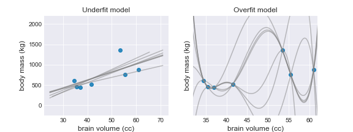
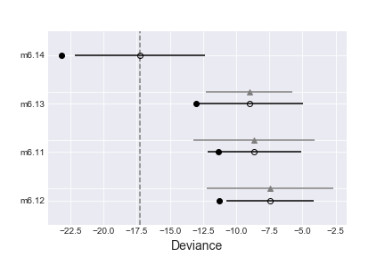
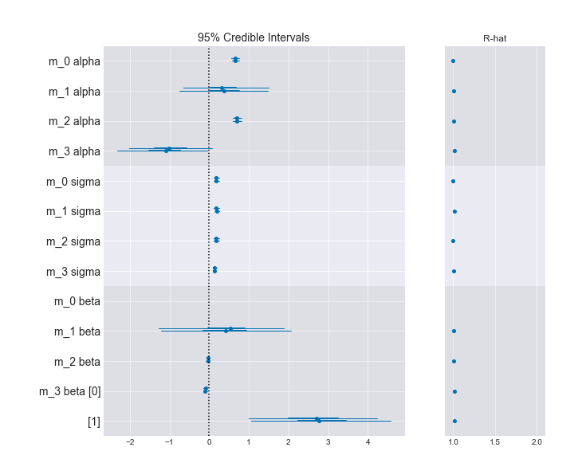
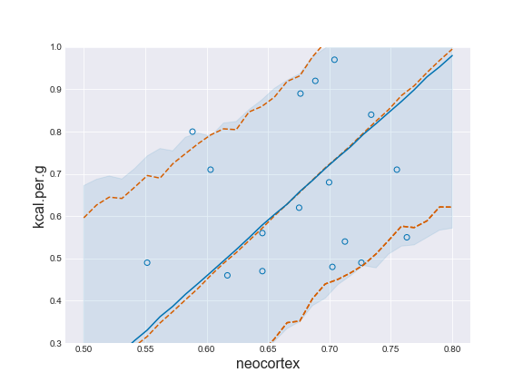

# Rethinking Statistics

## Chp6 Overfitting, Regularization, and Information Criteria

Two families to approach the trade off between over-/under-fitting:

1. Regularizing prior
2. Information criteria

AIC uses MAP estimates instead of the entire posterior distribution, and the prior is flat. The Bayesian Information Criterion (BIC) also requires flat priors and MAP estimates, although it's not really an "information criterion". Bayesian criteria like DIC and WAIC provide almost exactly the same results as AIC.

### 6.1 The problem with parameters

$R^2$ - "variance explained", is defined as:

$R^2 = \frac{var(outcome)-var(residuals)}{var(outcome)}=1-\frac{var(residuals)}{var(outcome)}$

Easy to compute, but poor choice for model selection.

#### More parameters always improve fit

1st order:

```python
m_6_1 = smf.ols('brain ~ mass', data=d).fit()
1 - m_6_1.resid.var()/d.brain.var()
# m_6_1.summary() check the value for R-squared
```

$R^2$: 0.4901580479490838

2nd - 6th order:

```python
m_6_2 = smf.ols('brain ~ mass + I(mass**2)', data=d).fit()
m_6_3 = smf.ols('brain ~ mass + I(mass**2) + I(mass**3)', data=d).fit()
m_6_4 = smf.ols('brain ~ mass + I(mass**2) + I(mass**3) + I(mass**4)', data=d).fit()
m_6_5 = smf.ols('brain ~ mass + I(mass**2) + I(mass**3) + I(mass**4) + I(mass**5)', data=d).fit()
m_6_6 = smf.ols('brain ~ mass + I(mass**2) + I(mass**3) + I(mass**4) + I(mass**5) + I(mass**6)', data=d).fit()
for model in [m_6_2, m_6_3, m_6_4, m_6_5, m_6_6]:
    print('R2: ', 1 - model.resid.var()/d.brain.var())
```

R2 for 2nd order model:  0.5359967130300407
R2 for 3rd order model:  0.6797736224399112
R2 for 4th order model:  0.8144339074066689
R2 for 5th order model:  0.9888540172279255
R2 for 6th order model:  0.9914536203218768

The increasing over-fitting is obvious.

It's possible to consider model fitting as a form of data compression. The compression sums the data in a simpler form, although information is lost about the sample.

For a "perfectly" over-fitted model, there is no compression. The model just encoded the data in a different form using parameters instead. Therefore, we learn nothing about the data through the model. This view of model selection is known as minimum description length (MDL).

#### Too few parameters hurts, too

Under-fitted models are less sensitive compared to regular models, and over-fitted models are too sensitive.



### Information theory and model performance

The target/criterion for model evaluation used in information theory: the out-of-sample deviance.

1. joint probability, not average probability, is the right way to judge model accuracy
2. establish a measurement scale for distance from perfect accuracy
3. deviance as an approximation of relative distance from perfect accuracy
4. deviance out-of-sample

The definition of the target depends on:

1. cost-benefit analysis.
2. accuracy in context.

Joint probability is the multiplication of probability from each event in the sequence. It appears in Bayes' theorem as the likelihood.

>Information: The reduction in uncertainty derived from learning an outcome.

Information theory is about how much the uncertainty reduced by learning an outcome.

Three intuitive desiderata:

1. The measure of uncertainty should be continuous.
2. The measure of uncertainty should increase as the number of possible events increases.
3. The measure of uncertainty should be additive.

The function that satisfies these desiderata: **Information Entropy**. If there are $n$ different possible events and each event $i$ has probability $p_i$, then we call the list of probabilities p, then the measure of uncertainty we seek is:

$H(p) = -E \log(p_i) = -\sum_{i=1}^{n}p_i \log(p_i)$

Or

>the uncertainty contained in a probability distribution is the average log-probability of an event.

E.g. to compute the information entropy for the weather, and we suppose the true probability of rain and shine are $p_1=0.3$ and $p_2=0.7$. Then:

$H(p)=-(p_1 \log(p_1) + p_2 \log(p_2)) \approx 0.61$

```python
p = (0.3, 0.7)
-sum(p * np.log(p))
#0.6108643020548935
```

If we live in a location where $p_1=0.01$ and $p_2=0.99$, then the uncertainty $H(p)=-(p_1 \log(p_1) + p_2 \log(p_2)) \approx 0.06$. The uncertainty has decreased. 

Adding an event to the dimensionality, sun, rain, and snow: $p_1=0.3$, $p_2=0.3$, and $p_3=0.7$. Then the entropy $H(p) \approx 0.82$.

Note: changing the base of the function does not affect the inference. Also, when $p_i=0$, do not include $p_i\log(p_i)$ in the calculation.

`MAXENT` maximizes the entropy, so that the distribution is the most consitent with the states of knowledge.

#### From entropy to accuracy

Divergence, describes the distance from the model to the target using information entropy. It's often known as the *Kullback-Leibler divergence* or K--L divergence. 

>Divergence: The additional uncertainty induced by using probabilities from one distribution to describe another distribution.

For example, if true distribution: $p_1=0.3$, $p_2=0.7$, and we believe it's $q_1=0.25$ and $q_2=0.75$, then the additional uncertainty is calculated as:

$D_{KL}(p, q)=\sum_{i}p_i(\log(p_i)-\log(q_i))=\sum_{i}p_i\log(\frac{p_i}{q_i})$

If p = q, then $D_{KL}(p,q)=0$, no extra uncertainty is introduced.

**Cross entropy**: introduced when we use distribution $q$ to predict events from distribution $p$. The divergence is defined as the *additional* entropy introduced by using $q$:

$D_{KL}(p, q) = H(p,q) - H(p) = -\sum_i p_i \log(q_i) - (- \sum_i p_i \log(p_i)) = -\sum_i p_i (\log(q_i) - \log(p_i))$

**Note**: knowing which is the target matters. $H(p, q)$ does not equal $H(q,p)$.

A good informative example (p180):

>In general, H(p, q) is not equal to H(q, p). The direction matters, when computing divergence. Understanding why this is true is of some value, so here’s a contrived teaching example.
Suppose we get in a rocket and head to Mars. But we have no control over our landing spot, once we reach Mars. Let’s try to predict whether we land in water or on dry land, using the Earth to provide a probability distribution q to approximate the actual distribution on Mars, p. For the Earth, $q = {0.7, 0.3}$, for probability of water and land, respectively. Mars is very dry, but let’s say for the sake of the example that there is 1% surface water, so $p = {0.01, 0.99}$. If we count the ice caps, that’s not too big a lie. Now compute the divergence going from Earth to Mars. It turns out to be
$D_{E→M} = D_{KL}(p, q) = 1.14$. That’s the additional uncertainty induced by using the Earth to predict the Martian landing spot. Now consider going back the other direction. The numbers in p and q stay the same, but we swap their roles, and now $D_{M→E} = D_{KL} (q, p) = 2.62$. The divergence is more than double in this direction. This result seems to defy comprehension. How can the distance from Earth to Mars be shorter than the distance from Mars to Earth?
Divergence behaves this way as a feature, not a bug. There really is more additional uncertainty induced by using Mars to predict Earth than by using Earth to predict Mars. The reason is that, going from Mars to Earth, Mars has so little water on its surface that we will be very very surprised when we most likely land in water on Earth. In contrast, Earth has good amounts of both water and dry land. So when we use the Earth to predict Mars, we expect both water and land, to some extent, even though we do expect more water than land. So we won’t be nearly as surprised when we inevitably arrive on Martian dry land, because 30% of Earth is dry land.

#### From divergence to deviance

Problem arises when in real life, the true value of $p$ is almost never known. Therefore, we cannot calculate the $D_{KL}$ to compare the models. But we can compare the relative divergences of different models. Since the parts related to $p$ are the same for any model to calculate the $D_{KL}$, we can just use the other terms (log-probabilities) for comparison.

To approximate the relative value of log-probability $E(\log(q_i))$, we can calculate the deviance:

$D(q) = -2 \sum_i \log(q_i)$

#### From deviance to out-of-sample

Deviance is similar to $R^2$ in the sense that the value improves as model gets more complex. Thus, using out-of-sample deviance as testing dataset to evaluate the models.

1. Suppose there's a training sample of size $N$
2. Fit a model to the training sample, and compute the deviance on the training sample as $D_{train}$
3. Suppose another sample of size $N$ as the test sample
4. Compute the deviance on the test sample $D_{test}$ using the MAP estimates from step 2

### Regularization

One way to prevent over-fitting is to assign a regularizing prior which is skeptical. The way to do it: assign a small standard deviation, so the model is more skeptical about values further away from the mean ($\mu=0$ if all variables are scaled).

Regularization on priors needs to be tuned: if too skeptical then underfitting.

### Information criteria

#### AIC

Akaike Information Criterion:

$AIC = D_{train} + 2p$

where $p$ is the number of free parameters to be estimated in the model.

AIC is only reliable when:

1. The priors are flat or overwhelmed by the likelihood.
2. The posterior distribution is approximately multivariate Gaussian.
3. The sample size $N$ is much greater than the number of parameters $k$. 

#### DIC

Deviance Information Criterion:

A version of AIC that is aware of informative priors, also assumes multivariate Gaussian posterior distribution.

$DIC = \bar{D} + (\bar{D} - \hat{D}) = \bar{D}+p_D$

where $(\bar{D}$ represents the average of $D$, the posterior distribution of deviance. The $\hat{D})$ represents the deviance calculated at the posterior mean. The $p_D$ is also often called a penalty term.

#### WAIC

Widely Applicable Information Criterion (WAIC) does not require a multivariate Gaussian posterior. More accurate than DIC.

WAIC is pointwise: calculates uncertainty case-by-case.

$Pr(y_i)$ as the average likelihood of observation $i$ in the training sample, and calculate the log-pointwise-predictive-density, $lppd$:

$lppd = \sum_{i=1}^{N} \log Pr(y_i)$

> the log-pointwise-predictive-density is the total across observations of the log-arithm of the average likelihood of each observation.

Effective number of parameters $P_{WAIC}$. Define $V(y_i)$ as the variance in log-likelihood for observation $i$ in the training sample, and compute the log-likelihood of $y_i$ for each sample from the posteior distribution. $P_{WAIC}$ is defined as:

$p_{WAIC} = \sum_{i=1}^{N}V(y_i)$

And WAIC is defined as:

$WAIC = -2(lppd - p_{WAIC})$

Calculating the WAIC:

```python
with pm.Model() as m_6_15 :
    a = pm.Normal('a', mu=0, sd=100)
    b = pm.Normal('b', mu=0, sd=10)
    sigma = pm.Uniform('sigma', 0, 30)
    mu = pm.Deterministic('mu', a + b * data['speed'])
    dist = pm.Normal('dist', mu=mu, sd=sigma, observed = data['dist'])
    m_6_15 = pm.sample(1000, tune=1000)
```

log-likelihood of each observation $i$ at each sample $s$ from the posterior

```python
n_samples = 1000
n_cases = data.shape[0]
ll = np.zeros((n_cases, n_samples))

for s in range(0, n_samples):
    mu = m_6_15['a'][s] + m_6_15['b'][s] * data['speed']
    p_ = stats.norm.logpdf(data['dist'], loc=mu, scale=m_6_15['sigma'][s])
    ll[:,s] = p_
```

ll: a 50-by-1000 matrix of log-likelihoods. Then we calculate the log of sum of exponentiated terms.

```python
from scipy.special import logsumexp
n_cases = data.shape[0]
lppd = np.zeros((n_cases))
for a in range(1, n_cases):
    lppd[a,] = logsumexp(ll[a,]) - np.log(n_samples)
```

Compute the $p_{WAIC}$:

```python
pWAIC = np.zeros((n_cases))
for i in range(1, n_cases):
    pWAIC[i,] = np.var(ll[i,])
```

The WAIC:

```python
- 2 * (sum(lppd) - sum(pWAIC))
#412.50672926467325
```

Calculate the standard error of WAIC by computing the square root of number of cases multiplied by the variance over the individual observation terms:

```python
waic_vec = - 2 * (lppd - pWAIC)
np.sqrt(n_cases * np.var(waic_vec))
```

#### DIC and WAIC as estimates of deviance

WAIC can be more accurate for out-of-bag estimates.

Using both regularization and information criteria can help, is always better than only using one or the other.

- Regularization: helps reduce overfitting for any particular model
- Information criteria: compare overfitting across models

### Using information criteria

Should not use AIC/DIC/WAIC for model selection, but model *comparison* and *averaging*

- Model comparison: using DIC/WAIC in combination with the estimates and posterior predictive checks from each model. 
- - Model averaging: using DIC/WAIC to construct a posterior predictive distribution. Does not mean averaging model parameters, but prediction averaging instead.

#### Model comparison

```python
d = pd.read_csv('Data/milk.csv', sep=';')
d['neocortex'] = d['neocortex.perc'] / 100
d.dropna(inplace=True)
d.shape
#17, 9

a_start = d['kcal.per.g'].mean()
sigma_start = d['kcal.per.g'].std()

import theano

mass_shared = theano.shared(np.log(d['mass'].values))
neocortex_shared = theano.shared(d['neocortex'].values)

with pm.Model() as m6_11:
    alpha = pm.Normal('alpha', mu=0, sd=10, testval=a_start)
    mu = alpha + 0 * neocortex_shared
    sigma = pm.HalfCauchy('sigma',beta=10, testval=sigma_start)
    kcal = pm.Normal('kcal', mu=mu, sd=sigma, observed=d['kcal.per.g'])
    trace_m6_11 = pm.sample(1000, tune=1000)    

with pm.Model() as m6_12:
    alpha = pm.Normal('alpha', mu=0, sd=10, testval=a_start)
    beta = pm.Normal('beta', mu=0, sd=10)
    sigma = pm.HalfCauchy('sigma',beta=10, testval=sigma_start)
    mu = alpha + beta * neocortex_shared
    kcal = pm.Normal('kcal', mu=mu, sd=sigma, observed=d['kcal.per.g'])
    trace_m6_12 = pm.sample(1000, tune=1000)
    
with pm.Model() as m6_13:
    alpha = pm.Normal('alpha', mu=0, sd=10, testval=a_start)
    beta = pm.Normal('beta', mu=0, sd=10)
    sigma = pm.HalfCauchy('sigma', beta=10, testval=sigma_start)
    mu = alpha + beta * mass_shared
    kcal = pm.Normal('kcal', mu=mu, sd=sigma, observed=d['kcal.per.g'])
    trace_m6_13 = pm.sample(1000, tune=1000)
    
with pm.Model() as m6_14:
    alpha = pm.Normal('alpha', mu=0, sd=10, testval=a_start)
    beta = pm.Normal('beta', mu=0, sd=10, shape=2)
    sigma = pm.HalfCauchy('sigma', beta=10, testval=sigma_start)
    mu = alpha + beta[0] * mass_shared + beta[1] * neocortex_shared
    kcal = pm.Normal('kcal', mu=mu, sd=sigma, observed=d['kcal.per.g'])
    trace_m6_14 = pm.sample(1000, tune=1000)

pm.waic(trace_m6_14, m6_14)
#WAIC_r(WAIC=-16.199698254670658, WAIC_se=5.8639218309423118, p_WAIC=3.7132315642314833, var_warn=1)
```

Compare the 4 models:

```python
compare_df = pm.compare({m6_11:trace_m6_11,
                        m6_12:trace_m6_12,
                        m6_13:trace_m6_13,
                        m6_14:trace_m6_14},
                        method='pseudo-BMA')

compare_df.loc[:,'model'] = pd.Series(['m6.11', 'm6.12', 'm6.13', 'm6.14'])
compare_df = compare_df.set_index('model')
compare_df
```

Output:
| WAIC |pWAIC|dWAIC|weight| SE |dSE |var_warn|
|-----:|----:|----:|-----:|---:|---:|-------:|
|-17.26| 2.95| 0.00|  0.96|4.92|0.00|       1|
| -9.03| 2.01| 8.23|  0.02|4.09|3.28|       1|
| -8.65| 1.34| 8.61|  0.01|3.52|4.55|       0|
| -7.45| 1.91| 9.81|  0.01|3.27|4.74|       0|

> 1. `WAIC` is obviously WAIC for each model. Smaller WAIC indicates better estimated out-of-sample deviance, so model m6.14 is ranked first.
>2. `pWAIC` is the estimated effective number of parameters. This provides a clue as to how flexible each model is in fitting the sample.
>3. `dWAIC` is the difference between each WAIC and the lowest WAIC. Since only relative deviance matters, this column shows the differences in relative fashion.
>4. `weight` is the Akaike weight for each model. These values are transformed information criterion values. I’ll explain them below.
>5. `SE` is the standard error of the WAIC estimate. WAIC is an estimate, and provided the sample size $N$ is large enough, its uncertainty will be well approximated by its standard error. So this `SE` value isn’t necessarily very precise, but it does provide a check against overconfidence in differences between WAIC values.
>6. `dSE` is the standard error of the difference in WAIC between each model and the top-ranked model. So it is missing for the top model. If you want the full set of pairwise model differences, you can extract milk.models@dSE (in `R`).

Plotting the values:

```python
pm.compareplot(compare_df)
```



The weights in the table are Akaike weights for $m$ models:

$w_i = \frac{\exp{-\frac{1}{2}dWAIC_i}}{\sum_{j=1}^{m}\exp{(-\frac{1}{2}dWAIC_j)}}$

The Akaike weights always add up to 1 for all models, with larger weight suggesting better model.

>A model’s weight is an estimate of the probability that the model will make the best predictions on new data, conditional on the set of models considered.

Comparing estimates:

```python
traces = [trace_m6_11, trace_m6_12, trace_m6_13, trace_m6_14]   
models = [m6_11, m6_12, m6_13, m6_14]

plt.figure(figsize=(10, 8))
pm.forestplot(traces, plot_kwargs={'fontsize':14})
```



Model averaging is to compute an ensemble of posterior distributions:

1. Compute WAIC for each model
2. Compute the weight for each model
3. Combine linear model and simulated outcomes for each model
4. Combine these values into an ensemble of predictions using the model weights as proportions

```python
kcal_per_g = np.repeat(0, 30) # empty outcome
neocortex = np.linspace(0.5, 0.8, 30) # sequence of neocortex
mass = np.repeat(4.5, 30)     # average mass

mass_shared.set_value(np.log(mass))
neocortex_shared.set_value(neocortex)
post_pred = pm.sample_ppc(trace_m6_14, samples=10000, model=m6_14)

milk_ensemble = pm.sample_ppc_w(traces, 10000,
                                models, weights=compare_df.weight.sort_index(ascending=True))
```

```python
plt.figure(figsize=(8, 6))

plt.plot(neocortex, post_pred['kcal'].mean(0), ls='--', color='C2')
hpd_post_pred = pm.hpd(post_pred['kcal'])
plt.plot(neocortex,hpd_post_pred[:,0], ls='--', color='C2')
plt.plot(neocortex,hpd_post_pred[:,], ls='--', color='C2')

plt.plot(neocortex, milk_ensemble['kcal'].mean(0), color='C0')
hpd_av = pm.hpd(milk_ensemble['kcal'])
plt.fill_between(neocortex, hpd_av[:,0], hpd_av[:,1], alpha=0.1, color='C0')

plt.scatter(d['neocortex'], d['kcal.per.g'], facecolor='None', edgecolors='C0')

plt.ylim(0.3, 1)
plt.xlabel('neocortex', fontsize=16)
plt.ylabel('kcal.per.g', fontsize=16)
```

